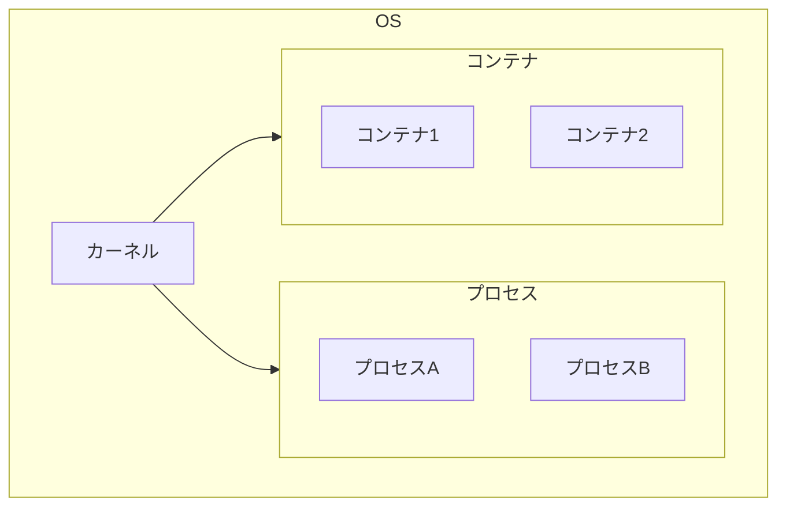
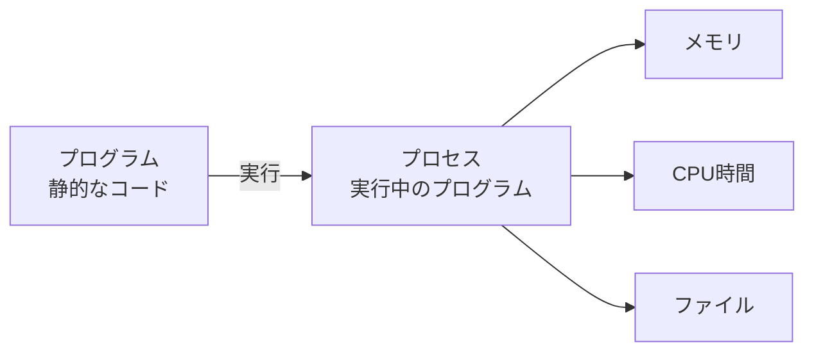
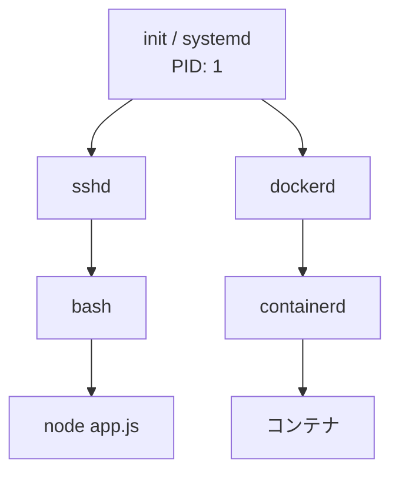
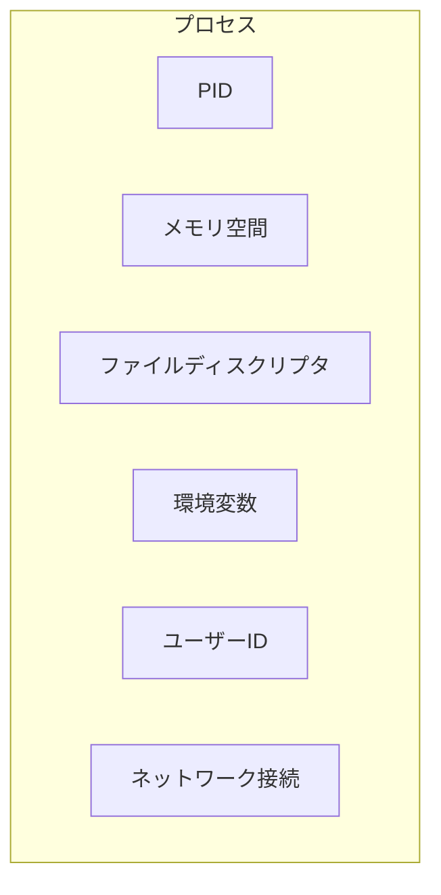
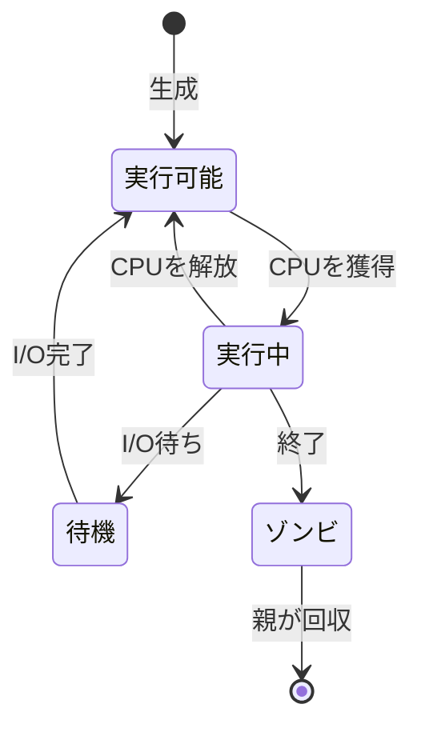
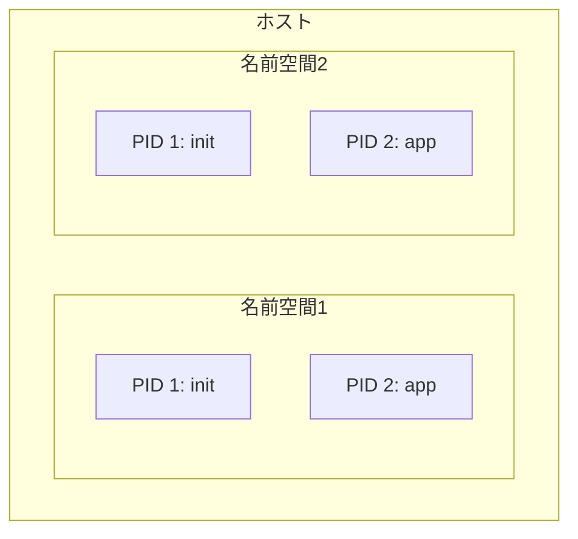
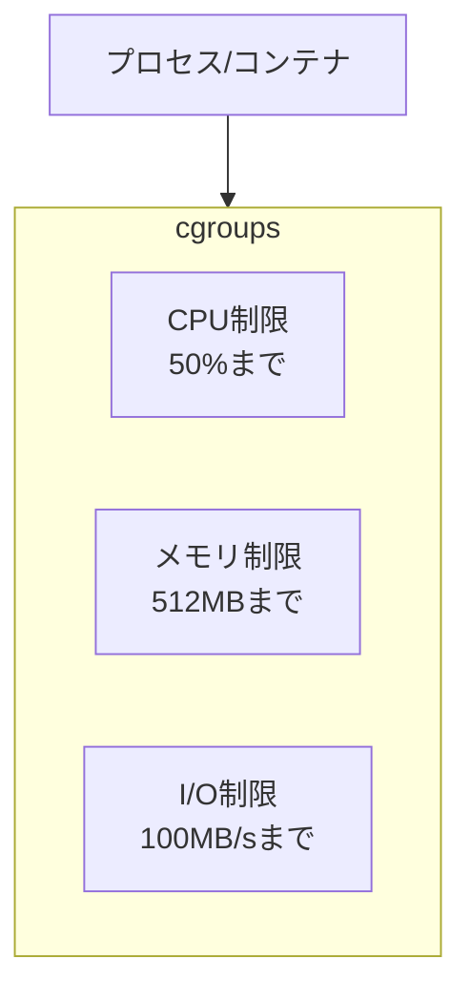
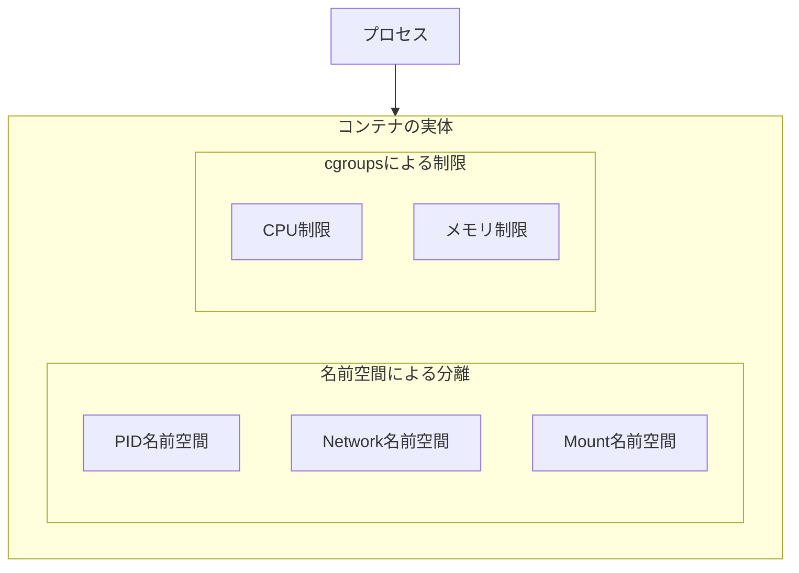

# OS・プロセス基礎

## 📋 概要

| 項目 | 内容 |
|------|------|
| 所要時間 | 60分 |
| 難易度 | [中級] |
| 前提知識 | インフラ基礎、Docker基礎 |

## 🎯 なぜこれを学ぶのか

コンテナを深く理解するには、OSとプロセスの基礎知識が必要です。



コンテナは「軽量な仮想化」と言われますが、その仕組みを理解することで：

- **トラブルシューティング**: コンテナの問題を根本から解決できる
- **パフォーマンス最適化**: リソースの使い方を最適化できる
- **セキュリティ**: コンテナの分離レベルを正しく理解できる

## 📚 学習内容

### 1. プロセスとは

#### 1.1 プロセスの基本



**プロセス** = 実行中のプログラム

| 概念 | 説明 |
|------|------|
| **プログラム** | ディスク上の実行可能ファイル（静的） |
| **プロセス** | メモリ上で実行中のプログラム（動的） |
| **PID** | プロセスID、各プロセスの一意な識別子 |

#### 1.2 プロセスの階層構造



Linuxでは、すべてのプロセスは親子関係を持ちます：

- **PID 1**: 最初のプロセス（init または systemd）
- **親プロセス**: 子プロセスを生成（fork）
- **子プロセス**: 親から生成される

```bash
# プロセスツリーを確認
pstree -p

# プロセス一覧
ps aux

# 特定のプロセスを確認
ps aux | grep node
```

### 2. プロセスのリソース

#### 2.1 プロセスが持つリソース



| リソース | 説明 |
|----------|------|
| **メモリ空間** | プロセス専用のメモリ領域 |
| **ファイルディスクリプタ** | 開いているファイルやソケット |
| **環境変数** | 設定情報（PATH、NODE_ENVなど） |
| **ユーザーID** | 実行ユーザーの権限 |

#### 2.2 プロセスの状態



| 状態 | 説明 |
|------|------|
| **実行可能（R）** | CPUを待っている |
| **実行中** | CPUで実行中 |
| **待機（S/D）** | I/O等を待っている |
| **ゾンビ（Z）** | 終了したが親が回収していない |

### 3. Linuxの名前空間（Namespace）

#### 3.1 名前空間とは

**名前空間** = プロセスが見えるリソースを分離する仕組み



**コンテナはこの名前空間を使って分離を実現しています。**

#### 3.2 名前空間の種類

| 名前空間 | 分離するもの | コンテナでの用途 |
|----------|-------------|-----------------|
| **PID** | プロセスID | コンテナ内でPID 1を持てる |
| **Network** | ネットワーク | コンテナ専用のネットワーク |
| **Mount** | ファイルシステム | コンテナ専用のファイルシステム |
| **UTS** | ホスト名 | コンテナ専用のホスト名 |
| **User** | ユーザーID | コンテナ内でroot権限 |
| **IPC** | プロセス間通信 | 分離されたIPC |

#### 3.3 名前空間の確認

```bash
# 現在のプロセスの名前空間を確認
ls -la /proc/$$/ns/

# 結果例
# lrwxrwxrwx 1 user user 0 Jan 1 00:00 mnt -> 'mnt:[4026531840]'
# lrwxrwxrwx 1 user user 0 Jan 1 00:00 net -> 'net:[4026531992]'
# lrwxrwxrwx 1 user user 0 Jan 1 00:00 pid -> 'pid:[4026531836]'
```

### 4. Linuxのcgroups

#### 4.1 cgroupsとは

**cgroups**（Control Groups）= プロセスのリソース使用量を制限する仕組み



#### 4.2 cgroupsで制限できるもの

| リソース | 説明 | コンテナでの例 |
|----------|------|---------------|
| **CPU** | CPU使用率、コア数 | `--cpus=0.5` |
| **メモリ** | メモリ使用量 | `--memory=512m` |
| **ブロックI/O** | ディスクI/O | `--device-read-bps` |
| **ネットワーク** | 帯域幅 | - |

#### 4.3 Dockerでのリソース制限

```bash
# CPUを0.5コアに制限
docker run --cpus=0.5 nginx

# メモリを512MBに制限
docker run --memory=512m nginx

# 両方を制限
docker run --cpus=1 --memory=1g nginx
```

### 5. コンテナ = 名前空間 + cgroups



**コンテナの正体**:
- **名前空間**: 他のプロセスから「見えない」ようにする
- **cgroups**: リソースの「使いすぎ」を防ぐ
- **ファイルシステム**: 専用のルートファイルシステム（イメージ）

```
コンテナ = 名前空間 + cgroups + ファイルシステム
```

### 6. 実践：プロセスとコンテナの比較

#### 6.1 通常のプロセス

```bash
# Node.jsアプリを直接実行
node app.js &

# プロセスを確認
ps aux | grep node
# ホストのPIDが見える

# ネットワークを確認
netstat -tlnp
# ホストのネットワークを使用
```

#### 6.2 コンテナ内のプロセス

```bash
# コンテナ内でNode.jsを実行
docker run -d --name myapp node:18 node -e "setInterval(() => {}, 1000)"

# コンテナ内のプロセスを確認
docker exec myapp ps aux
# PID 1 が node になっている

# ホストから見たプロセス
ps aux | grep node
# ホストでは別のPIDが割り当てられている
```

## ✅ まとめ

| 概念 | 説明 | コンテナとの関係 |
|------|------|-----------------|
| **プロセス** | 実行中のプログラム | コンテナ内で動くのもプロセス |
| **名前空間** | リソースの見え方を分離 | コンテナの分離を実現 |
| **cgroups** | リソース使用量を制限 | コンテナのリソース制限を実現 |

**コンテナは「特別な技術」ではなく、Linuxの機能を組み合わせたもの**

## 💬 考えてみよう

```
Q: コンテナがVMより軽量な理由は何ですか？
Q: コンテナ内でPID 1が重要な理由は何ですか？
Q: cgroupsでメモリ制限を超えるとどうなりますか？
```

## 🔗 次のコンテンツ

[仮想化技術理論](11-container-advanced-02.md)に進んでください。

---

**著作権表示**

Copyright © 2024 Honeycome Inc. All rights reserved.

本コンテンツは、Honeycome Inc.の所有物です。無断での複製、配布、転載を禁止します。
詳細は[利用規約](../../docs/terms-of-use.md)をご覧ください。
