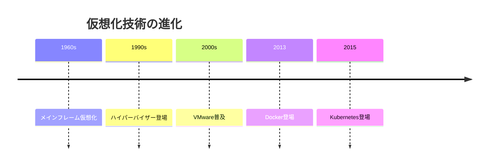
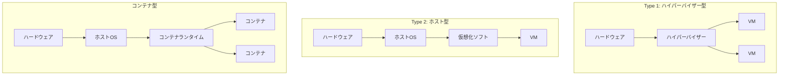
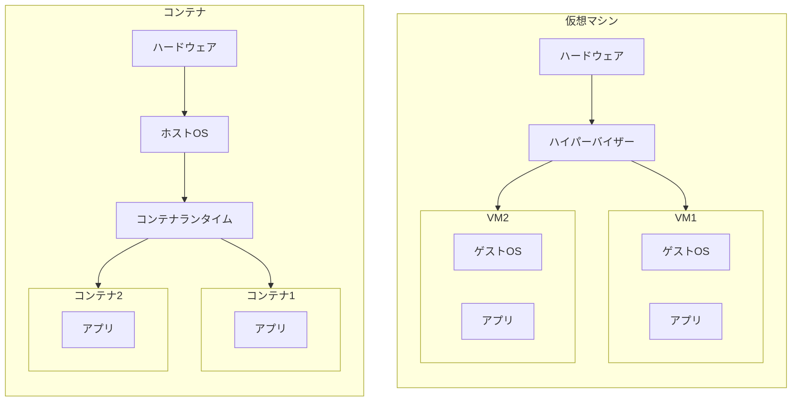
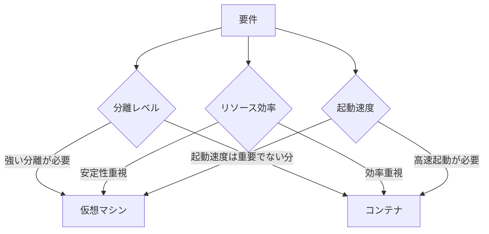
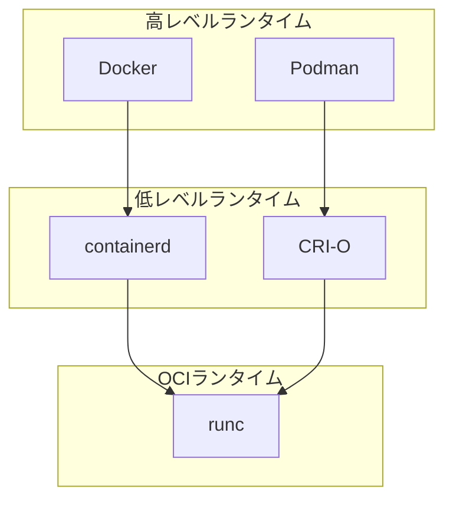
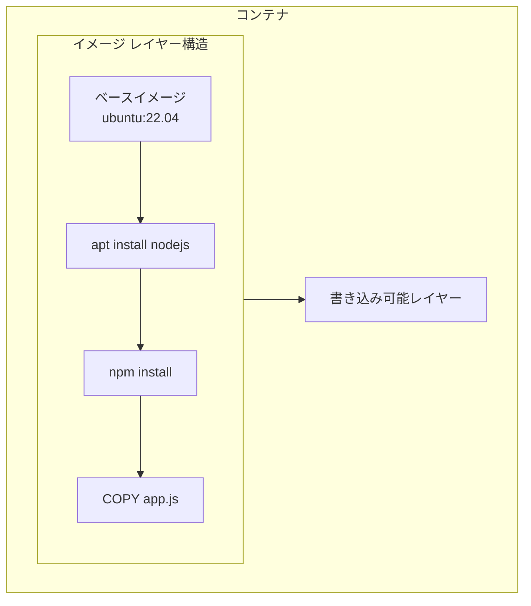
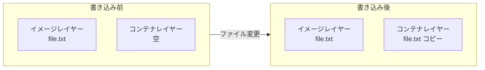
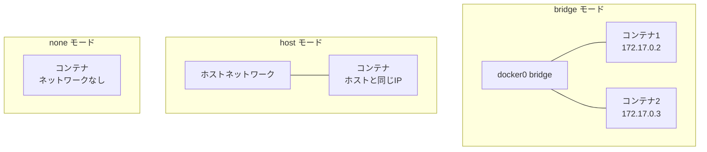
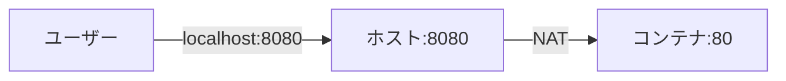
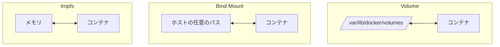

# 仮想化技術理論

## 📋 概要

| 項目 | 内容 |
|------|------|
| 所要時間 | 45分 |
| 難易度 | [中級] |
| 前提知識 | OS・プロセス基礎 |

## 🎯 なぜこれを学ぶのか

仮想化技術の歴史と種類を理解することで、コンテナの位置づけが明確になります。



## 📚 学習内容

### 1. 仮想化の種類

#### 1.1 仮想化技術の分類



| 種類 | 例 | 特徴 |
|------|-----|------|
| **Type 1** | VMware ESXi, Hyper-V | ハードウェア上で直接動作 |
| **Type 2** | VirtualBox, VMware Workstation | ホストOS上で動作 |
| **コンテナ** | Docker, containerd | カーネルを共有 |

### 2. 仮想マシン vs コンテナ

#### 2.1 アーキテクチャの違い



#### 2.2 比較表

| 項目 | 仮想マシン | コンテナ |
|------|-----------|---------|
| **起動時間** | 分単位 | 秒単位 |
| **サイズ** | GB単位 | MB単位 |
| **オーバーヘッド** | 大きい（ゲストOS） | 小さい |
| **分離レベル** | 強い（ハードウェアレベル） | 中程度（カーネル共有） |
| **密度** | 低い（1台に数十VM） | 高い（1台に数百コンテナ） |

#### 2.3 使い分け



| ユースケース | 推奨 |
|-------------|------|
| マルチテナント（顧客ごとに分離） | VM |
| マイクロサービス | コンテナ |
| 開発環境 | コンテナ |
| レガシーアプリ | VM |
| CI/CD | コンテナ |

### 3. コンテナランタイム

#### 3.1 コンテナランタイムの階層



| レベル | 役割 | 例 |
|--------|------|-----|
| **高レベル** | ユーザーインターフェース、イメージ管理 | Docker, Podman |
| **低レベル** | コンテナライフサイクル管理 | containerd, CRI-O |
| **OCI** | 実際のコンテナ作成・実行 | runc |

#### 3.2 Docker以外の選択肢

| ツール | 特徴 |
|--------|------|
| **Podman** | デーモンレス、rootless、Docker互換 |
| **containerd** | Kubernetes標準、軽量 |
| **CRI-O** | Kubernetes専用、軽量 |

### 4. コンテナイメージの仕組み

#### 4.1 レイヤー構造



**特徴**:
- 各命令が1つのレイヤーになる
- レイヤーは読み取り専用
- コンテナ起動時に書き込み可能レイヤーを追加
- レイヤーは再利用される（キャッシュ）

#### 4.2 Copy-on-Write



- **読み取り**: イメージレイヤーから直接読む
- **書き込み**: コンテナレイヤーにコピーしてから変更

### 5. コンテナネットワーク

#### 5.1 ネットワークモード



| モード | 説明 | ユースケース |
|--------|------|-------------|
| **bridge** | 仮想ブリッジ経由（デフォルト） | 一般的な用途 |
| **host** | ホストのネットワークを共有 | パフォーマンス重視 |
| **none** | ネットワークなし | セキュリティ |
| **overlay** | 複数ホスト間でネットワーク | Swarm/Kubernetes |

#### 5.2 ポートマッピング



```bash
# ホストの8080をコンテナの80にマッピング
docker run -p 8080:80 nginx
```

### 6. コンテナストレージ

#### 6.1 ストレージの種類



| 種類 | 説明 | ユースケース |
|------|------|-------------|
| **Volume** | Dockerが管理 | データ永続化（推奨） |
| **Bind Mount** | ホストのディレクトリをマウント | 開発時のコード共有 |
| **tmpfs** | メモリ上 | 一時データ |

## ✅ まとめ

| 概念 | 説明 |
|------|------|
| **VM vs コンテナ** | VMは完全分離、コンテナは軽量で高速 |
| **コンテナランタイム** | Docker, containerd, runc の階層構造 |
| **イメージ** | レイヤー構造、Copy-on-Write |
| **ネットワーク** | bridge, host, none, overlay |
| **ストレージ** | Volume, Bind Mount, tmpfs |

## 💬 考えてみよう

```
Q: セキュリティが最重要な場面では、VMとコンテナどちらを選びますか？
Q: イメージのレイヤーを少なくするメリットは何ですか？
Q: 開発時と本番でストレージの種類を変える理由は何ですか？
```

## 🔗 次のコンテンツ

[Docker Compose基礎](11-container-advanced-03.md)に進んでください。

---

**著作権表示**

Copyright © 2024 Honeycome Inc. All rights reserved.

本コンテンツは、Honeycome Inc.の所有物です。無断での複製、配布、転載を禁止します。
詳細は[利用規約](../../docs/terms-of-use.md)をご覧ください。
