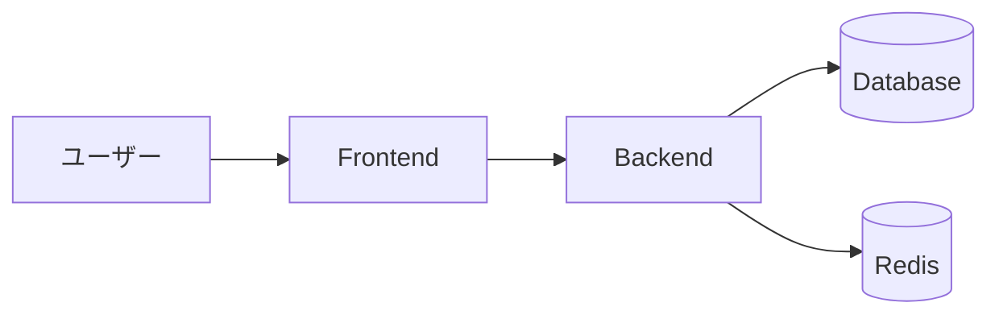
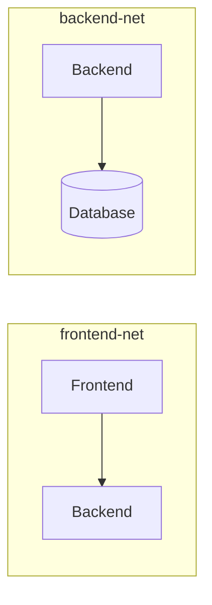

# Docker Compose基礎

## 📋 概要

| 項目 | 内容 |
|------|------|
| 所要時間 | 60分 |
| 難易度 | [中級] |
| 前提知識 | Docker基礎 |

## 🎯 なぜこれを学ぶのか

実際のアプリケーションは複数のサービスで構成されます。



Docker Composeを使うと、これらを**1つのコマンド**で起動・管理できます。

## 📚 学習内容

### 1. Docker Composeとは

#### 1.1 単一コンテナ vs マルチコンテナ

**単一コンテナ（docker run）**:
```bash
# 3つのコンテナを別々に起動
docker run -d --name db postgres
docker run -d --name redis redis
docker run -d --name app --link db --link redis myapp
```

**Docker Compose（compose.yaml）**:
```yaml
services:
  db:
    image: postgres
  redis:
    image: redis
  app:
    build: .
    depends_on:
      - db
      - redis
```

```bash
# 1コマンドで全て起動
docker compose up -d
```

#### 1.2 Docker Composeのメリット

| メリット | 説明 |
|----------|------|
| **宣言的** | YAMLで構成を定義 |
| **再現性** | 同じ環境を何度でも構築 |
| **簡単** | 1コマンドで起動・停止 |
| **ネットワーク** | 自動でサービス間通信を設定 |

### 2. compose.yaml の基本構文

#### 2.1 基本構造

```yaml
# compose.yaml

# サービス（コンテナ）の定義
services:
  web:
    image: nginx:latest
    ports:
      - "8080:80"
  
  api:
    build: ./api
    environment:
      - NODE_ENV=development

# ネットワークの定義（オプション）
networks:
  default:
    driver: bridge

# ボリュームの定義（オプション）
volumes:
  db-data:
```

#### 2.2 サービスの設定項目

```yaml
services:
  app:
    # イメージ指定
    image: node:18
    
    # または Dockerfile からビルド
    build:
      context: .
      dockerfile: Dockerfile
    
    # ポートマッピング
    ports:
      - "3000:3000"
    
    # 環境変数
    environment:
      - NODE_ENV=production
      - DATABASE_URL=postgres://db:5432/app
    
    # 環境変数ファイル
    env_file:
      - .env
    
    # ボリュームマウント
    volumes:
      - ./src:/app/src
      - node_modules:/app/node_modules
    
    # 依存関係
    depends_on:
      - db
      - redis
    
    # コマンド上書き
    command: npm start
    
    # 再起動ポリシー
    restart: unless-stopped
```

### 3. 実践：Webアプリケーション環境

#### 3.1 プロジェクト構造

```
my-app/
├── compose.yaml
├── frontend/
│   ├── Dockerfile
│   └── src/
├── backend/
│   ├── Dockerfile
│   └── src/
└── .env
```

#### 3.2 compose.yaml の例

```yaml
services:
  # PostgreSQL データベース
  db:
    image: postgres:15
    environment:
      POSTGRES_USER: ${DB_USER:-postgres}
      POSTGRES_PASSWORD: ${DB_PASSWORD:-password}
      POSTGRES_DB: ${DB_NAME:-myapp}
    volumes:
      - db-data:/var/lib/postgresql/data
    healthcheck:
      test: ["CMD-SHELL", "pg_isready -U postgres"]
      interval: 5s
      timeout: 5s
      retries: 5

  # Redis キャッシュ
  redis:
    image: redis:7-alpine
    volumes:
      - redis-data:/data

  # バックエンドAPI
  backend:
    build:
      context: ./backend
      dockerfile: Dockerfile
    ports:
      - "3001:3000"
    environment:
      - NODE_ENV=development
      - DATABASE_URL=postgres://postgres:password@db:5432/myapp
      - REDIS_URL=redis://redis:6379
    volumes:
      - ./backend/src:/app/src
    depends_on:
      db:
        condition: service_healthy
      redis:
        condition: service_started

  # フロントエンド
  frontend:
    build:
      context: ./frontend
      dockerfile: Dockerfile
    ports:
      - "3000:3000"
    environment:
      - NEXT_PUBLIC_API_URL=http://localhost:3001
    volumes:
      - ./frontend/src:/app/src
    depends_on:
      - backend

volumes:
  db-data:
  redis-data:
```

### 4. Docker Compose コマンド

#### 4.1 基本コマンド

```bash
# 起動（バックグラウンド）
docker compose up -d

# 起動（ログを表示）
docker compose up

# 停止
docker compose down

# 停止してボリュームも削除
docker compose down -v

# 再ビルドして起動
docker compose up -d --build

# 特定のサービスのみ起動
docker compose up -d backend
```

#### 4.2 確認・デバッグ

```bash
# サービス一覧
docker compose ps

# ログ確認
docker compose logs

# 特定サービスのログ
docker compose logs -f backend

# サービスに入る
docker compose exec backend sh

# 1回だけコマンド実行
docker compose run --rm backend npm test
```

#### 4.3 スケーリング

```bash
# サービスのスケール
docker compose up -d --scale backend=3
```

### 5. 開発環境と本番環境の分離

#### 5.1 ファイル構成

```
my-app/
├── compose.yaml          # 共通設定
├── compose.override.yaml # 開発環境（自動で読み込まれる）
├── compose.prod.yaml     # 本番環境
└── .env
```

#### 5.2 compose.yaml（共通）

```yaml
services:
  backend:
    build:
      context: ./backend
    depends_on:
      - db

  db:
    image: postgres:15
```

#### 5.3 compose.override.yaml（開発）

```yaml
services:
  backend:
    volumes:
      - ./backend/src:/app/src  # ホットリロード用
    environment:
      - NODE_ENV=development
    ports:
      - "3001:3000"
      - "9229:9229"  # デバッグポート
```

#### 5.4 compose.prod.yaml（本番）

```yaml
services:
  backend:
    environment:
      - NODE_ENV=production
    restart: always
    deploy:
      resources:
        limits:
          cpus: '1'
          memory: 1G
```

#### 5.5 環境別の起動

```bash
# 開発環境（compose.yaml + compose.override.yaml）
docker compose up -d

# 本番環境
docker compose -f compose.yaml -f compose.prod.yaml up -d
```

### 6. ネットワーク

#### 6.1 デフォルトネットワーク

```yaml
services:
  backend:
    # "backend" という名前でアクセス可能
    ...
  
  frontend:
    # backend に "http://backend:3000" でアクセス
    ...
```

Docker Composeは自動でネットワークを作成し、サービス名でアクセスできます。

#### 6.2 カスタムネットワーク

```yaml
services:
  frontend:
    networks:
      - frontend-net
  
  backend:
    networks:
      - frontend-net
      - backend-net
  
  db:
    networks:
      - backend-net

networks:
  frontend-net:
  backend-net:
```



## ✅ まとめ

| 項目 | 内容 |
|------|------|
| **compose.yaml** | サービス、ネットワーク、ボリュームを定義 |
| **docker compose up** | 全サービスを起動 |
| **docker compose down** | 全サービスを停止 |
| **depends_on** | 起動順序を制御 |
| **環境分離** | override, prod ファイルで分離 |

## 💬 考えてみよう

```
Q: depends_on だけでは不十分な場合があるのはなぜですか？
Q: 開発環境でボリュームマウントを使う理由は何ですか？
Q: 本番環境で restart: always が重要な理由は何ですか？
```

## 🔗 次のコンテンツ

[マルチコンテナ構成](11-container-advanced-04.md)に進んでください。

---

**著作権表示**

Copyright © 2024 Honeycome Inc. All rights reserved.

本コンテンツは、Honeycome Inc.の所有物です。無断での複製、配布、転載を禁止します。
詳細は[利用規約](../../docs/terms-of-use.md)をご覧ください。
