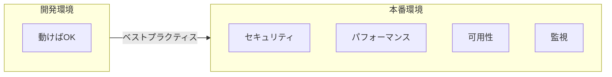

# 本番運用のベストプラクティス

## 📋 概要

| 項目 | 内容 |
|------|------|
| 所要時間 | 60分 |
| 難易度 | [応用] |
| 前提知識 | Docker Compose、マルチコンテナ構成 |

## 🎯 なぜこれを学ぶのか

開発環境で動くコンテナと、本番環境で安全に動くコンテナは異なります。



## 📚 学習内容

### 1. Dockerfileのベストプラクティス

#### 1.1 マルチステージビルド

```dockerfile
# ❌ 悪い例：ビルドツールも含まれる
FROM node:18
WORKDIR /app
COPY package*.json ./
RUN npm install
COPY . .
RUN npm run build
CMD ["node", "dist/index.js"]
# イメージサイズ: 1GB以上
```

```dockerfile
# ✅ 良い例：マルチステージビルド
# ビルドステージ
FROM node:18 AS builder
WORKDIR /app
COPY package*.json ./
RUN npm ci
COPY . .
RUN npm run build

# 実行ステージ
FROM node:18-alpine
WORKDIR /app
COPY --from=builder /app/dist ./dist
COPY --from=builder /app/node_modules ./node_modules
CMD ["node", "dist/index.js"]
# イメージサイズ: 200MB程度
```

#### 1.2 レイヤーの最適化

```dockerfile
# ❌ 悪い例：キャッシュが効かない
COPY . .
RUN npm install

# ✅ 良い例：依存関係のキャッシュが効く
COPY package*.json ./
RUN npm ci
COPY . .
```

#### 1.3 .dockerignore

```
# .dockerignore
node_modules
npm-debug.log
.git
.gitignore
.env
*.md
dist
coverage
.nyc_output
```

### 2. セキュリティ

#### 2.1 非rootユーザーで実行

```dockerfile
# ✅ 非rootユーザーを作成して使用
FROM node:18-alpine

# 非rootユーザーを作成
RUN addgroup -g 1001 -S nodejs
RUN adduser -S nodejs -u 1001

WORKDIR /app
COPY --chown=nodejs:nodejs . .

# 非rootユーザーに切り替え
USER nodejs

CMD ["node", "index.js"]
```

#### 2.2 読み取り専用ファイルシステム

```yaml
services:
  app:
    image: myapp
    read_only: true
    tmpfs:
      - /tmp
      - /var/run
```

#### 2.3 最小限のベースイメージ

| イメージ | サイズ | 用途 |
|----------|--------|------|
| `node:18` | ~1GB | 開発用 |
| `node:18-slim` | ~200MB | 軽量版 |
| `node:18-alpine` | ~170MB | 最小限 |
| `gcr.io/distroless/nodejs18` | ~120MB | 超最小限 |

#### 2.4 シークレット管理

```yaml
# ❌ 悪い例：環境変数に直接書く
services:
  app:
    environment:
      - DB_PASSWORD=mysecretpassword

# ✅ 良い例：環境変数ファイルを使う
services:
  app:
    env_file:
      - .env  # .gitignoreに追加
```

```yaml
# ✅ さらに良い例：Docker Secrets（Swarm/Kubernetes）
services:
  app:
    secrets:
      - db_password

secrets:
  db_password:
    external: true
```

### 3. パフォーマンス

#### 3.1 リソース制限

```yaml
services:
  app:
    deploy:
      resources:
        limits:
          cpus: '1'
          memory: 1G
        reservations:
          cpus: '0.5'
          memory: 512M
```

#### 3.2 ヘルスチェック

```yaml
services:
  app:
    healthcheck:
      test: ["CMD", "curl", "-f", "http://localhost:3000/health"]
      interval: 30s
      timeout: 10s
      retries: 3
      start_period: 40s
```

```typescript
// health エンドポイントの実装
app.get('/health', async (req, res) => {
  try {
    // DBへの接続確認
    await db.query('SELECT 1');
    // Redisへの接続確認
    await redis.ping();
    
    res.json({ status: 'healthy' });
  } catch (error) {
    res.status(503).json({ status: 'unhealthy', error: error.message });
  }
});
```

### 4. ログ管理

#### 4.1 標準出力へのログ

```typescript
// ❌ ファイルに書き込み
fs.appendFileSync('/var/log/app.log', message);

// ✅ 標準出力に出力（Docker が収集）
console.log(JSON.stringify({
  timestamp: new Date().toISOString(),
  level: 'info',
  message: 'User logged in',
  userId: user.id
}));
```

#### 4.2 構造化ログ

```json
{
  "timestamp": "2024-01-15T10:30:00.000Z",
  "level": "info",
  "message": "Request completed",
  "method": "GET",
  "path": "/api/users",
  "status": 200,
  "duration": 45,
  "requestId": "abc-123"
}
```

#### 4.3 ログドライバー

```yaml
services:
  app:
    logging:
      driver: json-file
      options:
        max-size: "10m"
        max-file: "3"
```

### 5. 可用性

#### 5.1 再起動ポリシー

```yaml
services:
  app:
    restart: unless-stopped
    # または
    restart: always
```

| ポリシー | 説明 |
|----------|------|
| `no` | 再起動しない（デフォルト） |
| `always` | 常に再起動 |
| `unless-stopped` | 手動停止以外は再起動 |
| `on-failure` | 異常終了時のみ再起動 |

#### 5.2 Graceful Shutdown

```typescript
// シグナルをハンドリング
process.on('SIGTERM', async () => {
  console.log('SIGTERM received, shutting down gracefully');
  
  // 新しいリクエストを受け付けない
  server.close();
  
  // 既存の接続を完了させる
  await db.end();
  await redis.quit();
  
  process.exit(0);
});
```

```yaml
services:
  app:
    stop_grace_period: 30s  # 30秒待ってから強制終了
```

### 6. 本番用compose.yaml

```yaml
# compose.prod.yaml
services:
  app:
    image: myapp:${VERSION:-latest}
    
    # セキュリティ
    read_only: true
    user: "1001:1001"
    security_opt:
      - no-new-privileges:true
    
    # リソース制限
    deploy:
      resources:
        limits:
          cpus: '2'
          memory: 2G
        reservations:
          cpus: '0.5'
          memory: 512M
      replicas: 2
    
    # ヘルスチェック
    healthcheck:
      test: ["CMD", "curl", "-f", "http://localhost:3000/health"]
      interval: 30s
      timeout: 10s
      retries: 3
      start_period: 40s
    
    # ログ
    logging:
      driver: json-file
      options:
        max-size: "50m"
        max-file: "5"
    
    # 再起動
    restart: unless-stopped
    
    # 一時ファイル用
    tmpfs:
      - /tmp
    
    # 環境変数
    env_file:
      - .env.prod

  db:
    image: postgres:15-alpine
    volumes:
      - db-data:/var/lib/postgresql/data
    deploy:
      resources:
        limits:
          cpus: '2'
          memory: 4G
    restart: unless-stopped

volumes:
  db-data:
    driver: local
```

### 7. チェックリスト

#### 本番デプロイ前のチェックリスト

```markdown
## Dockerfile
- [ ] マルチステージビルドを使用
- [ ] 軽量ベースイメージ（alpine等）を使用
- [ ] 非rootユーザーで実行
- [ ] .dockerignore を設定

## セキュリティ
- [ ] シークレットを環境変数/ファイルで管理
- [ ] read_only でファイルシステムを保護
- [ ] 不要なポートを公開していない

## パフォーマンス
- [ ] リソース制限（CPU、メモリ）を設定
- [ ] ヘルスチェックを設定

## 可用性
- [ ] restart ポリシーを設定
- [ ] Graceful Shutdown を実装
- [ ] 依存サービスの起動順序を制御

## ログ
- [ ] 標準出力にログを出力
- [ ] 構造化ログ（JSON）を使用
- [ ] ログローテーションを設定
```

## ✅ まとめ

| カテゴリ | ベストプラクティス |
|----------|-------------------|
| **Dockerfile** | マルチステージビルド、軽量イメージ |
| **セキュリティ** | 非root、read_only、シークレット管理 |
| **パフォーマンス** | リソース制限、ヘルスチェック |
| **ログ** | 標準出力、構造化ログ |
| **可用性** | restart、Graceful Shutdown |

## 💬 考えてみよう

```
Q: マルチステージビルドでイメージサイズが小さくなる理由は？
Q: 非rootユーザーで実行する理由は何ですか？
Q: Graceful Shutdownが重要な理由は何ですか？
```

## 🔗 次のステップ

コンテナ発展カテゴリを修了しました！
次は[IaC入門（AWS CDK）](../12-iac-basics/)または[クラウド実践](../13-cloud-practice/)に進んでください。
