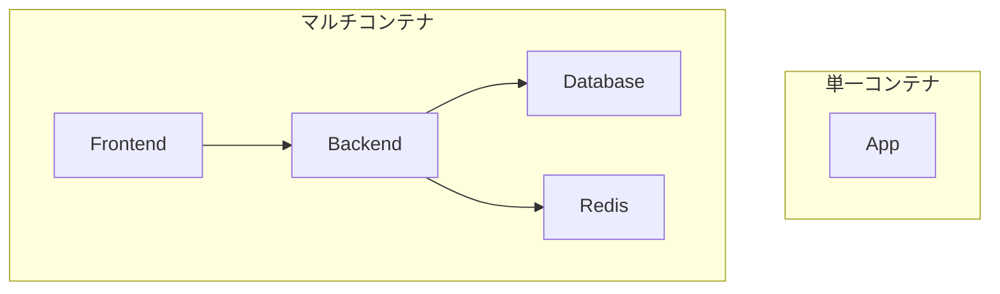
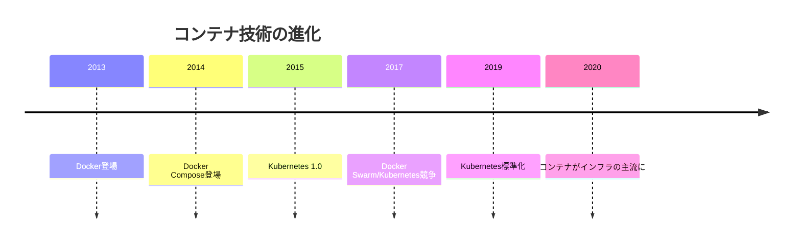

# 11. コンテナ発展 [選択]

## ⚠️ このカテゴリは選択コンテンツです

このカテゴリは**必須ではありません**。以下の場合に学習をおすすめします：

- インフラ基礎のDocker基礎を修了し、さらに深く学びたい
- 実務でDocker Composeやマルチコンテナ構成を使う予定がある
- DevOps/インフラエンジニアを目指している

## 概要

**学習日数**: 3-4日（選択）

Docker基礎で学んだ内容を発展させ、実践的なコンテナ運用を学びます。Docker Compose、マルチコンテナ構成、本番運用のベストプラクティスを習得します。

## 前提知識

- **必須**: [07. インフラ基礎](../07-infrastructure-basics/) を修了していること
- **推奨**: Webエンジニアコースのバックエンド開発を修了していること

## なぜ学ぶ必要があるのか

### この技術が解決する問題

実際のアプリケーションは複数のコンテナで構成されます：

- **複雑な構成の管理**: Web、API、DB、キャッシュ等を一元管理
- **環境の再現性**: 開発・ステージング・本番で同じ構成
- **スケーラビリティ**: コンテナ単位でのスケールアウト

### 実務での重要性

- **現代のインフラ標準**: Kubernetes、ECS等はコンテナが前提
- **CI/CDとの連携**: コンテナベースのデプロイパイプライン
- **マイクロサービス**: コンテナはマイクロサービスの基盤

## 技術の歴史的背景

- **2014年**: Docker Composeの前身「Fig」が登場
- **目的**: 複数コンテナの定義・管理を簡単に
- **現在**: Kubernetes等のオーケストレーションの基礎

## 学習内容

| No | コンテンツ | 難易度 | 内容 |
|----|------------|--------|------|
| 01 | [OS・プロセス基礎](11-container-advanced-01.md) | [中級] | プロセス、名前空間、cgroups |
| 02 | [仮想化技術理論](11-container-advanced-02.md) | [中級] | VM vs コンテナ、仮想化の仕組み |
| 03 | [Docker Compose基礎](11-container-advanced-03.md) | [中級] | compose.yaml、サービス定義 |
| 04 | [マルチコンテナ構成](11-container-advanced-04.md) | [中級] | ネットワーク、ボリューム、依存関係 |
| 05 | [本番運用のベストプラクティス](11-container-advanced-05.md) | [応用] | セキュリティ、最適化、ログ |

## 学習目標

このカテゴリを修了すると、以下ができるようになります：

- [ ] コンテナの仕組み（名前空間、cgroups）を説明できる
- [ ] Docker Composeで複数コンテナを管理できる
- [ ] マルチコンテナのネットワーク設計ができる
- [ ] 本番運用を意識したDockerfile/Composeを書ける

## 📝 理解度チェックテスト

[quiz.md](./quiz.md) - コンテンツを読んだ後に解いてください（15問、目安15分）

## 🔨 実践課題

[exercises/](./exercises/) - Docker Composeを使ったマルチコンテナ構成の実践

| 課題 | 難易度 | 内容 |
|------|:------:|------|
| [課題1](./exercises/exercise-01.md) | ⭐ | Docker Compose基礎 |
| [課題2](./exercises/exercise-02.md) | ⭐⭐ | マルチコンテナWebアプリ |
| [課題3](./exercises/exercise-03.md) | ⭐⭐⭐ | 本番運用を意識した構成 |

## 📚 参考リソース

- [Docker Compose公式ドキュメント](https://docs.docker.com/compose/)
- [Dockerfile ベストプラクティス](https://docs.docker.com/develop/develop-images/dockerfile_best-practices/)
- [12 Factor App](https://12factor.net/ja/)

---

**著作権表示**

Copyright © 2024 Honeycome Inc. All rights reserved.

本コンテンツは、Honeycome Inc.の所有物です。無断での複製、配布、転載を禁止します。
詳細は[利用規約](../../../docs/terms-of-use.md)をご覧ください。
