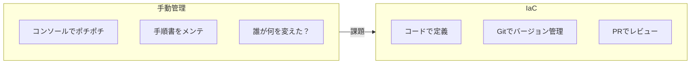
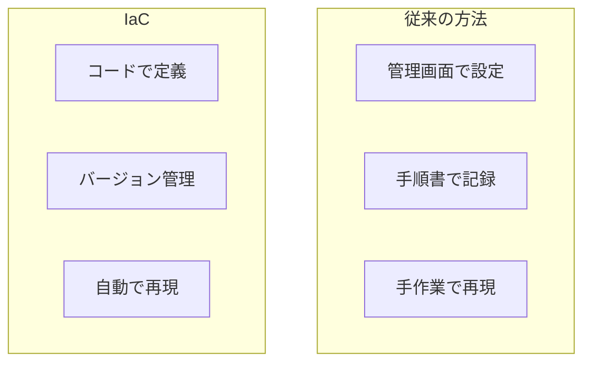
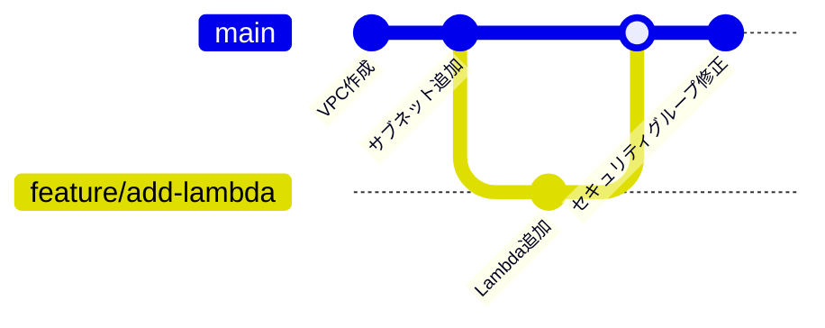
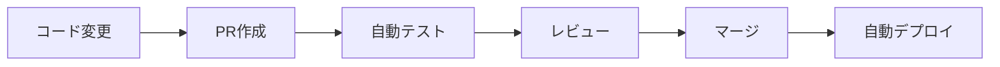
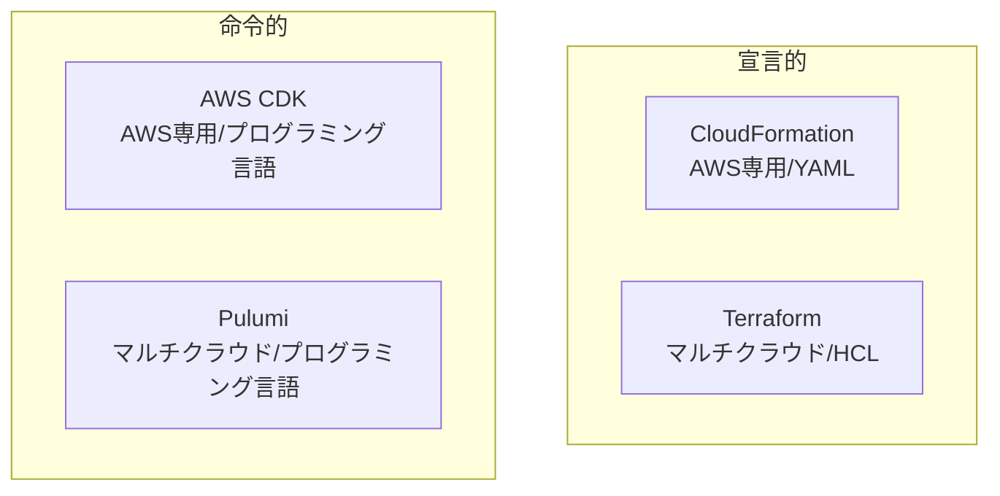
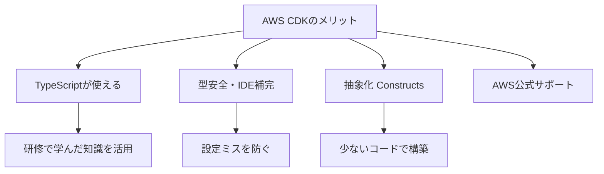
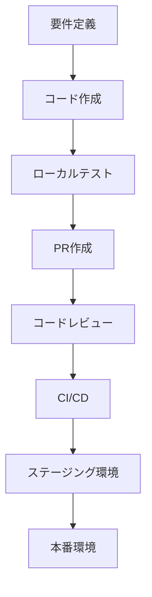

# IaCの概念と必要性

## 📋 概要

| 項目 | 内容 |
|------|------|
| 所要時間 | 45分 |
| 難易度 | [中級] |
| 前提知識 | インフラ基礎、クラウドの基本概念 |

## 🎯 なぜこれを学ぶのか

インフラをコードで管理することで、開発の生産性と信頼性が大きく向上します。



## 📚 学習内容

### 1. Infrastructure as Code（IaC）とは

#### 1.1 定義

**IaC** = インフラストラクチャの構成をコードとして定義・管理すること



#### 1.2 IaCが解決する問題

| 問題 | 従来 | IaC |
|------|------|-----|
| **再現性** | 手順書に依存、ミスが発生 | コードから何度でも同じ環境を構築 |
| **変更履歴** | 誰が何を変えたか不明 | Gitで全履歴を追跡 |
| **レビュー** | 変更後に気づく | PRで事前レビュー |
| **テスト** | 本番でしか確認できない | ステージング環境で検証 |
| **ドキュメント** | 手順書が古くなる | コード自体がドキュメント |

### 2. IaCのメリット

#### 2.1 バージョン管理



- すべての変更がGitに記録される
- いつでも過去の状態に戻せる
- 変更の理由がコミットメッセージに残る

#### 2.2 自動化



- CI/CDパイプラインと統合
- 手作業のミスを排除
- デプロイの高速化

#### 2.3 再利用性

```typescript
// 同じ構成を複数環境に適用
const devStack = new MyStack(app, 'Dev', { env: 'development' });
const prodStack = new MyStack(app, 'Prod', { env: 'production' });
```

### 3. IaCツールの比較

#### 3.1 主要なIaCツール



| ツール | 言語 | クラウド | 特徴 |
|--------|------|---------|------|
| **CloudFormation** | YAML/JSON | AWS | AWS公式、YAMLベース |
| **Terraform** | HCL | マルチ | 業界標準、独自言語 |
| **AWS CDK** | TypeScript等 | AWS | プログラミング言語、型安全 |
| **Pulumi** | TypeScript等 | マルチ | プログラミング言語、マルチクラウド |

#### 3.2 なぜAWS CDKを選ぶのか



### 4. 宣言的 vs 命令的

#### 4.1 宣言的アプローチ（What）

「何が欲しいか」を記述する

```yaml
# CloudFormation（宣言的）
Resources:
  MyBucket:
    Type: AWS::S3::Bucket
    Properties:
      BucketName: my-bucket
      VersioningConfiguration:
        Status: Enabled
```

#### 4.2 命令的アプローチ（How）

「どうやって作るか」を記述する

```typescript
// AWS CDK（命令的だが宣言的な記述も可能）
const bucket = new s3.Bucket(this, 'MyBucket', {
  bucketName: 'my-bucket',
  versioned: true,
});
```

#### 4.3 CDKの特徴：両方の良いとこ取り

```typescript
// プログラミング言語の力を使える（命令的）
for (let i = 0; i < 3; i++) {
  new s3.Bucket(this, `Bucket${i}`);
}

// でも最終的にはCloudFormation（宣言的）に変換
// → 冪等性（何度実行しても同じ結果）が保証される
```

### 5. IaCのワークフロー

#### 5.1 開発フロー



#### 5.2 CDKの基本コマンド

```bash
# プロジェクト作成
cdk init app --language typescript

# CloudFormationテンプレートを確認（デプロイしない）
cdk synth

# 差分を確認
cdk diff

# デプロイ
cdk deploy

# 削除
cdk destroy
```

### 6. IaCのベストプラクティス

#### 6.1 基本原則

| 原則 | 説明 |
|------|------|
| **バージョン管理** | すべてのコードをGitで管理 |
| **レビュー** | PRでチームレビュー |
| **環境分離** | dev/staging/prodを分離 |
| **シークレット管理** | コードに秘密情報を含めない |
| **テスト** | 可能な限り自動テスト |

#### 6.2 避けるべきこと

```typescript
// ❌ 悪い例：ハードコードされた値
const bucket = new s3.Bucket(this, 'Bucket', {
  bucketName: 'prod-my-app-bucket',  // 環境固有の値
});

// ✅ 良い例：パラメータ化
const bucket = new s3.Bucket(this, 'Bucket', {
  bucketName: `${props.environment}-my-app-bucket`,
});
```

## ✅ まとめ

| 概念 | 説明 |
|------|------|
| **IaC** | インフラをコードで定義・管理 |
| **メリット** | バージョン管理、自動化、再利用性 |
| **AWS CDK** | TypeScriptでAWSインフラを定義 |
| **ワークフロー** | コード → レビュー → デプロイ |

## 💬 考えてみよう

```
Q: 手動でインフラを管理すると、どんな問題が起きますか？
Q: IaCを導入するとチーム開発でどんなメリットがありますか？
Q: なぜAWS CDKはTypeScriptと相性が良いのですか？
```

## 🔗 次のコンテンツ

[AWS CDK基礎](12-iac-basics-02.md)に進んでください。

---

**著作権表示**

Copyright © 2024 Honeycome Inc. All rights reserved.

本コンテンツは、Honeycome Inc.の所有物です。無断での複製、配布、転載を禁止します。
詳細は[利用規約](../../docs/terms-of-use.md)をご覧ください。
