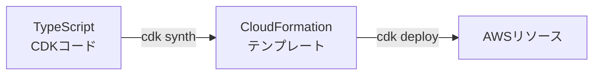
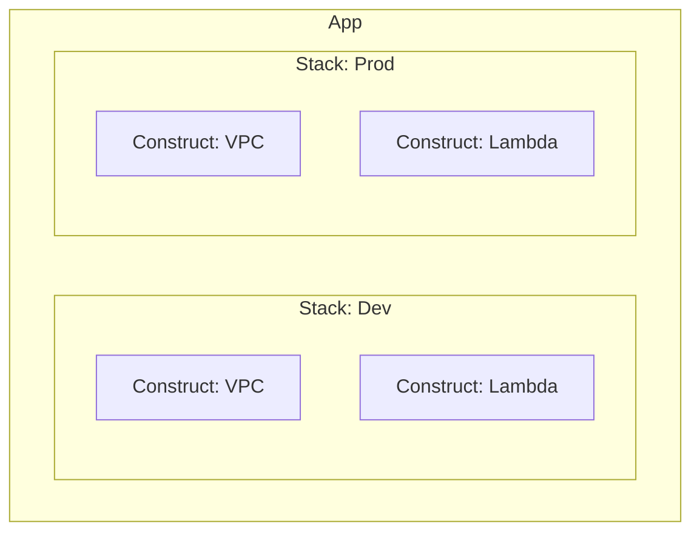
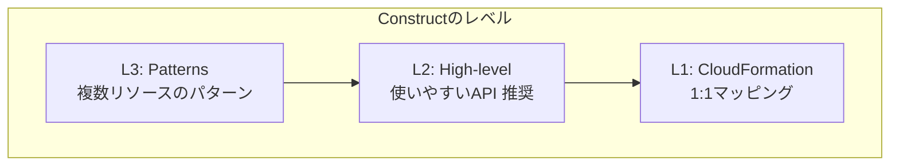

# AWS CDK基礎

## 📋 概要

| 項目 | 内容 |
|------|------|
| 所要時間 | 60分 |
| 難易度 | [中級] |
| 前提知識 | IaCの概念、TypeScript基礎 |

## 🎯 なぜこれを学ぶのか

AWS CDKを使うと、TypeScriptでAWSインフラを定義できます。

```typescript
// たった数行でS3バケットを作成
import * as s3 from 'aws-cdk-lib/aws-s3';

new s3.Bucket(this, 'MyBucket', {
  versioned: true,
});
```

## 📚 学習内容

### 1. AWS CDKの基本概念

#### 1.1 CDKの仕組み



- **CDKコード**: TypeScriptで書いたインフラ定義
- **CloudFormation**: AWSのIaCサービス（YAML/JSON）
- **Synth**: CDKコードをCloudFormationに変換
- **Deploy**: CloudFormationをAWSにデプロイ

#### 1.2 主要な概念



| 概念 | 説明 | 例 |
|------|------|-----|
| **App** | CDKアプリケーション全体 | プロジェクト |
| **Stack** | CloudFormationスタック | 環境ごと（dev/prod） |
| **Construct** | AWSリソースの抽象化 | S3、Lambda、VPC |

### 2. プロジェクトのセットアップ

#### 2.1 CDK CLIのインストール

```bash
# CDK CLIをインストール
npm install -g aws-cdk

# バージョン確認
cdk --version
```

#### 2.2 プロジェクト作成

```bash
# 新しいディレクトリを作成
mkdir my-cdk-app && cd my-cdk-app

# CDKプロジェクトを初期化
cdk init app --language typescript
```

#### 2.3 プロジェクト構造

```
my-cdk-app/
├── bin/
│   └── my-cdk-app.ts      # エントリーポイント
├── lib/
│   └── my-cdk-app-stack.ts # スタック定義
├── test/
│   └── my-cdk-app.test.ts  # テスト
├── cdk.json                # CDK設定
├── package.json
└── tsconfig.json
```

### 3. 基本的なスタックの作成

#### 3.1 エントリーポイント

```typescript
// bin/my-cdk-app.ts
import * as cdk from 'aws-cdk-lib';
import { MyCdkAppStack } from '../lib/my-cdk-app-stack';

const app = new cdk.App();

// スタックを作成
new MyCdkAppStack(app, 'MyCdkAppStack', {
  env: {
    account: process.env.CDK_DEFAULT_ACCOUNT,
    region: process.env.CDK_DEFAULT_REGION,
  },
});
```

#### 3.2 スタック定義

```typescript
// lib/my-cdk-app-stack.ts
import * as cdk from 'aws-cdk-lib';
import * as s3 from 'aws-cdk-lib/aws-s3';
import { Construct } from 'constructs';

export class MyCdkAppStack extends cdk.Stack {
  constructor(scope: Construct, id: string, props?: cdk.StackProps) {
    super(scope, id, props);

    // S3バケットを作成
    new s3.Bucket(this, 'MyBucket', {
      versioned: true,
      removalPolicy: cdk.RemovalPolicy.DESTROY,
      autoDeleteObjects: true,
    });
  }
}
```

### 4. Constructのレベル

#### 4.1 L1（Low-level）Constructs

CloudFormationリソースを直接扱う

```typescript
// L1: Cfn〜 で始まる
import * as s3 from 'aws-cdk-lib/aws-s3';

new s3.CfnBucket(this, 'MyBucket', {
  bucketName: 'my-bucket',
  versioningConfiguration: {
    status: 'Enabled',
  },
});
```

#### 4.2 L2（High-level）Constructs

より抽象化された、使いやすいAPI

```typescript
// L2: 推奨
import * as s3 from 'aws-cdk-lib/aws-s3';

new s3.Bucket(this, 'MyBucket', {
  versioned: true,  // シンプルなプロパティ
  encryption: s3.BucketEncryption.S3_MANAGED,
});
```

#### 4.3 L3（Patterns）Constructs

複数リソースをまとめたパターン

```typescript
// L3: 複数リソースをまとめて作成
import * as patterns from 'aws-cdk-lib/aws-ecs-patterns';

new patterns.ApplicationLoadBalancedFargateService(this, 'Service', {
  taskImageOptions: {
    image: ecs.ContainerImage.fromRegistry('nginx'),
  },
});
// → ALB + ECS + VPC + セキュリティグループなどを自動作成
```



### 5. よく使うリソース

#### 5.1 S3バケット

```typescript
import * as s3 from 'aws-cdk-lib/aws-s3';

const bucket = new s3.Bucket(this, 'Bucket', {
  bucketName: 'my-unique-bucket-name',
  versioned: true,
  encryption: s3.BucketEncryption.S3_MANAGED,
  blockPublicAccess: s3.BlockPublicAccess.BLOCK_ALL,
  removalPolicy: cdk.RemovalPolicy.RETAIN,
});
```

#### 5.2 Lambda関数

```typescript
import * as lambda from 'aws-cdk-lib/aws-lambda';
import * as path from 'path';

const fn = new lambda.Function(this, 'MyFunction', {
  runtime: lambda.Runtime.NODEJS_18_X,
  handler: 'index.handler',
  code: lambda.Code.fromAsset(path.join(__dirname, '../lambda')),
  environment: {
    BUCKET_NAME: bucket.bucketName,
  },
});

// バケットへの読み取り権限を付与
bucket.grantRead(fn);
```

#### 5.3 DynamoDB

```typescript
import * as dynamodb from 'aws-cdk-lib/aws-dynamodb';

const table = new dynamodb.Table(this, 'Table', {
  partitionKey: {
    name: 'id',
    type: dynamodb.AttributeType.STRING,
  },
  billingMode: dynamodb.BillingMode.PAY_PER_REQUEST,
  removalPolicy: cdk.RemovalPolicy.DESTROY,
});
```

### 6. CDKコマンド

#### 6.1 基本コマンド

```bash
# CloudFormationテンプレートを生成（デプロイしない）
cdk synth

# 現在の環境との差分を確認
cdk diff

# デプロイ
cdk deploy

# 全スタックをデプロイ
cdk deploy --all

# スタックを削除
cdk destroy
```

#### 6.2 便利なオプション

```bash
# 確認をスキップ
cdk deploy --require-approval never

# 出力を表示
cdk deploy --outputs-file outputs.json

# プロファイルを指定
cdk deploy --profile my-profile
```

### 7. ベストプラクティス

#### 7.1 環境の分離

```typescript
// bin/app.ts
const app = new cdk.App();

// 開発環境
new MyStack(app, 'Dev', {
  env: { account: '111111111111', region: 'ap-northeast-1' },
  environment: 'development',
});

// 本番環境
new MyStack(app, 'Prod', {
  env: { account: '222222222222', region: 'ap-northeast-1' },
  environment: 'production',
});
```

#### 7.2 パラメータ化

```typescript
interface MyStackProps extends cdk.StackProps {
  environment: string;
  bucketName: string;
}

export class MyStack extends cdk.Stack {
  constructor(scope: Construct, id: string, props: MyStackProps) {
    super(scope, id, props);

    new s3.Bucket(this, 'Bucket', {
      bucketName: `${props.environment}-${props.bucketName}`,
    });
  }
}
```

## ✅ まとめ

| 概念 | 説明 |
|------|------|
| **App** | CDKアプリケーション全体 |
| **Stack** | デプロイ単位（CloudFormationスタック） |
| **Construct** | AWSリソースの抽象化 |
| **L1/L2/L3** | 抽象化のレベル（L2推奨） |

## 💬 考えてみよう

```
Q: L2 Constructを使うメリットは何ですか？
Q: cdk synthとcdk deployの違いは何ですか？
Q: 環境ごとにスタックを分ける理由は何ですか？
```

## 🔗 次のコンテンツ

[AWS CDK実践](12-iac-basics-03.md)に進んでください。
