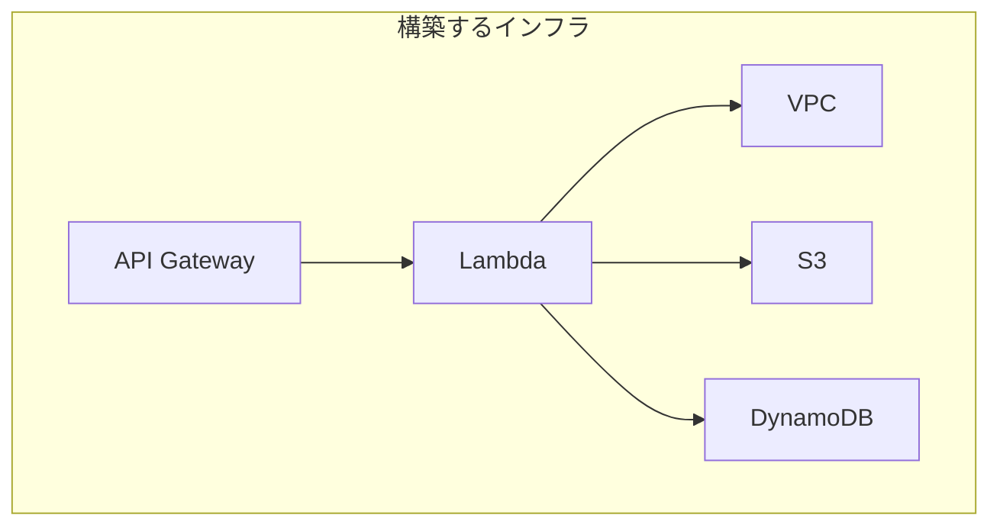
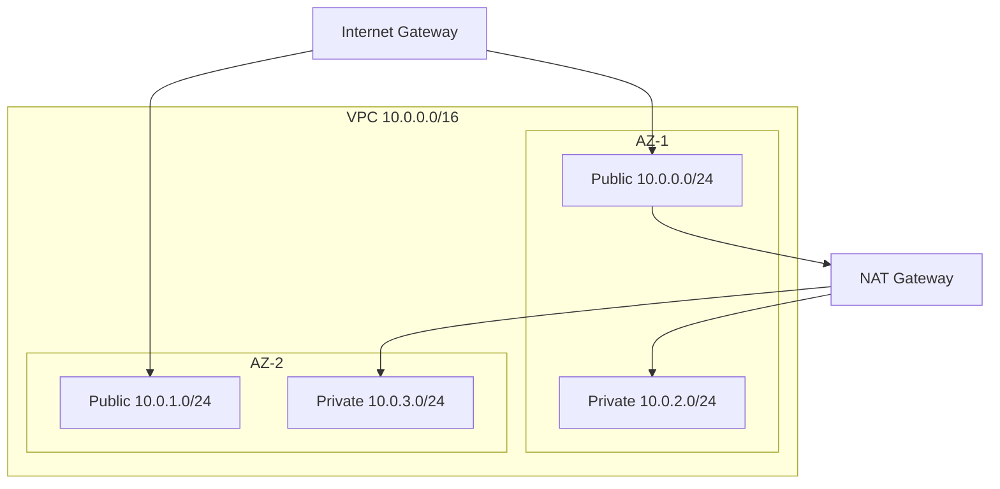
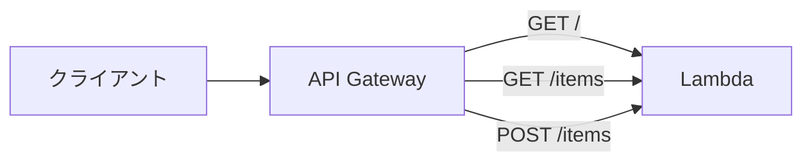

# AWS CDK実践

## 📋 概要

| 項目 | 内容 |
|------|------|
| 所要時間 | 90分 |
| 難易度 | [応用] |
| 前提知識 | AWS CDK基礎 |

## 🎯 なぜこれを学ぶのか

実際のアプリケーションに必要なインフラをCDKで構築します。



## 📚 学習内容

### 1. VPCの構築

#### 1.1 基本的なVPC

```typescript
import * as ec2 from 'aws-cdk-lib/aws-ec2';

// VPCを作成（サブネット自動作成）
const vpc = new ec2.Vpc(this, 'MyVpc', {
  maxAzs: 2,  // 2つのAZを使用
  natGateways: 1,  // NATゲートウェイは1つ（コスト削減）
});
```

#### 1.2 サブネット構成



```typescript
const vpc = new ec2.Vpc(this, 'MyVpc', {
  ipAddresses: ec2.IpAddresses.cidr('10.0.0.0/16'),
  maxAzs: 2,
  subnetConfiguration: [
    {
      name: 'Public',
      subnetType: ec2.SubnetType.PUBLIC,
      cidrMask: 24,
    },
    {
      name: 'Private',
      subnetType: ec2.SubnetType.PRIVATE_WITH_EGRESS,
      cidrMask: 24,
    },
  ],
});
```

### 2. Lambda関数の構築

#### 2.1 Node.js Lambda

```typescript
import * as lambda from 'aws-cdk-lib/aws-lambda';
import * as nodejs from 'aws-cdk-lib/aws-lambda-nodejs';
import * as path from 'path';

// esbuildでバンドルされるLambda（推奨）
const fn = new nodejs.NodejsFunction(this, 'MyFunction', {
  entry: path.join(__dirname, '../lambda/handler.ts'),
  handler: 'handler',
  runtime: lambda.Runtime.NODEJS_18_X,
  environment: {
    NODE_ENV: 'production',
  },
  timeout: cdk.Duration.seconds(30),
  memorySize: 256,
});
```

#### 2.2 Lambda関数のコード

```typescript
// lambda/handler.ts
import { APIGatewayProxyHandler } from 'aws-lambda';

export const handler: APIGatewayProxyHandler = async (event) => {
  console.log('Event:', JSON.stringify(event, null, 2));
  
  return {
    statusCode: 200,
    headers: {
      'Content-Type': 'application/json',
    },
    body: JSON.stringify({
      message: 'Hello from Lambda!',
      timestamp: new Date().toISOString(),
    }),
  };
};
```

### 3. API Gatewayの構築

#### 3.1 REST API

```typescript
import * as apigateway from 'aws-cdk-lib/aws-apigateway';

// REST APIを作成
const api = new apigateway.RestApi(this, 'MyApi', {
  restApiName: 'My Service',
  description: 'This is my API',
  deployOptions: {
    stageName: 'prod',
  },
});

// Lambda統合
const integration = new apigateway.LambdaIntegration(fn);

// ルートを追加
api.root.addMethod('GET', integration);

// /items リソースを追加
const items = api.root.addResource('items');
items.addMethod('GET', integration);
items.addMethod('POST', integration);
```

#### 3.2 API構成図



### 4. DynamoDBの構築

#### 4.1 テーブル作成

```typescript
import * as dynamodb from 'aws-cdk-lib/aws-dynamodb';

const table = new dynamodb.Table(this, 'ItemsTable', {
  tableName: 'Items',
  partitionKey: {
    name: 'id',
    type: dynamodb.AttributeType.STRING,
  },
  sortKey: {
    name: 'createdAt',
    type: dynamodb.AttributeType.STRING,
  },
  billingMode: dynamodb.BillingMode.PAY_PER_REQUEST,
  removalPolicy: cdk.RemovalPolicy.DESTROY,
});

// GSI（グローバルセカンダリインデックス）
table.addGlobalSecondaryIndex({
  indexName: 'byStatus',
  partitionKey: {
    name: 'status',
    type: dynamodb.AttributeType.STRING,
  },
});
```

#### 4.2 Lambdaからのアクセス

```typescript
// LambdaにDynamoDBへのアクセス権限を付与
table.grantReadWriteData(fn);

// 環境変数でテーブル名を渡す
fn.addEnvironment('TABLE_NAME', table.tableName);
```

### 5. 完全なスタック例

#### 5.1 サーバーレスAPIスタック

```typescript
// lib/serverless-api-stack.ts
import * as cdk from 'aws-cdk-lib';
import * as lambda from 'aws-cdk-lib/aws-lambda';
import * as nodejs from 'aws-cdk-lib/aws-lambda-nodejs';
import * as apigateway from 'aws-cdk-lib/aws-apigateway';
import * as dynamodb from 'aws-cdk-lib/aws-dynamodb';
import * as s3 from 'aws-cdk-lib/aws-s3';
import { Construct } from 'constructs';
import * as path from 'path';

interface ServerlessApiStackProps extends cdk.StackProps {
  environment: string;
}

export class ServerlessApiStack extends cdk.Stack {
  public readonly apiUrl: cdk.CfnOutput;

  constructor(scope: Construct, id: string, props: ServerlessApiStackProps) {
    super(scope, id, props);

    const { environment } = props;

    // ----------------------------------------
    // DynamoDB テーブル
    // ----------------------------------------
    const table = new dynamodb.Table(this, 'ItemsTable', {
      tableName: `${environment}-items`,
      partitionKey: {
        name: 'id',
        type: dynamodb.AttributeType.STRING,
      },
      billingMode: dynamodb.BillingMode.PAY_PER_REQUEST,
      removalPolicy: environment === 'production'
        ? cdk.RemovalPolicy.RETAIN
        : cdk.RemovalPolicy.DESTROY,
    });

    // ----------------------------------------
    // S3 バケット
    // ----------------------------------------
    const bucket = new s3.Bucket(this, 'AssetsBucket', {
      bucketName: `${environment}-assets-${this.account}`,
      encryption: s3.BucketEncryption.S3_MANAGED,
      blockPublicAccess: s3.BlockPublicAccess.BLOCK_ALL,
      removalPolicy: environment === 'production'
        ? cdk.RemovalPolicy.RETAIN
        : cdk.RemovalPolicy.DESTROY,
      autoDeleteObjects: environment !== 'production',
    });

    // ----------------------------------------
    // Lambda 関数
    // ----------------------------------------
    const apiHandler = new nodejs.NodejsFunction(this, 'ApiHandler', {
      entry: path.join(__dirname, '../lambda/api/handler.ts'),
      handler: 'handler',
      runtime: lambda.Runtime.NODEJS_18_X,
      environment: {
        TABLE_NAME: table.tableName,
        BUCKET_NAME: bucket.bucketName,
        ENVIRONMENT: environment,
      },
      timeout: cdk.Duration.seconds(30),
      memorySize: 256,
    });

    // 権限を付与
    table.grantReadWriteData(apiHandler);
    bucket.grantReadWrite(apiHandler);

    // ----------------------------------------
    // API Gateway
    // ----------------------------------------
    const api = new apigateway.RestApi(this, 'Api', {
      restApiName: `${environment}-api`,
      description: `${environment} API`,
      deployOptions: {
        stageName: environment,
      },
      defaultCorsPreflightOptions: {
        allowOrigins: apigateway.Cors.ALL_ORIGINS,
        allowMethods: apigateway.Cors.ALL_METHODS,
      },
    });

    const integration = new apigateway.LambdaIntegration(apiHandler);

    // ルート定義
    api.root.addMethod('GET', integration);

    const items = api.root.addResource('items');
    items.addMethod('GET', integration);
    items.addMethod('POST', integration);

    const item = items.addResource('{id}');
    item.addMethod('GET', integration);
    item.addMethod('PUT', integration);
    item.addMethod('DELETE', integration);

    // ----------------------------------------
    // 出力
    // ----------------------------------------
    this.apiUrl = new cdk.CfnOutput(this, 'ApiUrl', {
      value: api.url,
      description: 'API Gateway URL',
    });
  }
}
```

### 6. LocalStackでのテスト

#### 6.1 LocalStackとは

LocalStack = ローカルでAWSサービスをエミュレート

```bash
# LocalStackを起動
docker run -d --name localstack \
  -p 4566:4566 \
  -e SERVICES=s3,dynamodb,lambda,apigateway \
  localstack/localstack
```

#### 6.2 CDKでLocalStackを使う

```bash
# LocalStack用のCDKブートストラップ
cdklocal bootstrap

# LocalStackにデプロイ
cdklocal deploy
```

### 7. テスト

#### 7.1 スナップショットテスト

```typescript
// test/serverless-api.test.ts
import * as cdk from 'aws-cdk-lib';
import { Template } from 'aws-cdk-lib/assertions';
import { ServerlessApiStack } from '../lib/serverless-api-stack';

test('Snapshot test', () => {
  const app = new cdk.App();
  const stack = new ServerlessApiStack(app, 'TestStack', {
    environment: 'test',
  });

  const template = Template.fromStack(stack);
  expect(template.toJSON()).toMatchSnapshot();
});
```

#### 7.2 アサーションテスト

```typescript
test('DynamoDB table created', () => {
  const app = new cdk.App();
  const stack = new ServerlessApiStack(app, 'TestStack', {
    environment: 'test',
  });

  const template = Template.fromStack(stack);

  // DynamoDBテーブルが1つ作成されること
  template.resourceCountIs('AWS::DynamoDB::Table', 1);

  // テーブルの設定を確認
  template.hasResourceProperties('AWS::DynamoDB::Table', {
    BillingMode: 'PAY_PER_REQUEST',
  });
});
```

## ✅ まとめ

| リソース | CDK Construct |
|----------|--------------|
| VPC | `ec2.Vpc` |
| Lambda | `nodejs.NodejsFunction` |
| API Gateway | `apigateway.RestApi` |
| DynamoDB | `dynamodb.Table` |
| S3 | `s3.Bucket` |

## 💬 考えてみよう

```
Q: grantReadWriteData()を使うメリットは何ですか？
Q: 本番環境でRemovalPolicy.RETAINを使う理由は何ですか？
Q: LocalStackでテストするメリットは何ですか？
```

## 🔗 次のステップ

IaC入門カテゴリを修了しました！
次は[クラウド実践](../13-cloud-practice/)に進んで、実際のAWS環境での運用を学びましょう。

---

**著作権表示**

Copyright © 2024 Honeycome Inc. All rights reserved.

本コンテンツは、Honeycome Inc.の所有物です。無断での複製、配布、転載を禁止します。
詳細は[利用規約](../../docs/terms-of-use.md)をご覧ください。
