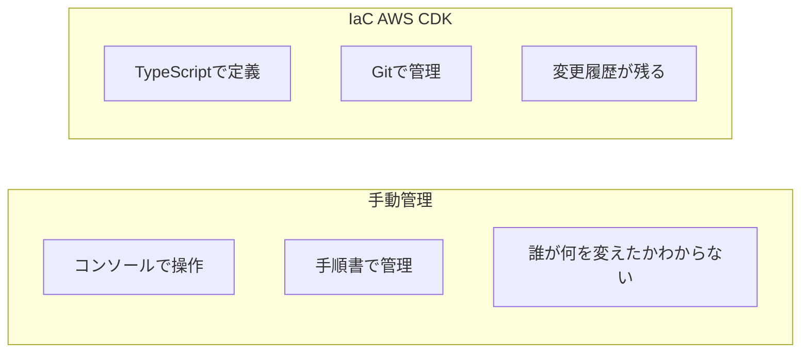
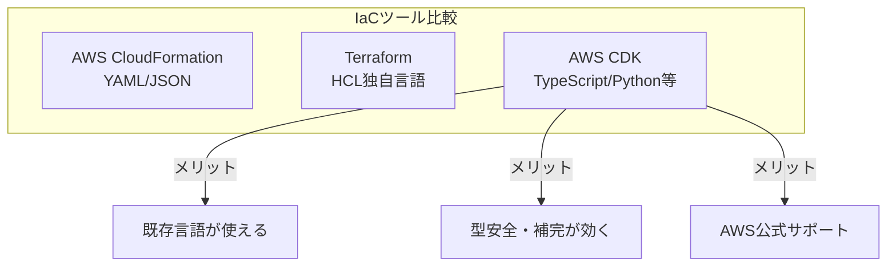
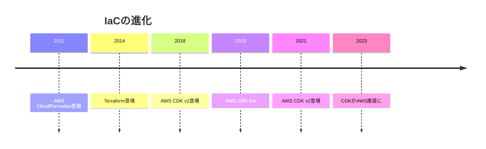

# 12. IaC入門（AWS CDK）[選択]

## ⚠️ このカテゴリは選択コンテンツです

このカテゴリは**必須ではありません**。以下の場合に学習をおすすめします：

- インフラをコードで管理したい
- AWSインフラの構築・運用に興味がある
- DevOps/SREエンジニアを目指している

## 概要

**学習日数**: 2-3日（選択）

Infrastructure as Code（IaC）の概念とAWS CDKの基礎を学びます。TypeScriptを使ってAWSインフラをコードで定義・管理する方法を習得します。

## 前提知識

- **必須**: [07. インフラ基礎](../07-infrastructure-basics/) を修了していること
- **必須**: [02. プログラミング基礎](../02-programming-fundamentals/) TypeScriptの基本
- **推奨**: AWSの基本概念を理解していること

## なぜ学ぶ必要があるのか

### この技術が解決する問題



手動管理の問題：

- **再現性がない**: 同じ環境を再構築できない
- **変更履歴がない**: 誰が何を変えたかわからない
- **ミスが起きやすい**: 手作業による設定ミス

IaC（AWS CDK）の利点：

- **再現性**: コードから何度でも同じ環境を構築
- **バージョン管理**: Gitで変更履歴を管理
- **レビュー**: インフラの変更もプルリクエストでレビュー
- **TypeScript**: 研修で学んだTypeScriptがそのまま使える

### なぜAWS CDKなのか



| ツール | 言語 | 学習コスト | 本研修との相性 |
|--------|------|-----------|---------------|
| CloudFormation | YAML/JSON | 中 | △ 新しい記法を学ぶ必要 |
| Terraform | HCL | 中 | △ 独自言語を学ぶ必要 |
| **AWS CDK** | **TypeScript** | **低** | **◎ 研修で学んだTSが使える** |

## 技術の歴史的背景



- **2018年**: AWSがCDKをリリース
- **特徴**: プログラミング言語でインフラを定義
- **利点**: 型安全、IDE補完、抽象化（Constructs）
- **現在**: AWSの公式推奨ツール

## 学習内容

| No | コンテンツ | 難易度 | 内容 |
|----|------------|--------|------|
| 01 | [IaCの概念と必要性](12-iac-basics-01.md) | [中級] | IaCとは、なぜ必要か |
| 02 | [AWS CDK基礎](12-iac-basics-02.md) | [中級] | CDKプロジェクト、スタック、Constructs |
| 03 | [AWS CDK実践](12-iac-basics-03.md) | [応用] | VPC、Lambda、S3の構築 |

## 学習目標

このカテゴリを修了すると、以下ができるようになります：

- [ ] IaCの概念と利点を説明できる
- [ ] AWS CDKのプロジェクト構造を理解している
- [ ] TypeScriptでAWSリソースを定義できる
- [ ] `cdk synth` / `cdk deploy` の流れを理解している

## AWS CDKの基本構造

```typescript
import * as cdk from 'aws-cdk-lib';
import * as s3 from 'aws-cdk-lib/aws-s3';

export class MyStack extends cdk.Stack {
  constructor(scope: cdk.App, id: string, props?: cdk.StackProps) {
    super(scope, id, props);

    // S3バケットを作成
    new s3.Bucket(this, 'MyBucket', {
      versioned: true,
      removalPolicy: cdk.RemovalPolicy.DESTROY,
    });
  }
}
```

**TypeScriptの知識がそのまま活かせます！**

## 費用に関する注意

> ⚠️ **注意**: AWS CDKでリソースを作成すると**費用が発生**する可能性があります。
> 
> 研修では以下の方法で学習します：
> - `cdk synth` でCloudFormationテンプレートを確認（デプロイしない）
> - LocalStackでローカル環境にデプロイ（無料）
> - 無料枠内のリソースのみを対象にする（S3、Lambda等）
> - 学習後は必ず `cdk destroy` でリソースを削除
>
> 学習後は必ず `cdk destroy` でリソースを削除してください。

## 📝 理解度チェックテスト

[quiz.md](./quiz.md) - コンテンツを読んだ後に解いてください（15問、目安15分）

## 🔨 実践課題

[exercises/](./exercises/) - AWS CDKでインフラをコード化する実践

| 課題 | 難易度 | 内容 |
|------|:------:|------|
| [課題1](./exercises/exercise-01.md) | ⭐ | CDKプロジェクト作成とS3バケット |
| [課題2](./exercises/exercise-02.md) | ⭐⭐ | Lambda + DynamoDB構成 |
| [課題3](./exercises/exercise-03.md) | ⭐⭐⭐ | サーバーレスAPI構築 |

## 📚 参考リソース

- [AWS CDK公式ドキュメント](https://docs.aws.amazon.com/cdk/v2/guide/home.html)
- [AWS CDK APIリファレンス](https://docs.aws.amazon.com/cdk/api/v2/)
- [CDK Workshop](https://cdkworkshop.com/) - 公式チュートリアル
- [LocalStack](https://localstack.cloud/) - ローカルAWSモック

---

**著作権表示**

Copyright © 2024 Honeycome Inc. All rights reserved.

本コンテンツは、Honeycome Inc.の所有物です。無断での複製、配布、転載を禁止します。
詳細は[利用規約](../../../docs/terms-of-use.md)をご覧ください。
