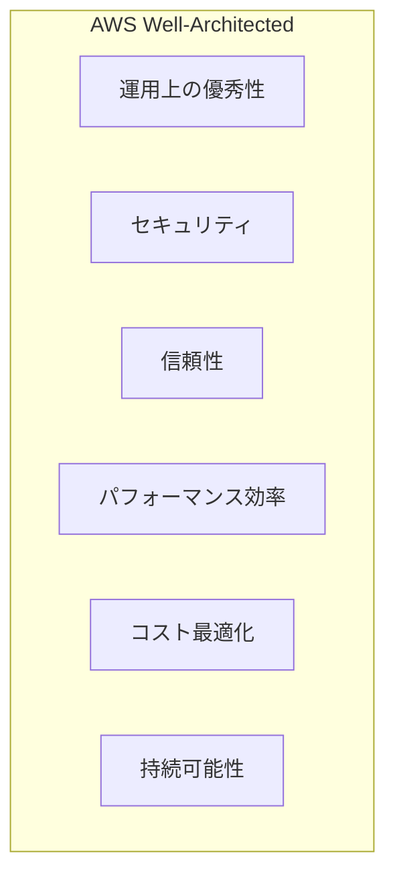
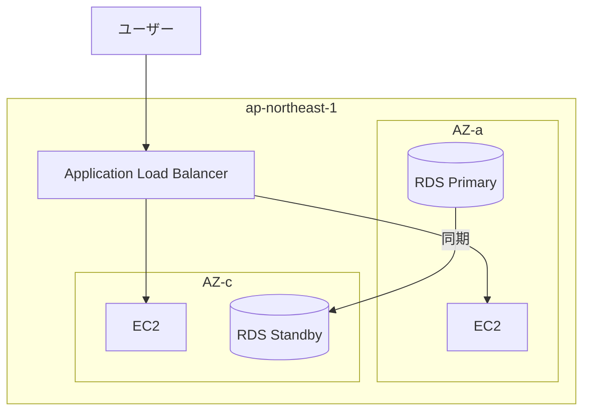
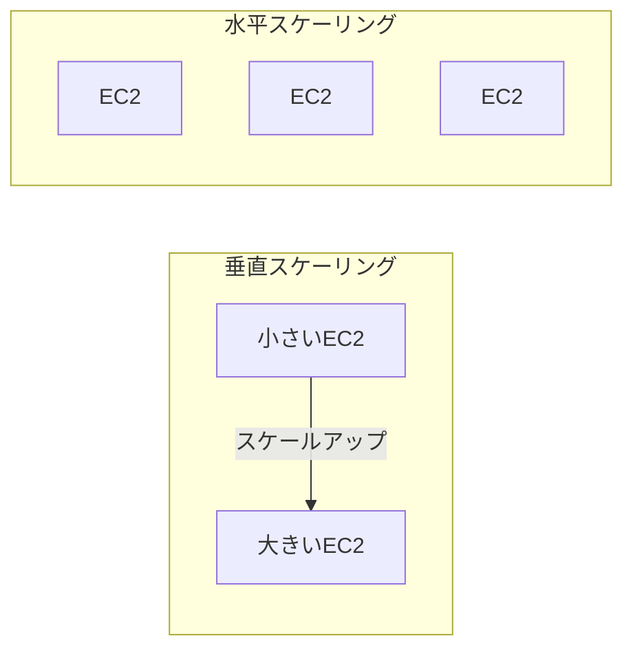
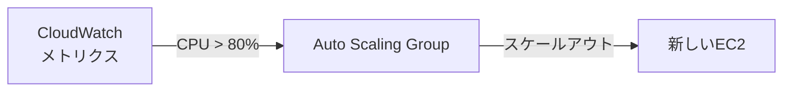
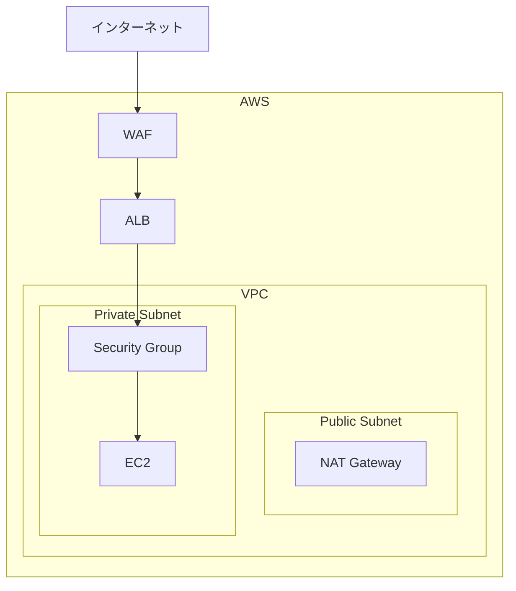
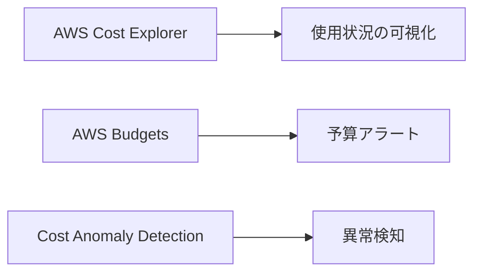
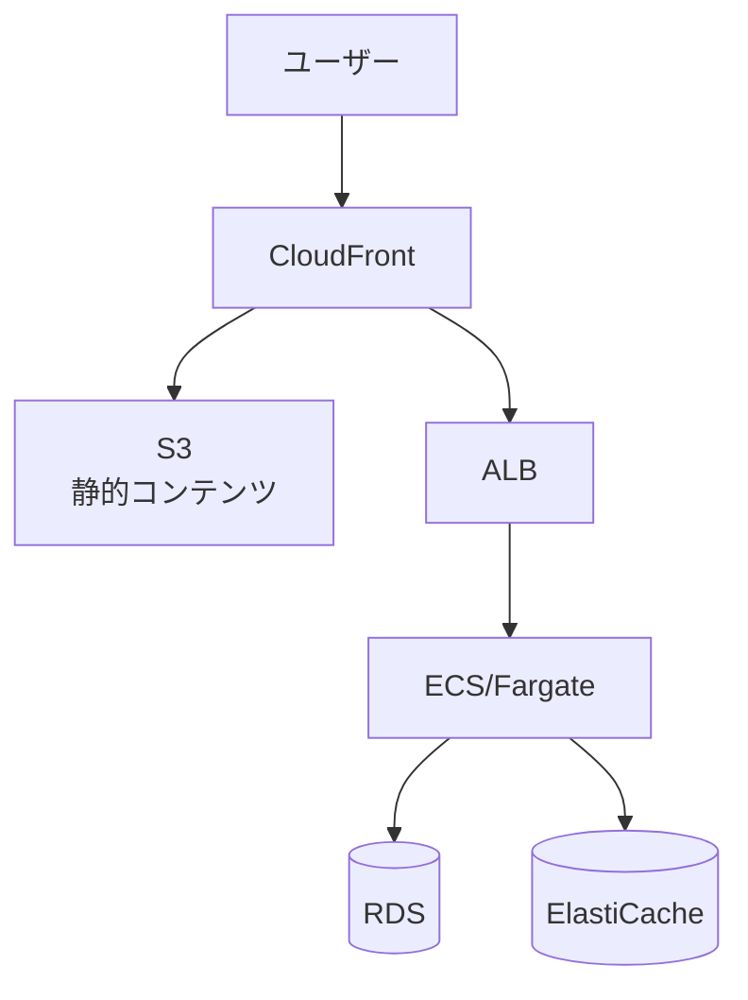
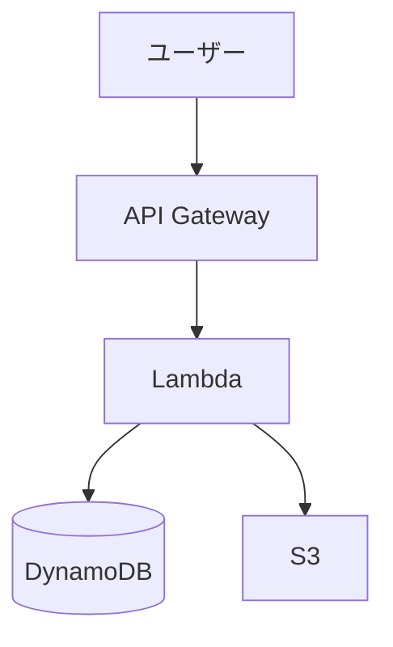

# クラウドアーキテクチャ

## 📋 概要

| 項目 | 内容 |
|------|------|
| 所要時間 | 45分 |
| 難易度 | [中級] |
| 前提知識 | インフラ基礎、AWS基本概念 |

## 🎯 なぜこれを学ぶのか

クラウドアーキテクチャの設計原則を学ぶことで、スケーラブルで信頼性の高いシステムを構築できます。



## 📚 学習内容

### 1. AWS Well-Architected Framework

#### 1.1 6つの柱

| 柱 | 説明 | 主な考慮点 |
|-----|------|-----------|
| **運用上の優秀性** | 運用の効率化 | 自動化、監視、継続的改善 |
| **セキュリティ** | 資産の保護 | 最小権限、暗号化、監査 |
| **信頼性** | 障害からの回復 | 冗長化、自動復旧、バックアップ |
| **パフォーマンス効率** | リソースの効率的利用 | 適切なサイズ、キャッシュ |
| **コスト最適化** | コストの管理 | 適正サイズ、予約、Spot |
| **持続可能性** | 環境への影響軽減 | 効率化、リージョン選択 |

### 2. 信頼性の設計

#### 2.1 マルチAZ構成



**マルチAZのメリット**:
- 1つのAZが障害になっても継続
- 自動フェイルオーバー
- ダウンタイムの最小化

#### 2.2 障害への対応

| レベル | 障害 | 対策 |
|--------|------|------|
| インスタンス | EC2障害 | Auto Scaling、ヘルスチェック |
| AZ | データセンター障害 | マルチAZ構成 |
| リージョン | 地域障害 | マルチリージョン（大規模サービス） |

### 3. スケーラビリティ

#### 3.1 水平スケーリング vs 垂直スケーリング



| 方式 | メリット | デメリット |
|------|---------|-----------|
| **垂直** | シンプル、アプリ変更不要 | 限界あり、ダウンタイム発生 |
| **水平** | 無限にスケール可能 | アプリの設計が必要 |

#### 3.2 Auto Scaling



### 4. セキュリティの設計

#### 4.1 多層防御



| レイヤー | サービス | 役割 |
|----------|---------|------|
| エッジ | WAF | SQLインジェクション等の防御 |
| ネットワーク | VPC、Security Group | ネットワーク分離、通信制御 |
| 認証 | IAM、Cognito | アクセス制御 |
| データ | KMS | 暗号化 |

#### 4.2 最小権限の原則

```json
{
  "Version": "2012-10-17",
  "Statement": [
    {
      "Effect": "Allow",
      "Action": [
        "s3:GetObject",
        "s3:PutObject"
      ],
      "Resource": "arn:aws:s3:::my-bucket/*"
    }
  ]
}
```

**ポイント**:
- 必要最小限の権限のみ付与
- `*` は避ける
- リソースを具体的に指定

### 5. コスト最適化

#### 5.1 EC2の料金モデル

| モデル | 割引 | ユースケース |
|--------|------|-------------|
| オンデマンド | なし | 短期、予測不能 |
| リザーブド | 最大72% | 長期、安定稼働 |
| Spot | 最大90% | 中断可能な処理 |
| Savings Plans | 最大72% | 柔軟なコミットメント |

#### 5.2 コスト管理ツール



### 6. 典型的なアーキテクチャ

#### 6.1 Webアプリケーション



#### 6.2 サーバーレスAPI



## ✅ まとめ

| 原則 | ポイント |
|------|---------|
| **信頼性** | マルチAZ、Auto Scaling |
| **セキュリティ** | 多層防御、最小権限 |
| **スケーラビリティ** | 水平スケーリング |
| **コスト** | 適切な料金モデル選択 |

## 💬 考えてみよう

```
Q: マルチAZとマルチリージョンの違いは何ですか？
Q: 水平スケーリングが適さないケースはありますか？
Q: コスト最適化で最初に取り組むべきことは何ですか？
```

## 🔗 次のコンテンツ

[ネットワーク設計](13-cloud-practice-02.md)に進んでください。

---

**著作権表示**

Copyright © 2024 Honeycome Inc. All rights reserved.

本コンテンツは、Honeycome Inc.の所有物です。無断での複製、配布、転載を禁止します。
詳細は[利用規約](../../docs/terms-of-use.md)をご覧ください。
