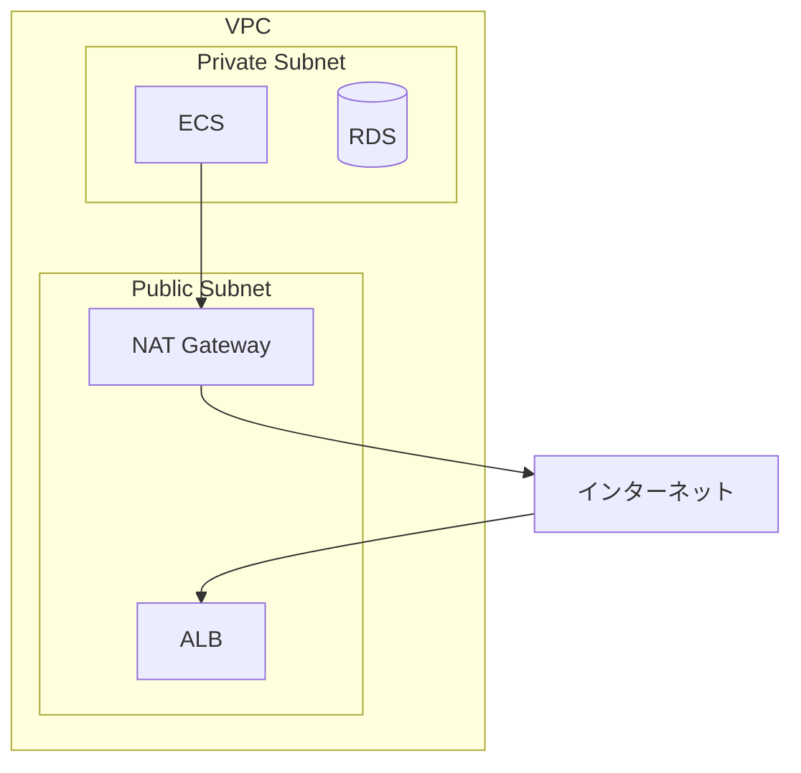
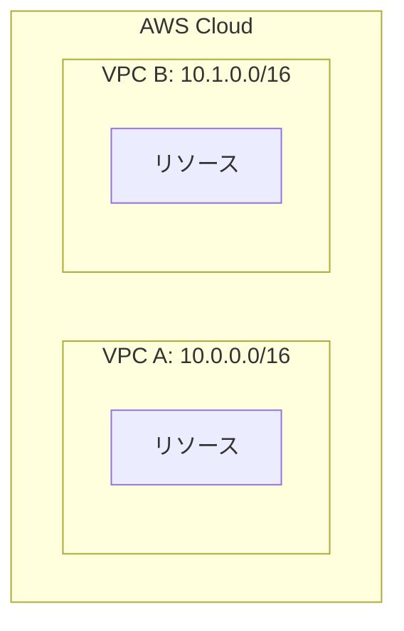
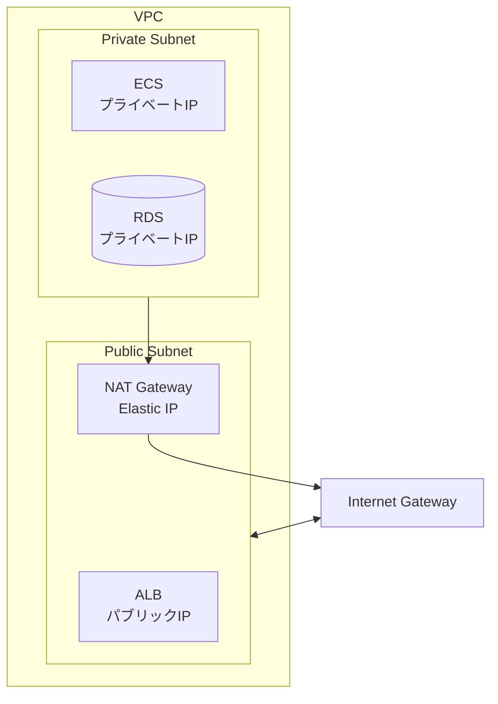
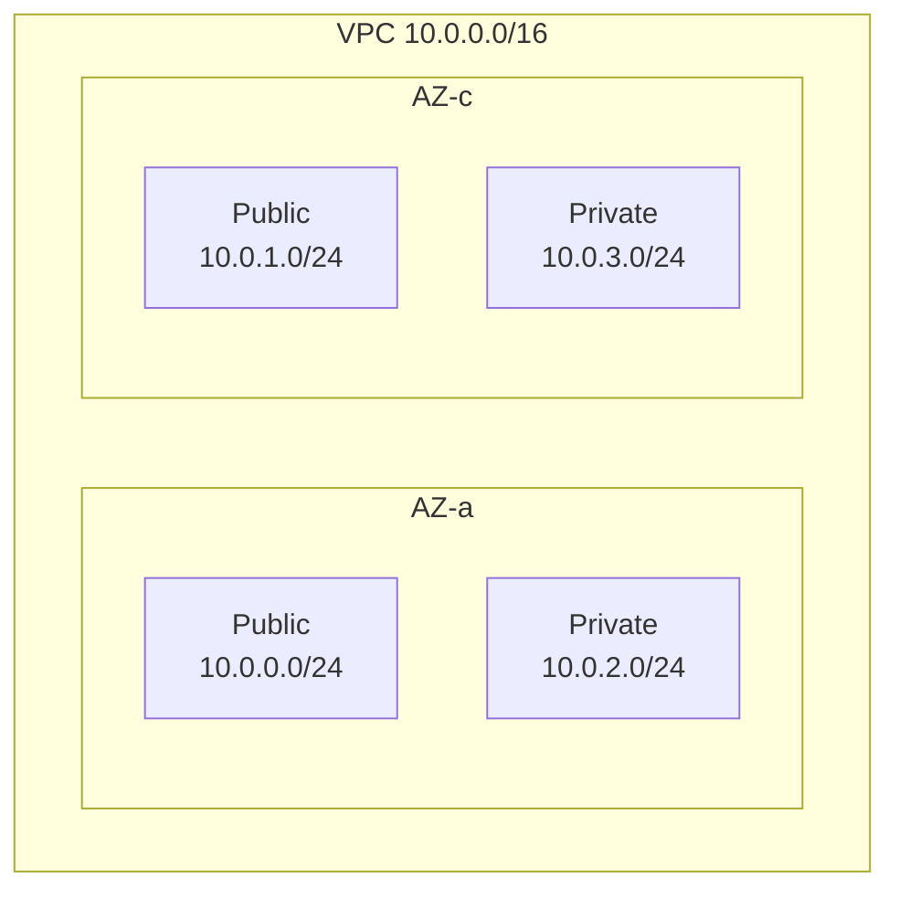
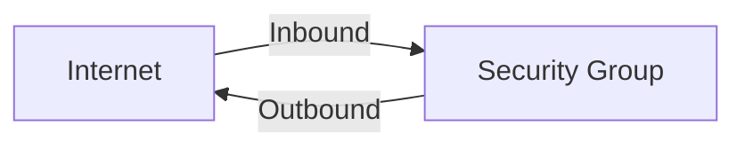
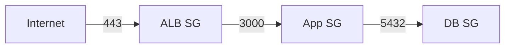
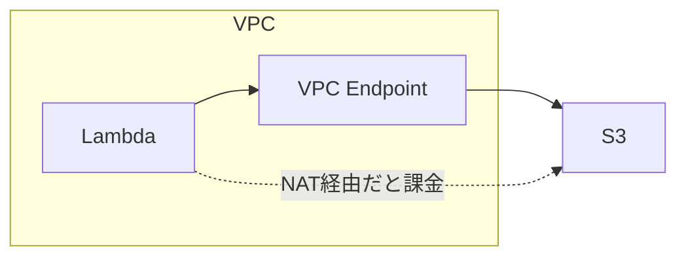
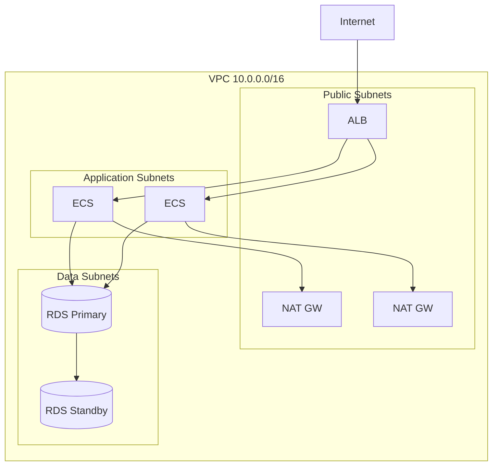

# ネットワーク設計

## 📋 概要

| 項目 | 内容 |
|------|------|
| 所要時間 | 60分 |
| 難易度 | [中級] |
| 前提知識 | クラウドアーキテクチャ、ネットワーク基礎 |

## 🎯 なぜこれを学ぶのか

AWSのネットワーク設計は、セキュリティとスケーラビリティの基盤です。



## 📚 学習内容

### 1. VPC（Virtual Private Cloud）

#### 1.1 VPCとは

**VPC** = AWS上の仮想ネットワーク



| コンポーネント | 説明 |
|---------------|------|
| **VPC** | 仮想ネットワーク、IPアドレス範囲を定義 |
| **サブネット** | VPC内のIPアドレス範囲のサブセット |
| **ルートテーブル** | トラフィックの転送先を定義 |
| **インターネットゲートウェイ** | インターネットとの接続点 |

#### 1.2 CIDRブロック

```
10.0.0.0/16 = 65,536個のIPアドレス
├── 10.0.0.0/24 = 256個（Public Subnet AZ-a）
├── 10.0.1.0/24 = 256個（Public Subnet AZ-c）
├── 10.0.2.0/24 = 256個（Private Subnet AZ-a）
└── 10.0.3.0/24 = 256個（Private Subnet AZ-c）
```

### 2. サブネット設計

#### 2.1 Public vs Private サブネット



| 種類 | インターネットアクセス | 用途 |
|------|----------------------|------|
| **Public** | 双方向（IGW経由） | ALB、踏み台サーバー |
| **Private** | 外向きのみ（NAT経由） | アプリサーバー、DB |
| **Isolated** | なし | 機密データ |

#### 2.2 マルチAZ設計



### 3. セキュリティグループ

#### 3.1 セキュリティグループとは

**セキュリティグループ** = 仮想ファイアウォール（ステートフル）



#### 3.2 ルール設計

```
# ALB用セキュリティグループ
Inbound:
  - HTTP (80) from 0.0.0.0/0
  - HTTPS (443) from 0.0.0.0/0

# アプリサーバー用セキュリティグループ
Inbound:
  - Custom TCP (3000) from ALB-SG

# データベース用セキュリティグループ
Inbound:
  - PostgreSQL (5432) from App-SG
```

#### 3.3 チェーン構成



### 4. ルートテーブル

#### 4.1 Publicサブネットのルートテーブル

```
Destination     Target
10.0.0.0/16     local
0.0.0.0/0       igw-xxxxx  ← インターネットゲートウェイ
```

#### 4.2 Privateサブネットのルートテーブル

```
Destination     Target
10.0.0.0/16     local
0.0.0.0/0       nat-xxxxx  ← NATゲートウェイ
```

### 5. VPCエンドポイント

#### 5.1 VPCエンドポイントとは

**VPCエンドポイント** = AWSサービスへのプライベート接続



#### 5.2 エンドポイントの種類

| 種類 | 対象 | 料金 |
|------|------|------|
| **Gateway** | S3, DynamoDB | 無料 |
| **Interface** | その他のサービス | 有料 |

### 6. 実践：VPC設計

#### 6.1 標準的な設計パターン



#### 6.2 CDKでのVPC定義

```typescript
import * as ec2 from 'aws-cdk-lib/aws-ec2';

const vpc = new ec2.Vpc(this, 'MyVpc', {
  ipAddresses: ec2.IpAddresses.cidr('10.0.0.0/16'),
  maxAzs: 2,
  natGateways: 2,
  subnetConfiguration: [
    {
      name: 'Public',
      subnetType: ec2.SubnetType.PUBLIC,
      cidrMask: 24,
    },
    {
      name: 'Application',
      subnetType: ec2.SubnetType.PRIVATE_WITH_EGRESS,
      cidrMask: 24,
    },
    {
      name: 'Database',
      subnetType: ec2.SubnetType.PRIVATE_ISOLATED,
      cidrMask: 24,
    },
  ],
});

// S3のVPCエンドポイント（無料）
vpc.addGatewayEndpoint('S3Endpoint', {
  service: ec2.GatewayVpcEndpointAwsService.S3,
});
```

## ✅ まとめ

| コンポーネント | 役割 |
|---------------|------|
| **VPC** | 仮想ネットワーク |
| **サブネット** | ネットワークの分割（Public/Private） |
| **セキュリティグループ** | 通信の許可/拒否 |
| **ルートテーブル** | トラフィックの経路 |
| **VPCエンドポイント** | AWSサービスへのプライベート接続 |

## 💬 考えてみよう

```
Q: データベースをPrivateサブネットに置く理由は何ですか？
Q: NATゲートウェイのコストを削減する方法は？
Q: セキュリティグループとネットワークACLの違いは何ですか？
```

## 🔗 次のコンテンツ

[ECS/Fargate基礎](13-cloud-practice-03.md)に進んでください。
