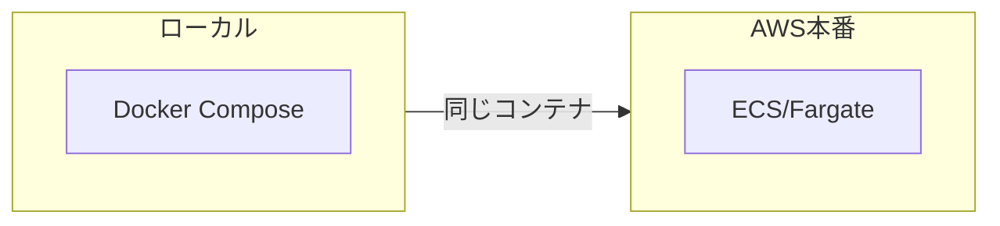
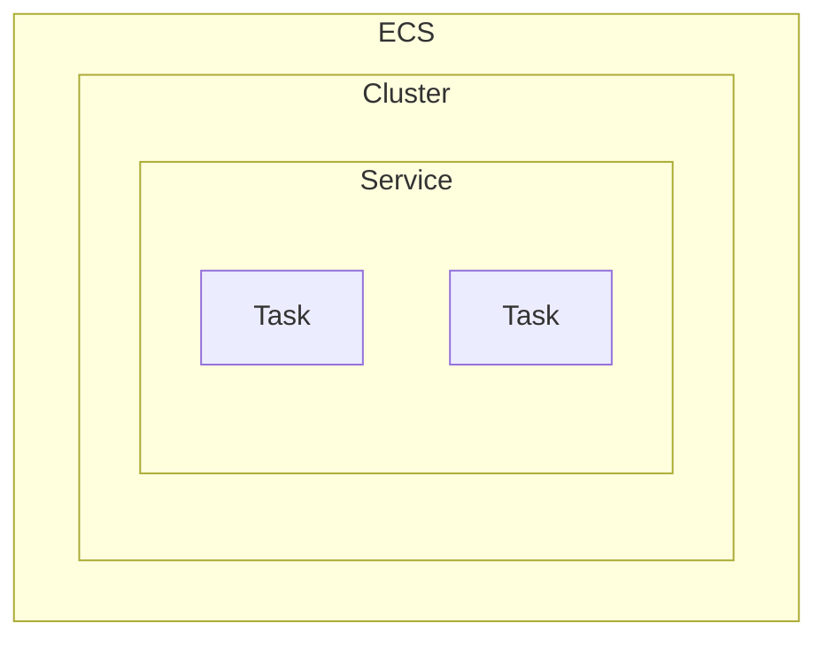
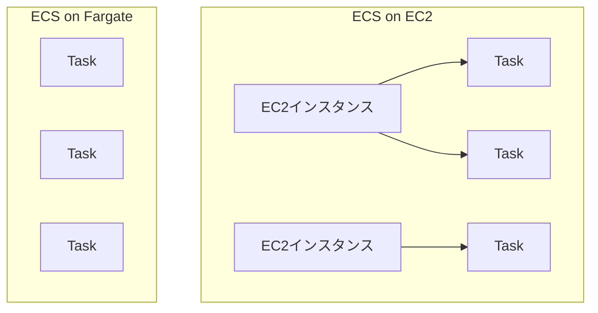
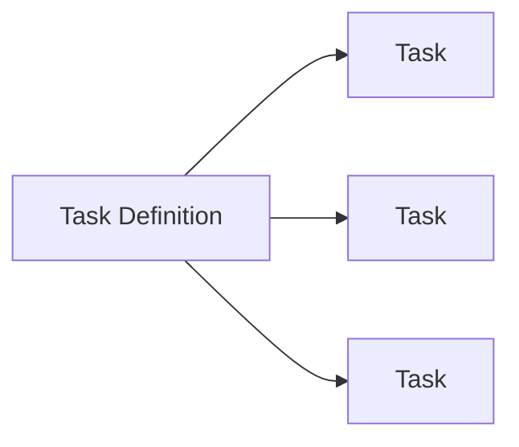
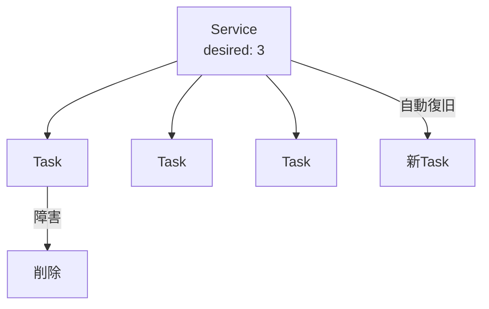
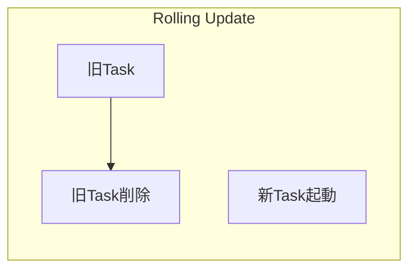
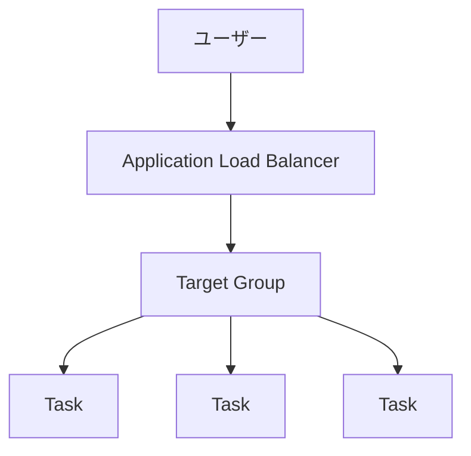
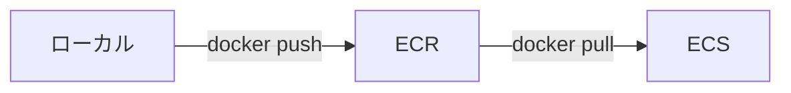

# ECS/Fargate基礎

## 📋 概要

| 項目 | 内容 |
|------|------|
| 所要時間 | 60分 |
| 難易度 | [中級] |
| 前提知識 | Docker基礎、ネットワーク設計 |

## 🎯 なぜこれを学ぶのか

ECS/Fargateを使うと、サーバー管理なしでコンテナを本番運用できます。



## 📚 学習内容

### 1. ECSの概念

#### 1.1 ECSとは

**ECS**（Elastic Container Service）= AWSのコンテナオーケストレーションサービス



| 概念 | 説明 |
|------|------|
| **Cluster** | コンテナを実行する論理的なグループ |
| **Service** | タスクの数を維持・管理 |
| **Task** | 実行中のコンテナ（1つ以上） |
| **Task Definition** | タスクの設定（イメージ、CPU、メモリ等） |

#### 1.2 EC2 vs Fargate



| 項目 | EC2 | Fargate |
|------|-----|---------|
| **サーバー管理** | 必要 | 不要 |
| **スケーリング** | インスタンス単位 | タスク単位 |
| **料金** | インスタンス料金 | CPU/メモリ使用量 |
| **カスタマイズ** | 高い | 低い |

### 2. タスク定義

#### 2.1 タスク定義とは



**タスク定義** = コンテナの設計図

#### 2.2 タスク定義の構成

```json
{
  "family": "my-app",
  "networkMode": "awsvpc",
  "requiresCompatibilities": ["FARGATE"],
  "cpu": "256",
  "memory": "512",
  "containerDefinitions": [
    {
      "name": "app",
      "image": "123456789012.dkr.ecr.ap-northeast-1.amazonaws.com/my-app:latest",
      "portMappings": [
        {
          "containerPort": 3000,
          "protocol": "tcp"
        }
      ],
      "environment": [
        {
          "name": "NODE_ENV",
          "value": "production"
        }
      ],
      "logConfiguration": {
        "logDriver": "awslogs",
        "options": {
          "awslogs-group": "/ecs/my-app",
          "awslogs-region": "ap-northeast-1",
          "awslogs-stream-prefix": "ecs"
        }
      }
    }
  ]
}
```

#### 2.3 Fargateのサイズ

| vCPU | メモリ（GB） |
|------|-------------|
| 0.25 | 0.5, 1, 2 |
| 0.5 | 1, 2, 3, 4 |
| 1 | 2, 3, 4, 5, 6, 7, 8 |
| 2 | 4 〜 16 |
| 4 | 8 〜 30 |

### 3. サービス

#### 3.1 サービスの役割



**サービス**が行うこと：
- 指定した数のタスクを維持
- 障害時の自動復旧
- ロードバランサーとの連携
- デプロイメント管理

#### 3.2 デプロイ戦略



| 戦略 | 説明 |
|------|------|
| **Rolling Update** | 徐々に入れ替え（デフォルト） |
| **Blue/Green** | 新環境を作って切り替え |

### 4. ALBとの連携

#### 4.1 アーキテクチャ



#### 4.2 ヘルスチェック

```
ALB → /health → Task
       200 OK → 正常
       5xx    → 異常 → タスク置換
```

### 5. ECR（Elastic Container Registry）

#### 5.1 ECRとは

**ECR** = AWSのコンテナレジストリ（Docker Hubの代わり）



#### 5.2 イメージのプッシュ

```bash
# ECRにログイン
aws ecr get-login-password --region ap-northeast-1 | \
  docker login --username AWS --password-stdin 123456789012.dkr.ecr.ap-northeast-1.amazonaws.com

# イメージをビルド
docker build -t my-app .

# タグ付け
docker tag my-app:latest 123456789012.dkr.ecr.ap-northeast-1.amazonaws.com/my-app:latest

# プッシュ
docker push 123456789012.dkr.ecr.ap-northeast-1.amazonaws.com/my-app:latest
```

### 6. CDKでのECS構築

#### 6.1 Fargateサービス

```typescript
import * as ecs from 'aws-cdk-lib/aws-ecs';
import * as ecsPatterns from 'aws-cdk-lib/aws-ecs-patterns';

// クラスター
const cluster = new ecs.Cluster(this, 'Cluster', {
  vpc,
});

// ALB + Fargateサービス（L3 Construct）
const service = new ecsPatterns.ApplicationLoadBalancedFargateService(
  this,
  'Service',
  {
    cluster,
    taskImageOptions: {
      image: ecs.ContainerImage.fromEcrRepository(repository),
      containerPort: 3000,
      environment: {
        NODE_ENV: 'production',
      },
    },
    desiredCount: 2,
    cpu: 256,
    memoryLimitMiB: 512,
    publicLoadBalancer: true,
  }
);

// ヘルスチェック設定
service.targetGroup.configureHealthCheck({
  path: '/health',
  healthyHttpCodes: '200',
});

// Auto Scaling
const scaling = service.service.autoScaleTaskCount({
  minCapacity: 2,
  maxCapacity: 10,
});

scaling.scaleOnCpuUtilization('CpuScaling', {
  targetUtilizationPercent: 70,
});
```

## ✅ まとめ

| 概念 | 説明 |
|------|------|
| **ECS** | コンテナオーケストレーション |
| **Fargate** | サーバーレスコンテナ実行 |
| **Task Definition** | コンテナの設計図 |
| **Service** | タスクの維持・管理 |
| **ECR** | コンテナイメージの保存 |

## 💬 考えてみよう

```
Q: FargateとEC2、どちらを選ぶべきですか？
Q: タスクのCPU/メモリはどう決めますか？
Q: Rolling Updateのデメリットは何ですか？
```

## 🔗 次のコンテンツ

[本番運用](13-cloud-practice-04.md)に進んでください。
