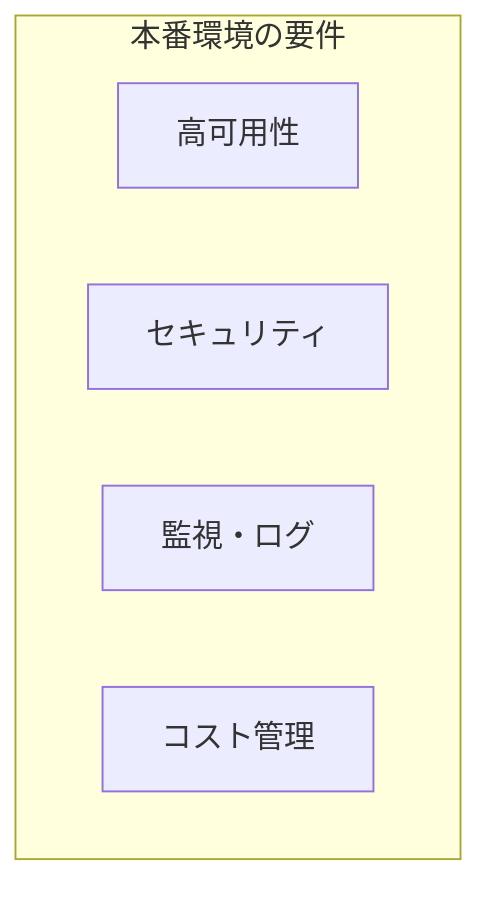
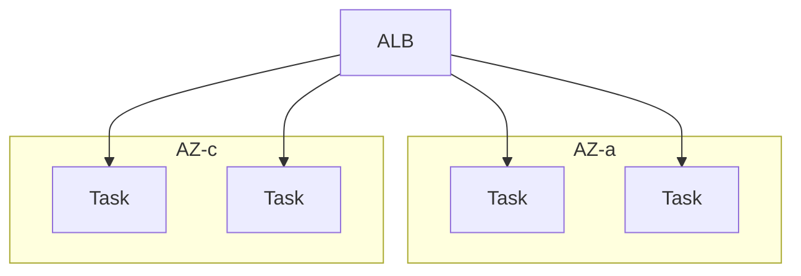
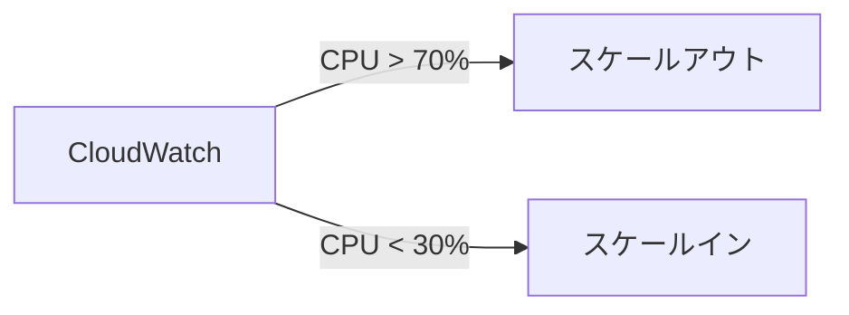
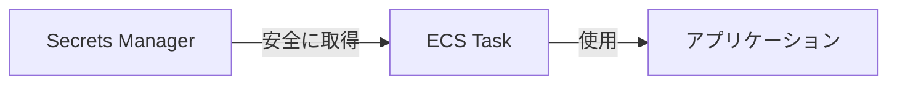
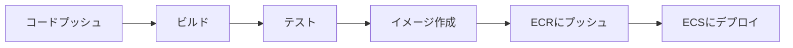

# 本番運用

## 📋 概要

| 項目 | 内容 |
|------|------|
| 所要時間 | 60分 |
| 難易度 | [応用] |
| 前提知識 | ECS/Fargate基礎 |

## 🎯 なぜこれを学ぶのか

本番環境では、可用性・セキュリティ・運用効率を考慮した設計が必要です。



## 📚 学習内容

### 1. 高可用性の実現

#### 1.1 マルチAZ構成



```typescript
// CDKでマルチAZ構成
const service = new ecsPatterns.ApplicationLoadBalancedFargateService(
  this,
  'Service',
  {
    cluster,
    taskImageOptions: { /* ... */ },
    desiredCount: 4,  // 複数タスク
    // サブネットは自動的にマルチAZに分散
  }
);
```

#### 1.2 Auto Scaling



```typescript
const scaling = service.service.autoScaleTaskCount({
  minCapacity: 2,
  maxCapacity: 20,
});

// CPU使用率でスケーリング
scaling.scaleOnCpuUtilization('CpuScaling', {
  targetUtilizationPercent: 70,
  scaleInCooldown: cdk.Duration.seconds(60),
  scaleOutCooldown: cdk.Duration.seconds(60),
});

// リクエスト数でスケーリング
scaling.scaleOnRequestCount('RequestScaling', {
  requestsPerTarget: 1000,
  targetGroup: service.targetGroup,
});
```

### 2. セキュリティ

#### 2.1 シークレット管理



```typescript
import * as secretsmanager from 'aws-cdk-lib/aws-secretsmanager';

// シークレットを作成
const dbSecret = new secretsmanager.Secret(this, 'DbSecret', {
  secretName: 'prod/db/credentials',
  generateSecretString: {
    secretStringTemplate: JSON.stringify({ username: 'admin' }),
    generateStringKey: 'password',
    excludePunctuation: true,
  },
});

// タスク定義でシークレットを参照
const taskDefinition = new ecs.FargateTaskDefinition(this, 'TaskDef');

taskDefinition.addContainer('app', {
  image: ecs.ContainerImage.fromEcrRepository(repository),
  secrets: {
    DB_PASSWORD: ecs.Secret.fromSecretsManager(dbSecret, 'password'),
  },
});
```

#### 2.2 IAMロール

```typescript
// タスク実行ロール（ECRからのプル、CloudWatch Logsへの書き込み）
// → CDKが自動で作成

// タスクロール（アプリケーションが使用）
const taskRole = new iam.Role(this, 'TaskRole', {
  assumedBy: new iam.ServicePrincipal('ecs-tasks.amazonaws.com'),
});

// 必要な権限のみ付与
bucket.grantRead(taskRole);
table.grantReadWriteData(taskRole);
```

### 3. ログと監視

#### 3.1 CloudWatch Logs

```typescript
const logGroup = new logs.LogGroup(this, 'LogGroup', {
  logGroupName: '/ecs/my-app',
  retention: logs.RetentionDays.ONE_MONTH,
  removalPolicy: cdk.RemovalPolicy.DESTROY,
});

taskDefinition.addContainer('app', {
  image: ecs.ContainerImage.fromEcrRepository(repository),
  logging: ecs.LogDrivers.awsLogs({
    logGroup,
    streamPrefix: 'app',
  }),
});
```

#### 3.2 アラーム設定

```typescript
import * as cloudwatch from 'aws-cdk-lib/aws-cloudwatch';
import * as actions from 'aws-cdk-lib/aws-cloudwatch-actions';
import * as sns from 'aws-cdk-lib/aws-sns';

// SNSトピック
const alertTopic = new sns.Topic(this, 'AlertTopic');

// CPU使用率アラーム
new cloudwatch.Alarm(this, 'HighCpuAlarm', {
  metric: service.service.metricCpuUtilization(),
  threshold: 80,
  evaluationPeriods: 3,
  alarmDescription: 'CPU使用率が80%を超えています',
}).addAlarmAction(new actions.SnsAction(alertTopic));

// エラー率アラーム
new cloudwatch.Alarm(this, 'HighErrorRateAlarm', {
  metric: service.targetGroup.metrics.httpCodeTarget(
    elb.HttpCodeTarget.TARGET_5XX_COUNT
  ),
  threshold: 10,
  evaluationPeriods: 2,
  alarmDescription: '5xxエラーが多発しています',
}).addAlarmAction(new actions.SnsAction(alertTopic));
```

### 4. CI/CDパイプライン

#### 4.1 デプロイフロー



#### 4.2 GitHub Actions例

```yaml
name: Deploy to ECS

on:
  push:
    branches: [main]

jobs:
  deploy:
    runs-on: ubuntu-latest
    steps:
      - uses: actions/checkout@v4

      - name: Configure AWS credentials
        uses: aws-actions/configure-aws-credentials@v4
        with:
          aws-access-key-id: ${{ secrets.AWS_ACCESS_KEY_ID }}
          aws-secret-access-key: ${{ secrets.AWS_SECRET_ACCESS_KEY }}
          aws-region: ap-northeast-1

      - name: Login to Amazon ECR
        id: login-ecr
        uses: aws-actions/amazon-ecr-login@v2

      - name: Build and push image
        env:
          ECR_REGISTRY: ${{ steps.login-ecr.outputs.registry }}
          IMAGE_TAG: ${{ github.sha }}
        run: |
          docker build -t $ECR_REGISTRY/my-app:$IMAGE_TAG .
          docker push $ECR_REGISTRY/my-app:$IMAGE_TAG

      - name: Deploy to ECS
        run: |
          aws ecs update-service \
            --cluster my-cluster \
            --service my-service \
            --force-new-deployment
```

### 5. コスト最適化

#### 5.1 Fargateのコスト

```
月額コスト = (vCPU単価 × vCPU数 + メモリ単価 × GB数) × 時間

例：0.25 vCPU, 0.5 GB, 2タスク, 24時間365日
= ($0.05056 × 0.25 + $0.00553 × 0.5) × 2 × 24 × 365
≈ $250/月
```

#### 5.2 コスト削減のポイント

| 方法 | 効果 |
|------|------|
| **適切なサイズ選択** | 過剰なリソースを避ける |
| **Savings Plans** | 最大50%オフ |
| **スポットFargate** | 最大70%オフ（中断あり） |
| **Auto Scaling** | 不要な時間帯はスケールダウン |

```typescript
// Fargateスポット（開発環境向け）
const service = new ecsPatterns.ApplicationLoadBalancedFargateService(
  this,
  'Service',
  {
    cluster,
    taskImageOptions: { /* ... */ },
    capacityProviderStrategies: [
      {
        capacityProvider: 'FARGATE_SPOT',
        weight: 1,
      },
    ],
  }
);
```

### 6. 本番チェックリスト

```markdown
## 可用性
- [ ] マルチAZ構成
- [ ] Auto Scaling設定
- [ ] ヘルスチェック設定
- [ ] 最小タスク数 >= 2

## セキュリティ
- [ ] シークレットはSecrets Manager/Parameter Store
- [ ] 最小権限のIAMロール
- [ ] セキュリティグループの適切な設定
- [ ] Private Subnetでの実行

## 監視
- [ ] CloudWatch Logsの設定
- [ ] アラーム設定（CPU、メモリ、エラー率）
- [ ] ダッシュボード作成

## デプロイ
- [ ] CI/CDパイプライン構築
- [ ] Blue/Green or Rolling Update
- [ ] ロールバック手順の確認

## コスト
- [ ] リソースサイズの適正化
- [ ] 不要なリソースの削除
- [ ] コストアラートの設定
```

## ✅ まとめ

| カテゴリ | ポイント |
|----------|---------|
| **可用性** | マルチAZ、Auto Scaling |
| **セキュリティ** | Secrets Manager、最小権限 |
| **監視** | CloudWatch、アラーム |
| **CI/CD** | 自動デプロイパイプライン |
| **コスト** | 適切なサイズ、Savings Plans |

## 💬 考えてみよう

```
Q: 本番環境で最低限必要なタスク数はいくつですか？
Q: シークレットを環境変数に直接書いてはいけない理由は？
Q: どのメトリクスにアラームを設定すべきですか？
```

## 🔗 次のステップ

クラウド実践カテゴリを修了しました！
次は[監視と運用](../14-monitoring-operations/)に進んで、本番サービスの監視方法を学びましょう。
