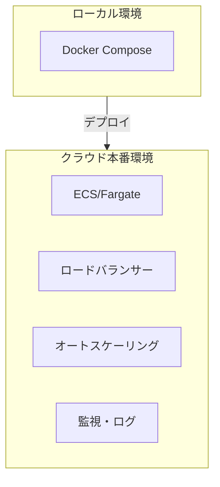
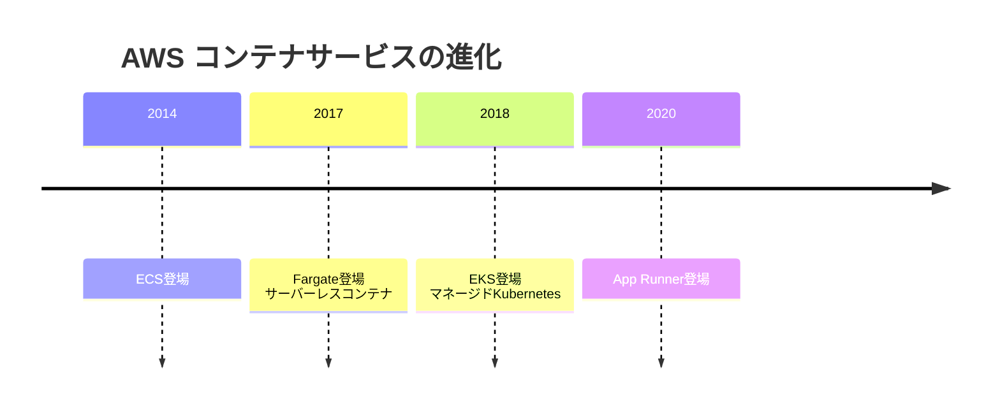

# 13. クラウド実践 [選択]

## ⚠️ このカテゴリは選択コンテンツです

このカテゴリは**必須ではありません**。以下の場合に学習をおすすめします：

- クラウドでの本番運用を学びたい
- コンテナオーケストレーション（ECS/Fargate）に興味がある
- インフラエンジニア/SREを目指している

## 概要

**学習日数**: 3-4日（選択）

AWSを中心としたクラウドの実践的な使い方を学びます。基礎で学んだ概念を実際のサービスに適用し、コンテナオーケストレーションまで習得します。

## 前提知識

- **必須**: [07. インフラ基礎](../07-infrastructure-basics/) を修了していること
- **推奨**: [11. コンテナ発展](../11-container-advanced/) を修了していること

## なぜ学ぶ必要があるのか

### この技術が解決する問題

ローカルから本番へ：

- **スケーラビリティ**: 負荷に応じた自動スケール
- **可用性**: 複数AZでの冗長構成
- **運用**: ログ収集、監視、アラート

### 実務での重要性

- **クラウドは標準**: ほとんどのサービスがクラウド上で動作
- **コンテナ運用**: Kubernetes/ECSでのコンテナ管理が主流
- **インフラコスト**: 適切な設計でコストを最適化

## 技術の歴史的背景

- **2017年**: AWS Fargateリリース
- **特徴**: サーバー管理不要のコンテナ実行
- **利点**: インフラ管理の負荷を大幅削減

## 学習内容

| No | コンテンツ | 難易度 | 内容 |
|----|------------|--------|------|
| 01 | [クラウドアーキテクチャ](13-cloud-practice-01.md) | [中級] | Well-Architected、設計原則 |
| 02 | [ネットワーク設計](13-cloud-practice-02.md) | [中級] | VPC、サブネット、セキュリティグループ |
| 03 | [ECS/Fargate基礎](13-cloud-practice-03.md) | [中級] | タスク定義、サービス、クラスター |
| 04 | [本番運用](13-cloud-practice-04.md) | [応用] | ロードバランサー、オートスケーリング |

## 学習目標

このカテゴリを修了すると、以下ができるようになります：

- [ ] クラウドアーキテクチャの設計原則を説明できる
- [ ] VPC、サブネットの基本設計ができる
- [ ] ECS/Fargateでコンテナをデプロイできる
- [ ] ロードバランサーとオートスケーリングを設定できる

## 費用に関する注意

> ⚠️ **重要**: AWSリソースを作成すると**費用が発生**します。
> 
> 研修では以下の対策を取ります：
> - 無料枠内での学習を優先
> - 学習後は必ずリソースを削除
> - 予算アラートを設定
> - LocalStackでのローカル学習を推奨
>
> 学習後は必ずリソースを削除し、予算アラートを設定してください。

## 📝 理解度チェックテスト

[quiz.md](./quiz.md) - コンテンツを読んだ後に解いてください（15問、目安15分）

## 🔨 実践課題

[exercises/](./exercises/) - AWSでのクラウドインフラ構築の実践

| 課題 | 難易度 | 内容 | 環境 |
|------|:------:|------|:----:|
| [課題1](./exercises/exercise-01.md) | ⭐ | VPC設計（CDK） | LocalStack |
| [課題2](./exercises/exercise-02.md) | ⭐⭐ | ECS/Fargateローカル実行 | Docker |
| [課題3](./exercises/exercise-03.md) | ⭐⭐⭐ | 本番デプロイ | AWS |

## 📚 参考リソース

- [AWS Well-Architected Framework](https://aws.amazon.com/jp/architecture/well-architected/)
- [Amazon ECS ドキュメント](https://docs.aws.amazon.com/ja_jp/ecs/)
- [AWS Fargate](https://aws.amazon.com/jp/fargate/)
