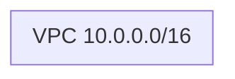

# 課題1: VPC設計（CDK）

## 📋 概要

| 項目 | 内容 |
|------|------|
| 難易度 | ⭐ |
| 所要時間 | 45分 |
| 前提知識 | AWS CDK基礎 |
| 環境 | LocalStack |

## 🎯 目標

本番運用を意識したVPC構成をCDKで設計・構築する。

## 📝 課題内容

### 設計要件

以下の要件を満たすVPCを設計してください。

```
CIDR: 10.0.0.0/16
リージョン: ap-northeast-1
AZ: 2つ（ap-northeast-1a, ap-northeast-1c）
```

### サブネット構成

| サブネット | CIDR | 用途 | インターネットアクセス |
|-----------|------|------|---------------------|
| Public AZ-a | 10.0.0.0/24 | ALB, NAT GW | 双方向（IGW） |
| Public AZ-c | 10.0.1.0/24 | ALB, NAT GW | 双方向（IGW） |
| Private AZ-a | 10.0.10.0/24 | ECS/Fargate | 外向きのみ（NAT） |
| Private AZ-c | 10.0.11.0/24 | ECS/Fargate | 外向きのみ（NAT） |
| Isolated AZ-a | 10.0.20.0/24 | RDS | なし |
| Isolated AZ-c | 10.0.21.0/24 | RDS | なし |

### Step 1: アーキテクチャ図の作成

まず、Mermaidでアーキテクチャ図を作成してください。

**architecture.md**:
```markdown
# VPCアーキテクチャ

## 構成図



## 設計意図

- なぜこのサブネット構成にしたか
- 各サブネットの役割
```

### Step 2: CDKでVPCを実装

```typescript
// lib/vpc-stack.ts
import * as cdk from 'aws-cdk-lib';
import * as ec2 from 'aws-cdk-lib/aws-ec2';
import { Construct } from 'constructs';

export class VpcStack extends cdk.Stack {
  public readonly vpc: ec2.Vpc;

  constructor(scope: Construct, id: string, props?: cdk.StackProps) {
    super(scope, id, props);

    // VPCを実装してください
    this.vpc = new ec2.Vpc(this, 'Vpc', {
      // 要件に従って設定
    });
  }
}
```

### Step 3: セキュリティグループの設計

以下のセキュリティグループを作成:

| 名前 | 用途 | インバウンド |
|------|------|-------------|
| ALB-SG | ロードバランサー | 80, 443 from 0.0.0.0/0 |
| App-SG | アプリケーション | 3000 from ALB-SG |
| DB-SG | データベース | 5432 from App-SG |

```typescript
// セキュリティグループの実装
const albSg = new ec2.SecurityGroup(this, 'AlbSg', {
  vpc: this.vpc,
  description: 'Security group for ALB',
});

albSg.addIngressRule(
  ec2.Peer.anyIpv4(),
  ec2.Port.tcp(80),
  'Allow HTTP'
);

// App-SG, DB-SG も実装してください
```

### Step 4: VPCエンドポイントの追加

以下のVPCエンドポイントを追加:

| エンドポイント | 種類 | 理由 |
|---------------|------|------|
| S3 | Gateway | 無料、ECRイメージ取得 |
| ECR API | Interface | ECRへのAPI呼び出し |
| ECR DKR | Interface | Dockerイメージのプル |
| CloudWatch Logs | Interface | ログ送信 |

```typescript
// S3エンドポイント（Gateway型、無料）
vpc.addGatewayEndpoint('S3Endpoint', {
  service: ec2.GatewayVpcEndpointAwsService.S3,
});

// Interfaceエンドポイントも追加してください
```

### Step 5: デプロイと確認

```bash
# デプロイ
cdklocal deploy

# VPC確認
aws --endpoint-url=http://localhost:4566 ec2 describe-vpcs

# サブネット確認
aws --endpoint-url=http://localhost:4566 ec2 describe-subnets
```

## ✅ 完了条件

- [ ] アーキテクチャ図が作成されている
- [ ] 6つのサブネット（Public×2, Private×2, Isolated×2）が作成されている
- [ ] セキュリティグループが適切に設定されている
- [ ] VPCエンドポイントが設定されている
- [ ] 設計意図がドキュメント化されている

## 💡 ヒント

<details>
<summary>VPCの基本設定</summary>

```typescript
const vpc = new ec2.Vpc(this, 'Vpc', {
  ipAddresses: ec2.IpAddresses.cidr('10.0.0.0/16'),
  maxAzs: 2,
  natGateways: 1,  // コスト削減のため1つ
  subnetConfiguration: [
    {
      name: 'Public',
      subnetType: ec2.SubnetType.PUBLIC,
      cidrMask: 24,
    },
    {
      name: 'Private',
      subnetType: ec2.SubnetType.PRIVATE_WITH_EGRESS,
      cidrMask: 24,
    },
    {
      name: 'Isolated',
      subnetType: ec2.SubnetType.PRIVATE_ISOLATED,
      cidrMask: 24,
    },
  ],
});
```

</details>

## 📤 提出物

- `exercise-01/lib/vpc-stack.ts`
- `exercise-01/architecture.md`（Mermaid図と設計意図）
- デプロイ結果のスクリーンショット

## 🔗 参考

- [ネットワーク設計](../13-cloud-practice-02.md)
