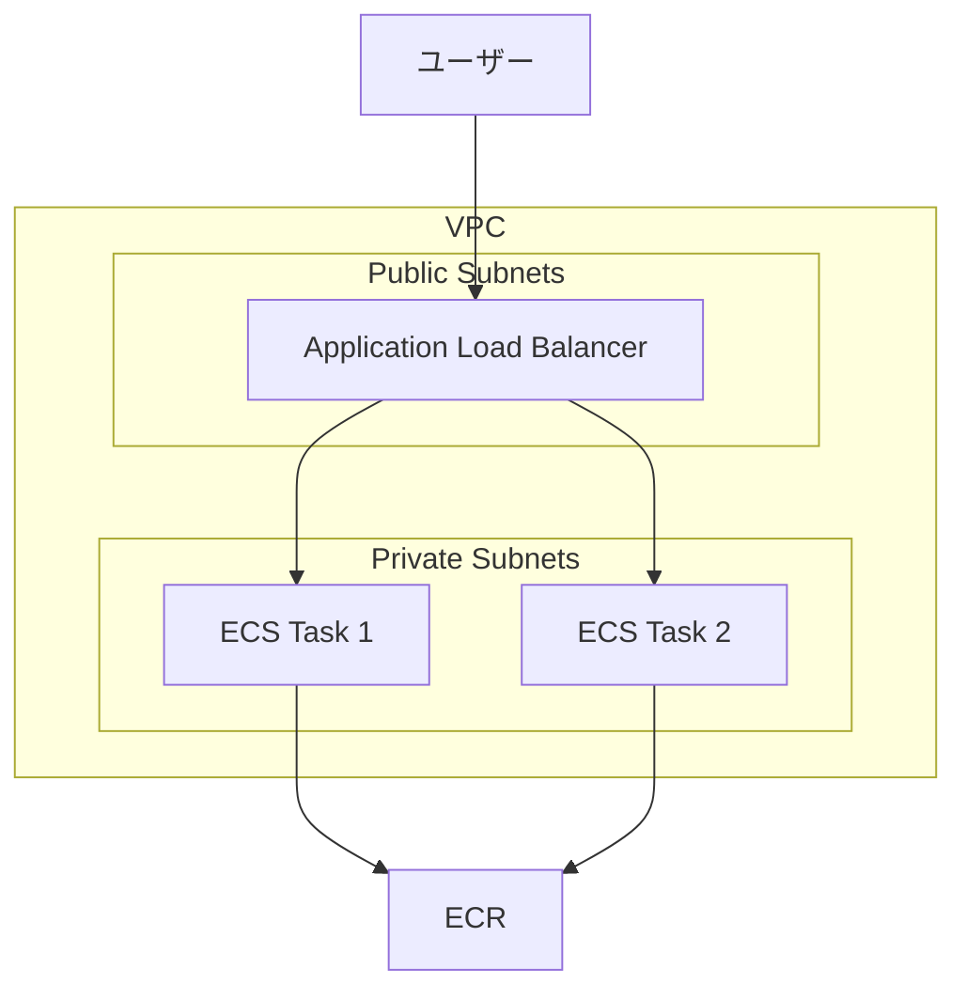

# 課題3: 本番デプロイ

## 📋 概要

| 項目 | 内容 |
|------|------|
| 難易度 | ⭐⭐⭐ |
| 所要時間 | 120分 |
| 前提知識 | VPC設計、ECS/Fargate |
| 環境 | **AWS（費用発生の可能性あり）** |

> ⚠️ **重要**: この課題は実際のAWSを使用します。費用が発生する可能性があるため、学習後は必ずリソースを削除してください。

## 🎯 目標

課題1・2で準備した構成を、実際のAWS環境にデプロイする。

## 📝 課題内容

### アーキテクチャ



### Step 1: ECRリポジトリの作成とイメージのプッシュ

```bash
# ECRリポジトリ作成
aws ecr create-repository --repository-name bootcamp/ecs-app

# ログイン
aws ecr get-login-password --region ap-northeast-1 | \
  docker login --username AWS --password-stdin \
  xxxxxxxxxxxx.dkr.ecr.ap-northeast-1.amazonaws.com

# ビルド
docker build -t bootcamp/ecs-app ./app

# タグ付け
docker tag bootcamp/ecs-app:latest \
  xxxxxxxxxxxx.dkr.ecr.ap-northeast-1.amazonaws.com/bootcamp/ecs-app:latest

# プッシュ
docker push xxxxxxxxxxxx.dkr.ecr.ap-northeast-1.amazonaws.com/bootcamp/ecs-app:latest
```

### Step 2: CDKスタックの実装

**lib/ecs-stack.ts**:
```typescript
import * as cdk from 'aws-cdk-lib';
import * as ec2 from 'aws-cdk-lib/aws-ec2';
import * as ecs from 'aws-cdk-lib/aws-ecs';
import * as ecsPatterns from 'aws-cdk-lib/aws-ecs-patterns';
import * as ecr from 'aws-cdk-lib/aws-ecr';
import { Construct } from 'constructs';

interface EcsStackProps extends cdk.StackProps {
  vpc: ec2.IVpc;
}

export class EcsStack extends cdk.Stack {
  constructor(scope: Construct, id: string, props: EcsStackProps) {
    super(scope, id, props);

    const { vpc } = props;

    // ECRリポジトリの参照
    const repository = ecr.Repository.fromRepositoryName(
      this, 'Repository', 'bootcamp/ecs-app'
    );

    // ECSクラスター
    const cluster = new ecs.Cluster(this, 'Cluster', {
      vpc,
      clusterName: 'bootcamp-cluster',
    });

    // ALB + Fargateサービス
    const service = new ecsPatterns.ApplicationLoadBalancedFargateService(
      this, 'Service',
      {
        cluster,
        serviceName: 'bootcamp-service',
        taskImageOptions: {
          image: ecs.ContainerImage.fromEcrRepository(repository, 'latest'),
          containerPort: 3000,
          environment: {
            NODE_ENV: 'production',
          },
        },
        desiredCount: 2,
        cpu: 256,
        memoryLimitMiB: 512,
        publicLoadBalancer: true,
        // コスト削減: Fargate Spot使用
        capacityProviderStrategies: [
          {
            capacityProvider: 'FARGATE_SPOT',
            weight: 2,
          },
          {
            capacityProvider: 'FARGATE',
            weight: 1,
          },
        ],
      }
    );

    // ヘルスチェック設定
    service.targetGroup.configureHealthCheck({
      path: '/health',
      healthyHttpCodes: '200',
      interval: cdk.Duration.seconds(30),
    });

    // Auto Scaling
    const scaling = service.service.autoScaleTaskCount({
      minCapacity: 2,
      maxCapacity: 4,
    });

    scaling.scaleOnCpuUtilization('CpuScaling', {
      targetUtilizationPercent: 70,
    });

    // 出力
    new cdk.CfnOutput(this, 'LoadBalancerDNS', {
      value: service.loadBalancer.loadBalancerDnsName,
    });
  }
}
```

### Step 3: デプロイ

```bash
# 初回のみ: ブートストラップ
cdk bootstrap

# デプロイ
cdk deploy --all

# 出力されたALB DNSにアクセス
curl http://bootcamp-xxxxx.ap-northeast-1.elb.amazonaws.com/
```

### Step 4: 動作確認

```bash
# 負荷分散の確認
for i in {1..10}; do
  curl -s http://bootcamp-xxxxx.ap-northeast-1.elb.amazonaws.com/ | jq -r .container
done

# ヘルスチェック
curl http://bootcamp-xxxxx.ap-northeast-1.elb.amazonaws.com/health

# CloudWatch Logsでログ確認
aws logs tail /ecs/bootcamp-service --follow
```

### Step 5: GitHub Actionsでのデプロイ自動化（オプション）

**.github/workflows/deploy.yml**:
```yaml
name: Deploy to ECS

on:
  push:
    branches: [main]

env:
  AWS_REGION: ap-northeast-1
  ECR_REPOSITORY: bootcamp/ecs-app
  ECS_CLUSTER: bootcamp-cluster
  ECS_SERVICE: bootcamp-service

jobs:
  deploy:
    runs-on: ubuntu-latest
    steps:
      - uses: actions/checkout@v4

      - name: Configure AWS credentials
        uses: aws-actions/configure-aws-credentials@v4
        with:
          aws-access-key-id: ${{ secrets.AWS_ACCESS_KEY_ID }}
          aws-secret-access-key: ${{ secrets.AWS_SECRET_ACCESS_KEY }}
          aws-region: ${{ env.AWS_REGION }}

      - name: Login to Amazon ECR
        id: login-ecr
        uses: aws-actions/amazon-ecr-login@v2

      - name: Build, tag, and push image
        id: build-image
        env:
          ECR_REGISTRY: ${{ steps.login-ecr.outputs.registry }}
          IMAGE_TAG: ${{ github.sha }}
        run: |
          docker build -t $ECR_REGISTRY/$ECR_REPOSITORY:$IMAGE_TAG ./app
          docker push $ECR_REGISTRY/$ECR_REPOSITORY:$IMAGE_TAG
          echo "image=$ECR_REGISTRY/$ECR_REPOSITORY:$IMAGE_TAG" >> $GITHUB_OUTPUT

      - name: Deploy to ECS
        run: |
          aws ecs update-service \
            --cluster $ECS_CLUSTER \
            --service $ECS_SERVICE \
            --force-new-deployment
```

### Step 6: リソースの削除

> ⚠️ **重要**: 課題完了後、必ずリソースを削除してください

```bash
# CDKスタックの削除
cdk destroy --all

# ECRリポジトリの削除
aws ecr delete-repository --repository-name bootcamp/ecs-app --force

# 確認
aws ecs list-clusters
aws ecr describe-repositories
```

## ✅ 完了条件

- [ ] ECRにイメージがプッシュされている
- [ ] ECS/Fargateでサービスが起動している
- [ ] ALB経由でアクセスできる
- [ ] ヘルスチェックが正常
- [ ] Auto Scalingが設定されている
- [ ] **リソースが削除されている**

## 📊 費用の目安

| リソース | 費用目安（1時間） |
|----------|------------------|
| Fargate (0.25 vCPU, 0.5GB) × 2 | ~$0.03 |
| ALB | ~$0.02 |
| NAT Gateway | ~$0.05 |
| **合計** | **~$0.10/時間** |

学習時間（3時間）の想定費用: **約$0.30**

## 💡 ヒント

<details>
<summary>コスト削減Tips</summary>

- Fargate Spotを使用（最大70%オフ）
- NAT Gatewayは1つに（AZ冗長性は下がる）
- 学習後はすぐに削除
- AWS Budgetsでアラート設定

</details>

## 📤 提出物

- `exercise-03/lib/ecs-stack.ts`
- `exercise-03/lib/vpc-stack.ts`
- スクリーンショット（ECSコンソール、ALBアクセス結果）
- リソース削除完了のスクリーンショット

## 🔗 参考

- [本番運用](../13-cloud-practice-04.md)

---

**著作権表示**

Copyright © 2024 Honeycome Inc. All rights reserved.

本コンテンツは、Honeycome Inc.の所有物です。無断での複製、配布、転載を禁止します。
詳細は[利用規約](../../../docs/terms-of-use.md)をご覧ください。
