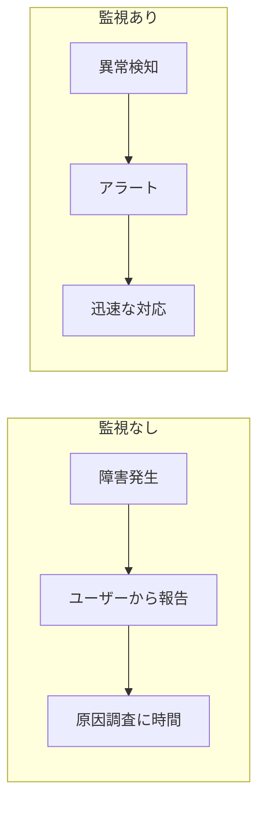
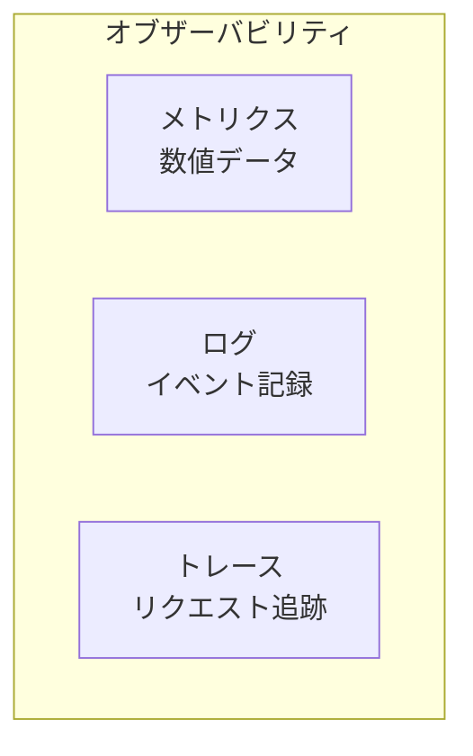
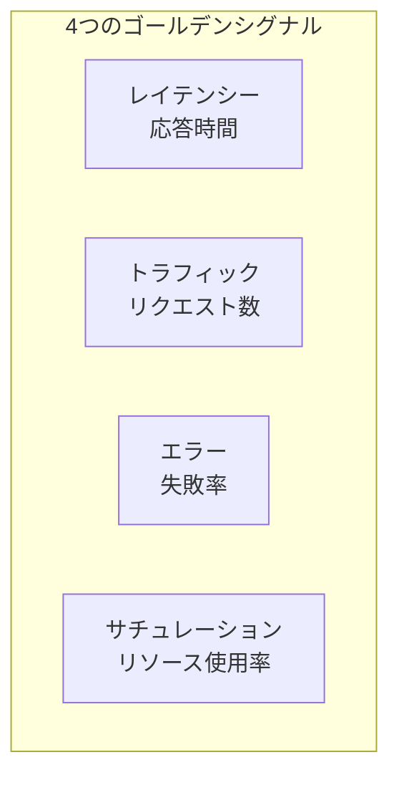
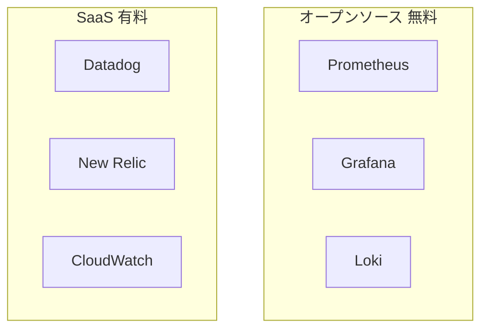
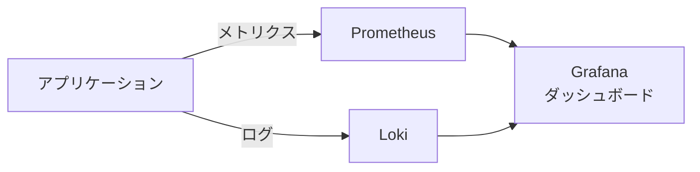
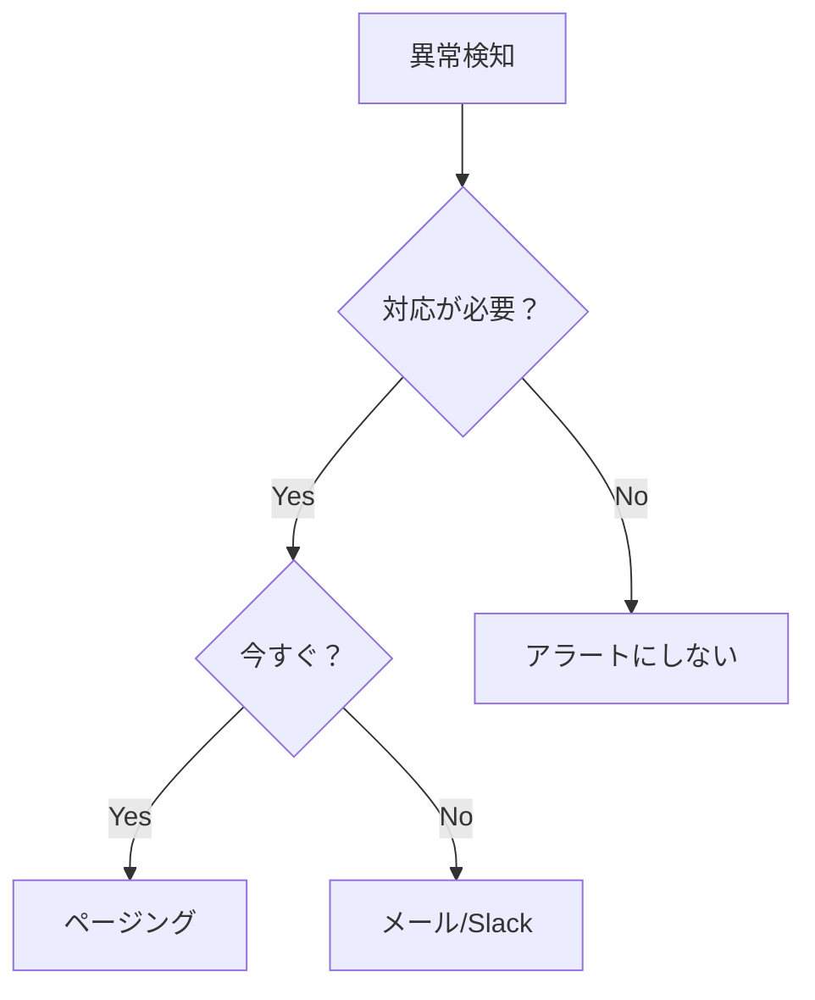
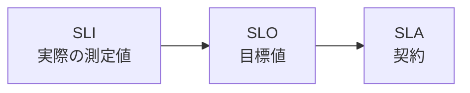

# 監視の基本概念

## 📋 概要

| 項目 | 内容 |
|------|------|
| 所要時間 | 45分 |
| 難易度 | [中級] |
| 前提知識 | インフラ基礎 |

## 🎯 なぜこれを学ぶのか

監視がないと、問題が起きても気づけません。



## 📚 学習内容

### 1. 監視とは

#### 1.1 監視の目的

| 目的 | 説明 |
|------|------|
| **障害検知** | 問題をいち早く発見 |
| **原因特定** | 何が起きたかを把握 |
| **予防** | 問題が起きる前に対処 |
| **改善** | データに基づいた意思決定 |

#### 1.2 オブザーバビリティの3本柱



| 柱 | 説明 | 例 |
|-----|------|-----|
| **メトリクス** | 数値で表せるデータ | CPU使用率、レスポンスタイム |
| **ログ** | イベントの記録 | エラーメッセージ、アクセスログ |
| **トレース** | リクエストの経路追跡 | マイクロサービス間の呼び出し |

### 2. 4つのゴールデンシグナル

Googleが提唱する、監視すべき4つの重要な指標



| シグナル | 説明 | 例 |
|----------|------|-----|
| **レイテンシー** | リクエストの処理時間 | p50, p95, p99 |
| **トラフィック** | システムへの需要 | リクエスト数/秒 |
| **エラー** | 失敗したリクエストの割合 | 5xx率、エラー率 |
| **サチュレーション** | リソースの飽和度 | CPU、メモリ、ディスク |

### 3. メトリクスの種類

#### 3.1 システムメトリクス

```
CPU使用率: 70%
メモリ使用率: 65%
ディスク使用率: 45%
ネットワークI/O: 100MB/s
```

#### 3.2 アプリケーションメトリクス

```
リクエスト数: 1000 req/s
レスポンスタイム: 
  - p50: 50ms
  - p95: 200ms
  - p99: 500ms
エラー率: 0.1%
アクティブユーザー: 500
```

#### 3.3 ビジネスメトリクス

```
サインアップ数: 100/日
注文数: 50/時間
売上: ¥1,000,000/日
```

### 4. 監視ツール

#### 4.1 主要なツール



| ツール | 種類 | 特徴 |
|--------|------|------|
| **Prometheus** | OSS | メトリクス収集、時系列DB |
| **Grafana** | OSS | ダッシュボード、可視化 |
| **Loki** | OSS | ログ集約 |
| **Datadog** | SaaS | オールインワン |
| **CloudWatch** | AWS | AWS統合 |

#### 4.2 研修での使用ツール



**無料で学習できるスタック**:
- Prometheus: メトリクス収集
- Loki: ログ収集
- Grafana: 可視化

### 5. 監視の設計原則

#### 5.1 何を監視すべきか

```
1. ユーザー体験に影響するもの
   → レスポンスタイム、エラー率

2. システムの健全性
   → CPU、メモリ、ディスク

3. ビジネスに重要なもの
   → 売上、コンバージョン
```

#### 5.2 アラートの原則

| 原則 | 説明 |
|------|------|
| **アクション可能** | アラートを受けたら何かできる |
| **緊急性** | 本当に今すぐ対応が必要か |
| **ノイズを減らす** | 重要でないアラートは送らない |



### 6. SLI、SLO、SLA

#### 6.1 用語の定義



| 用語 | 説明 | 例 |
|------|------|-----|
| **SLI** | Service Level Indicator | 可用性99.5%（実測） |
| **SLO** | Service Level Objective | 可用性99.9%（目標） |
| **SLA** | Service Level Agreement | 可用性99.9%（契約） |

#### 6.2 エラーバジェット

```
SLO: 99.9%の可用性
= 月に43分のダウンタイムが許容される

エラーバジェット = 許容されるエラーの量
```

## ✅ まとめ

| 概念 | ポイント |
|------|---------|
| **オブザーバビリティ** | メトリクス、ログ、トレース |
| **4つのゴールデンシグナル** | レイテンシー、トラフィック、エラー、サチュレーション |
| **監視ツール** | Prometheus + Grafana（無料） |
| **SLI/SLO/SLA** | 測定値、目標、契約 |

## 💬 考えてみよう

```
Q: 監視がないと、どんな問題が起きますか？
Q: 4つのゴールデンシグナルで最も重要なのはどれですか？
Q: アラートが多すぎるとどうなりますか？
```

## 🔗 次のコンテンツ

[ログ管理](14-monitoring-operations-02.md)に進んでください。
