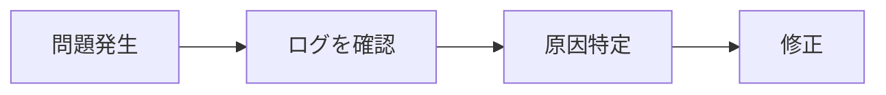
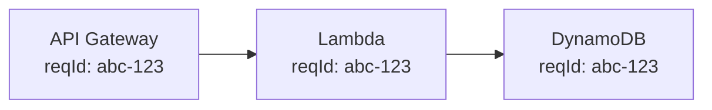
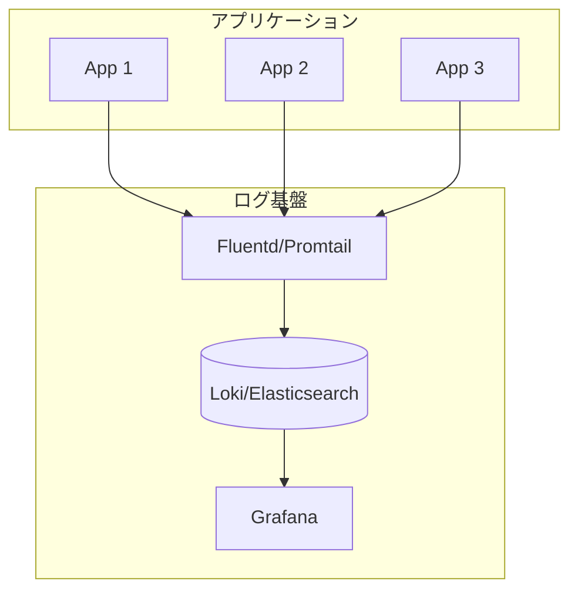

# ログ管理

## 📋 概要

| 項目 | 内容 |
|------|------|
| 所要時間 | 45分 |
| 難易度 | [中級] |
| 前提知識 | 監視の基本概念 |

## 🎯 なぜこれを学ぶのか

ログは問題解決の最も重要な情報源です。



## 📚 学習内容

### 1. ログの基本

#### 1.1 ログレベル

| レベル | 用途 | 例 |
|--------|------|-----|
| **ERROR** | エラー、要対応 | 例外、失敗 |
| **WARN** | 警告、注意が必要 | リトライ、遅延 |
| **INFO** | 正常な動作の記録 | リクエスト開始/終了 |
| **DEBUG** | デバッグ情報 | 変数の値、処理の詳細 |

```typescript
// 適切なログレベルの使用
logger.error('Database connection failed', { error });
logger.warn('Retry attempt', { attempt: 3 });
logger.info('User logged in', { userId: '123' });
logger.debug('Processing request', { body: req.body });
```

#### 1.2 構造化ログ

```typescript
// ❌ 非構造化ログ（パースしにくい）
console.log('User 123 logged in from 192.168.1.1');

// ✅ 構造化ログ（JSON）
console.log(JSON.stringify({
  timestamp: '2024-01-15T10:30:00.000Z',
  level: 'info',
  message: 'User logged in',
  userId: '123',
  ip: '192.168.1.1',
}));
```

### 2. 効果的なログ設計

#### 2.1 含めるべき情報

```json
{
  "timestamp": "2024-01-15T10:30:00.000Z",
  "level": "info",
  "message": "Request completed",
  "requestId": "abc-123",
  "method": "GET",
  "path": "/api/users",
  "status": 200,
  "duration": 45,
  "userId": "user-456"
}
```

| 項目 | 必須 | 説明 |
|------|:----:|------|
| timestamp | ✅ | いつ発生したか |
| level | ✅ | 重要度 |
| message | ✅ | 何が起きたか |
| requestId | ✅ | リクエストの追跡用 |
| error | △ | エラー時の詳細 |
| userId | △ | 誰の操作か |

#### 2.2 リクエストIDの重要性



同じリクエストIDで全てのログを追跡可能

```typescript
// Express/Fastifyでリクエストごとにuuidを付与
import { v4 as uuidv4 } from 'uuid';

app.use((req, res, next) => {
  req.requestId = req.headers['x-request-id'] || uuidv4();
  next();
});

// ログにrequestIdを含める
logger.info('Processing request', { 
  requestId: req.requestId,
  path: req.path 
});
```

### 3. ログ収集アーキテクチャ

#### 3.1 集中ログ管理



#### 3.2 Docker環境でのログ収集

```yaml
# docker-compose.yaml
services:
  app:
    image: myapp
    logging:
      driver: json-file
      options:
        max-size: "10m"
        max-file: "3"

  promtail:
    image: grafana/promtail
    volumes:
      - /var/lib/docker/containers:/var/lib/docker/containers:ro
      - ./promtail-config.yaml:/etc/promtail/config.yaml
    command: -config.file=/etc/promtail/config.yaml

  loki:
    image: grafana/loki
    ports:
      - "3100:3100"

  grafana:
    image: grafana/grafana
    ports:
      - "3000:3000"
```

### 4. ログの検索とフィルタリング

#### 4.1 Grafana Lokiでの検索

```
# 基本的なクエリ
{app="myapp"}

# ログレベルでフィルタ
{app="myapp"} |= "error"

# JSONフィールドでフィルタ
{app="myapp"} | json | level="error"

# 特定のユーザーのログ
{app="myapp"} | json | userId="123"

# レスポンスタイムが1秒以上
{app="myapp"} | json | duration > 1000
```

#### 4.2 CloudWatch Logs Insightsでの検索

```sql
-- エラーログを検索
fields @timestamp, @message
| filter @message like /error/
| sort @timestamp desc
| limit 100

-- 遅いリクエストを検索
fields @timestamp, @message
| filter duration > 1000
| sort duration desc
| limit 50
```

### 5. ベストプラクティス

#### 5.1 やるべきこと

```typescript
// ✅ 構造化ログを使用
logger.info('Order created', {
  orderId: order.id,
  userId: user.id,
  total: order.total,
});

// ✅ エラー時は詳細を記録
logger.error('Payment failed', {
  orderId: order.id,
  error: error.message,
  stack: error.stack,
});

// ✅ 処理時間を記録
const start = Date.now();
await processOrder(order);
logger.info('Order processed', {
  orderId: order.id,
  duration: Date.now() - start,
});
```

#### 5.2 やってはいけないこと

```typescript
// ❌ 機密情報をログに出力
logger.info('User login', {
  email: user.email,
  password: user.password,  // 絶対NG！
});

// ❌ 大量のデータをログに出力
logger.debug('Request body', {
  body: hugeJsonObject,  // サイズに注意
});

// ❌ ログレベルの誤用
logger.error('User not found');  // これはエラーではない
logger.info('User not found', { userId });  // 正しい
```

### 6. ログローテーションと保持

#### 6.1 ローテーション設定

```yaml
# Docker
logging:
  driver: json-file
  options:
    max-size: "50m"   # ファイルサイズ上限
    max-file: "5"     # ファイル数上限
```

#### 6.2 保持期間の目安

| 環境 | 保持期間 | 理由 |
|------|---------|------|
| 開発 | 7日 | コスト削減 |
| ステージング | 14日 | テスト用 |
| 本番 | 30-90日 | 調査・監査用 |

## ✅ まとめ

| ポイント | 内容 |
|----------|------|
| **構造化ログ** | JSON形式で検索しやすく |
| **リクエストID** | 追跡を可能にする |
| **ログレベル** | 適切に使い分ける |
| **機密情報** | 絶対にログに出さない |
| **保持期間** | 環境に応じて設定 |

## 💬 考えてみよう

```
Q: 構造化ログのメリットは何ですか？
Q: リクエストIDがないと、どんな問題がありますか？
Q: ログの保持期間を長くするデメリットは何ですか？
```

## 🔗 次のコンテンツ

[メトリクス監視](14-monitoring-operations-03.md)に進んでください。
