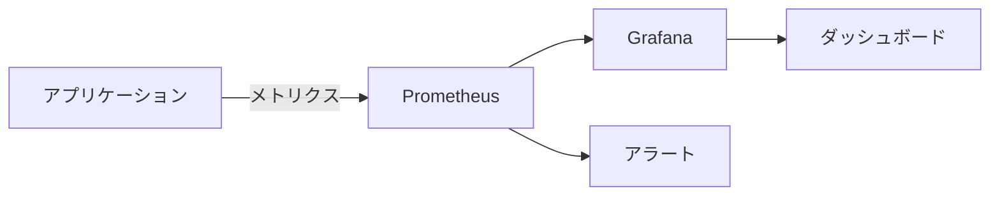
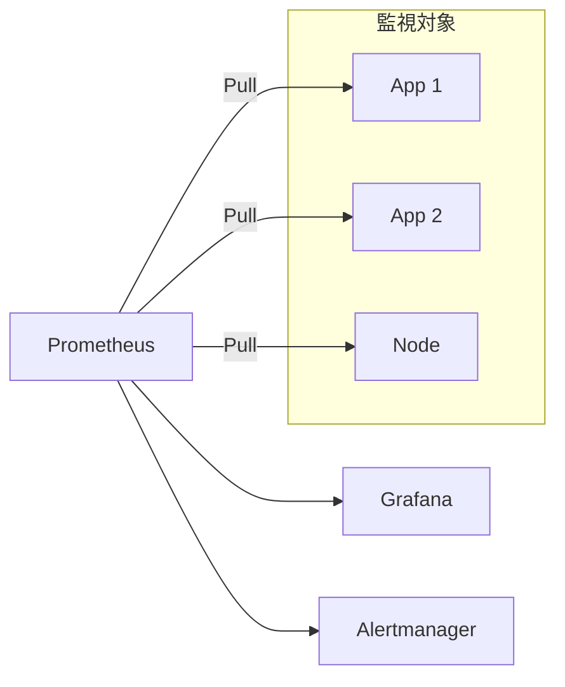
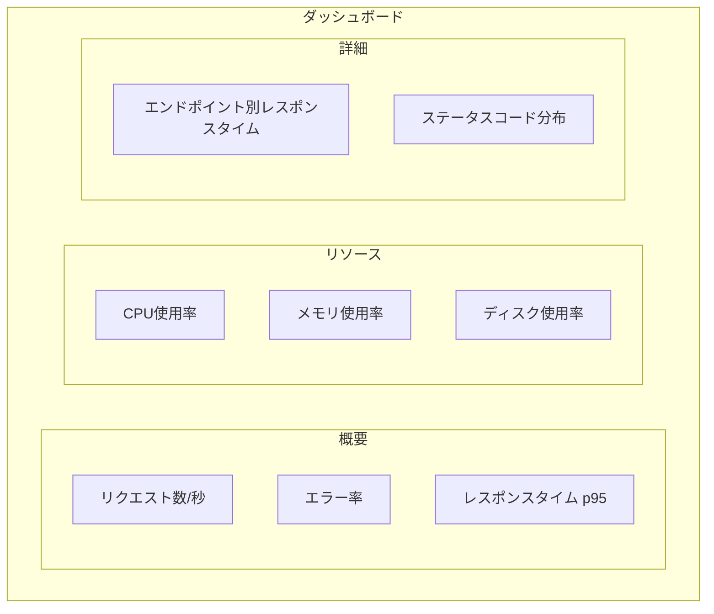
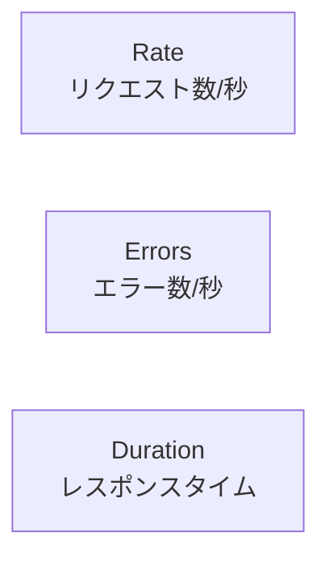

# メトリクス監視

## 📋 概要

| 項目 | 内容 |
|------|------|
| 所要時間 | 60分 |
| 難易度 | [中級] |
| 前提知識 | 監視の基本概念、ログ管理 |

## 🎯 なぜこれを学ぶのか

メトリクスは、システムの健全性を数値で把握するための基盤です。



## 📚 学習内容

### 1. Prometheusの基本

#### 1.1 Prometheusとは

**Prometheus** = オープンソースの監視システム



特徴:
- **Pull型**: Prometheusがアプリからメトリクスを取得
- **時系列DB**: メトリクスを時系列で保存
- **PromQL**: 強力なクエリ言語

#### 1.2 メトリクスの種類

| 種類 | 説明 | 例 |
|------|------|-----|
| **Counter** | 増加のみ | リクエスト数、エラー数 |
| **Gauge** | 増減あり | CPU使用率、メモリ使用量 |
| **Histogram** | 分布 | レスポンスタイム |
| **Summary** | パーセンタイル | p50、p99 |

### 2. アプリケーションのメトリクス実装

#### 2.1 Node.js（Express）の例

```typescript
import express from 'express';
import client from 'prom-client';

const app = express();

// デフォルトメトリクスを収集
client.collectDefaultMetrics();

// カスタムメトリクス
const httpRequestDuration = new client.Histogram({
  name: 'http_request_duration_seconds',
  help: 'Duration of HTTP requests in seconds',
  labelNames: ['method', 'path', 'status'],
  buckets: [0.01, 0.05, 0.1, 0.5, 1, 5],
});

const httpRequestTotal = new client.Counter({
  name: 'http_requests_total',
  help: 'Total number of HTTP requests',
  labelNames: ['method', 'path', 'status'],
});

// ミドルウェアでメトリクスを記録
app.use((req, res, next) => {
  const start = Date.now();
  
  res.on('finish', () => {
    const duration = (Date.now() - start) / 1000;
    const labels = {
      method: req.method,
      path: req.route?.path || req.path,
      status: res.statusCode,
    };
    
    httpRequestDuration.observe(labels, duration);
    httpRequestTotal.inc(labels);
  });
  
  next();
});

// メトリクスエンドポイント
app.get('/metrics', async (req, res) => {
  res.set('Content-Type', client.register.contentType);
  res.end(await client.register.metrics());
});
```

#### 2.2 メトリクスの出力例

```
# HELP http_requests_total Total number of HTTP requests
# TYPE http_requests_total counter
http_requests_total{method="GET",path="/api/users",status="200"} 1523
http_requests_total{method="POST",path="/api/users",status="201"} 234
http_requests_total{method="GET",path="/api/users",status="500"} 12

# HELP http_request_duration_seconds Duration of HTTP requests
# TYPE http_request_duration_seconds histogram
http_request_duration_seconds_bucket{method="GET",path="/api/users",status="200",le="0.01"} 500
http_request_duration_seconds_bucket{method="GET",path="/api/users",status="200",le="0.05"} 1200
http_request_duration_seconds_bucket{method="GET",path="/api/users",status="200",le="0.1"} 1450
```

### 3. Prometheus の設定

#### 3.1 prometheus.yml

```yaml
global:
  scrape_interval: 15s
  evaluation_interval: 15s

scrape_configs:
  - job_name: 'app'
    static_configs:
      - targets: ['app:3000']
    metrics_path: /metrics

  - job_name: 'node'
    static_configs:
      - targets: ['node-exporter:9100']
```

#### 3.2 Docker Composeでの構成

```yaml
services:
  app:
    build: .
    ports:
      - "3000:3000"

  prometheus:
    image: prom/prometheus
    ports:
      - "9090:9090"
    volumes:
      - ./prometheus.yml:/etc/prometheus/prometheus.yml
      - prometheus-data:/prometheus

  grafana:
    image: grafana/grafana
    ports:
      - "3001:3000"
    volumes:
      - grafana-data:/var/lib/grafana

  node-exporter:
    image: prom/node-exporter
    ports:
      - "9100:9100"

volumes:
  prometheus-data:
  grafana-data:
```

### 4. PromQLの基本

#### 4.1 基本クエリ

```promql
# 現在の値
http_requests_total

# ラベルでフィルタ
http_requests_total{status="500"}

# 過去5分間のレート（1秒あたり）
rate(http_requests_total[5m])

# エラー率
sum(rate(http_requests_total{status=~"5.."}[5m])) 
/ sum(rate(http_requests_total[5m])) * 100
```

#### 4.2 よく使うクエリ

```promql
# リクエスト数/秒
sum(rate(http_requests_total[5m]))

# レスポンスタイム p95
histogram_quantile(0.95, rate(http_request_duration_seconds_bucket[5m]))

# CPU使用率
100 - (avg(irate(node_cpu_seconds_total{mode="idle"}[5m])) * 100)

# メモリ使用率
(1 - node_memory_MemAvailable_bytes / node_memory_MemTotal_bytes) * 100
```

### 5. Grafanaダッシュボード

#### 5.1 ダッシュボードの構成例



#### 5.2 主要なパネル設定

```json
{
  "panels": [
    {
      "title": "リクエスト数/秒",
      "type": "stat",
      "targets": [
        {
          "expr": "sum(rate(http_requests_total[5m]))"
        }
      ]
    },
    {
      "title": "エラー率",
      "type": "gauge",
      "targets": [
        {
          "expr": "sum(rate(http_requests_total{status=~\"5..\"}[5m])) / sum(rate(http_requests_total[5m])) * 100"
        }
      ],
      "thresholds": {
        "steps": [
          { "value": 0, "color": "green" },
          { "value": 1, "color": "yellow" },
          { "value": 5, "color": "red" }
        ]
      }
    },
    {
      "title": "レスポンスタイム",
      "type": "timeseries",
      "targets": [
        {
          "expr": "histogram_quantile(0.50, rate(http_request_duration_seconds_bucket[5m]))",
          "legendFormat": "p50"
        },
        {
          "expr": "histogram_quantile(0.95, rate(http_request_duration_seconds_bucket[5m]))",
          "legendFormat": "p95"
        },
        {
          "expr": "histogram_quantile(0.99, rate(http_request_duration_seconds_bucket[5m]))",
          "legendFormat": "p99"
        }
      ]
    }
  ]
}
```

### 6. REDメソッド

サービス監視のベストプラクティス



| 指標 | PromQLの例 |
|------|-----------|
| **Rate** | `sum(rate(http_requests_total[5m]))` |
| **Errors** | `sum(rate(http_requests_total{status=~"5.."}[5m]))` |
| **Duration** | `histogram_quantile(0.95, rate(http_request_duration_seconds_bucket[5m]))` |

## ✅ まとめ

| 概念 | ポイント |
|------|---------|
| **Prometheus** | Pull型のメトリクス収集 |
| **メトリクス種類** | Counter, Gauge, Histogram |
| **PromQL** | メトリクスのクエリ言語 |
| **Grafana** | ダッシュボードで可視化 |
| **REDメソッド** | Rate, Errors, Duration |

## 💬 考えてみよう

```
Q: CounterとGaugeの違いは何ですか？
Q: p95とp99、どちらを監視すべきですか？
Q: ダッシュボードに最初に配置すべきパネルは何ですか？
```

## 🔗 次のコンテンツ

[アラートとインシデント対応](14-monitoring-operations-04.md)に進んでください。
