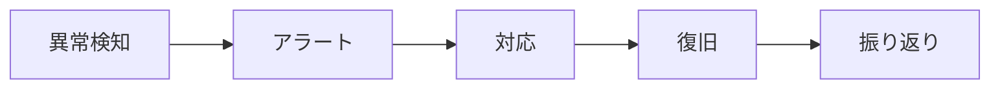
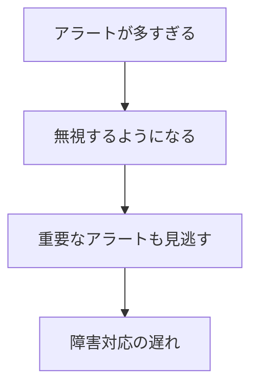
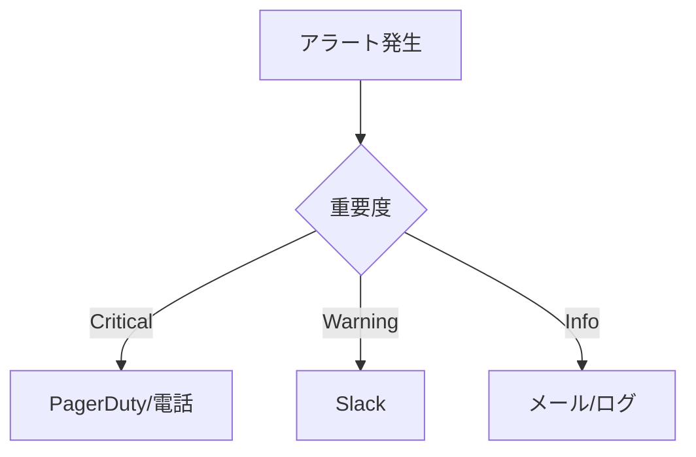
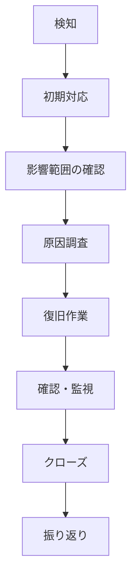
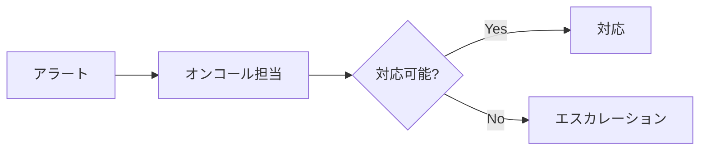

# アラートとインシデント対応

## 📋 概要

| 項目 | 内容 |
|------|------|
| 所要時間 | 60分 |
| 難易度 | [応用] |
| 前提知識 | 監視の基本概念、メトリクス監視 |

## 🎯 なぜこれを学ぶのか

適切なアラート設計と迅速なインシデント対応で、サービスの信頼性を高めます。



## 📚 学習内容

### 1. アラート設計の原則

#### 1.1 良いアラートの条件

| 条件 | 説明 |
|------|------|
| **アクション可能** | アラートを見たら何かできる |
| **緊急性が明確** | 今すぐ対応が必要かわかる |
| **コンテキスト** | 何が起きているかわかる |
| **ノイズが少ない** | 不要なアラートがない |

#### 1.2 アラート疲れを避ける



**対策**:
- 本当に重要なものだけアラート
- 閾値を適切に設定
- 一時的な変動は無視

### 2. アラートルールの設計

#### 2.1 Prometheusアラートルール

```yaml
# alerts.yml
groups:
  - name: app
    rules:
      # 高エラー率
      - alert: HighErrorRate
        expr: |
          sum(rate(http_requests_total{status=~"5.."}[5m])) 
          / sum(rate(http_requests_total[5m])) > 0.05
        for: 5m
        labels:
          severity: critical
        annotations:
          summary: "エラー率が5%を超えています"
          description: "過去5分間のエラー率: {{ $value | printf \"%.2f\" }}%"

      # 高レイテンシー
      - alert: HighLatency
        expr: |
          histogram_quantile(0.95, rate(http_request_duration_seconds_bucket[5m])) > 1
        for: 5m
        labels:
          severity: warning
        annotations:
          summary: "レスポンスタイム(p95)が1秒を超えています"
          description: "現在のp95: {{ $value | printf \"%.2f\" }}秒"

      # サービスダウン
      - alert: ServiceDown
        expr: up == 0
        for: 1m
        labels:
          severity: critical
        annotations:
          summary: "サービスがダウンしています"
          description: "{{ $labels.instance }} が応答していません"
```

#### 2.2 重要度（Severity）

| 重要度 | 対応 | 例 |
|--------|------|-----|
| **critical** | 即時対応（ページング） | サービスダウン、データ損失 |
| **warning** | 営業時間内に対応 | 高負荷、ディスク残量 |
| **info** | 確認のみ | キャパシティ予測 |

### 3. Alertmanagerの設定

#### 3.1 基本設定

```yaml
# alertmanager.yml
global:
  resolve_timeout: 5m

route:
  receiver: 'default'
  group_by: ['alertname', 'severity']
  group_wait: 30s
  group_interval: 5m
  repeat_interval: 4h
  
  routes:
    # Criticalはページング
    - match:
        severity: critical
      receiver: 'pagerduty'
    
    # WarningはSlack
    - match:
        severity: warning
      receiver: 'slack'

receivers:
  - name: 'default'
    slack_configs:
      - channel: '#alerts'

  - name: 'slack'
    slack_configs:
      - channel: '#alerts-warning'

  - name: 'pagerduty'
    pagerduty_configs:
      - service_key: 'xxxx'
```

#### 3.2 通知先の選択



### 4. インシデント対応

#### 4.1 インシデント対応フロー



#### 4.2 各フェーズのアクション

| フェーズ | アクション |
|----------|-----------|
| **検知** | アラート確認、状況把握 |
| **初期対応** | 関係者への連絡、影響軽減 |
| **原因調査** | ログ・メトリクス確認 |
| **復旧作業** | ロールバック、設定変更 |
| **確認** | 正常に戻ったか確認 |
| **振り返り** | ポストモーテム |

### 5. ポストモーテム

#### 5.1 ポストモーテムとは

**ポストモーテム** = インシデント後の振り返り

目的：
- 同じ問題を繰り返さない
- プロセスを改善する
- 知識を共有する

**非難しない文化（Blameless）が重要**

#### 5.2 ポストモーテムのテンプレート

```markdown
# インシデントポストモーテム

## 概要
- **日時**: 2024-01-15 14:00-15:30 JST
- **影響**: APIレスポンスタイムが5秒以上に悪化
- **影響を受けたユーザー**: 約1,000人
- **重要度**: Critical

## タイムライン
| 時刻 | イベント |
|------|---------|
| 14:00 | デプロイ実施 |
| 14:05 | レイテンシーアラート発報 |
| 14:10 | 調査開始 |
| 14:30 | 原因特定（N+1クエリ） |
| 14:45 | ロールバック実施 |
| 15:00 | 復旧確認 |

## 根本原因
新しいエンドポイントでN+1クエリが発生。
コードレビューで見落とし、負荷テストも未実施だった。

## 改善アクション
| アクション | 担当 | 期限 |
|-----------|------|------|
| N+1検出のLintルール追加 | @dev1 | 1/20 |
| デプロイ前の負荷テスト必須化 | @dev2 | 1/25 |
| カナリアデプロイの導入 | @infra | 2/1 |

## 学び
- コードレビューだけでは性能問題を見つけにくい
- 負荷テストの自動化が必要
- 段階的デプロイで影響を最小化すべき
```

### 6. オンコール

#### 6.1 オンコールとは

**オンコール** = 営業時間外も対応できる体制



#### 6.2 オンコールのベストプラクティス

| 項目 | 推奨 |
|------|------|
| **ローテーション** | 週次で交代 |
| **ドキュメント** | ランブックを整備 |
| **エスカレーション** | 明確なルート |
| **休息** | オンコール後は休む |

### 7. ランブック

#### 7.1 ランブックとは

**ランブック** = 障害対応の手順書

```markdown
# アラート: HighErrorRate

## 概要
エラー率が5%を超えた場合に発報

## 確認手順
1. Grafanaでエラーの内訳を確認
2. ログで具体的なエラーを確認
3. 最近のデプロイを確認

## 対応手順
### 特定のエンドポイントでエラーが多い場合
1. 該当エンドポイントのログを確認
2. 必要に応じて該当機能を無効化

### 全体的にエラーが増加している場合
1. 最新デプロイをロールバック
2. 外部サービスの状態を確認
3. インフラの状態を確認

## エスカレーション
- 30分で解決しない場合: @tech-lead
- サービス全体に影響: @manager
```

## ✅ まとめ

| 概念 | ポイント |
|------|---------|
| **アラート設計** | アクション可能、ノイズを減らす |
| **重要度** | Critical, Warning, Info |
| **インシデント対応** | 検知→対応→復旧→振り返り |
| **ポストモーテム** | 非難しない振り返り |
| **ランブック** | 対応手順をドキュメント化 |

## 💬 考えてみよう

```
Q: アラート疲れを防ぐにはどうすればいいですか？
Q: ポストモーテムで最も重要なことは何ですか？
Q: ランブックがないとどんな問題が起きますか？
```

## 🔗 次のステップ

監視と運用カテゴリを修了しました！
これで発展カテゴリ（11-14）のすべての学習が完了です。

次のステップ:
- [コース別学習](../../web/)に進む
- または他の発展カテゴリを学習する
