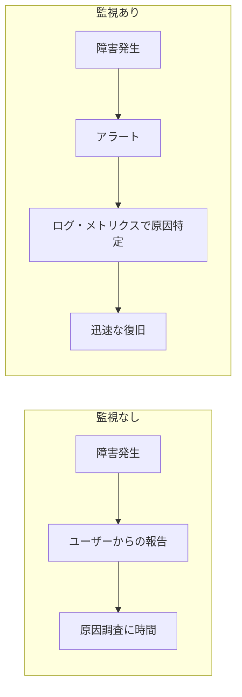
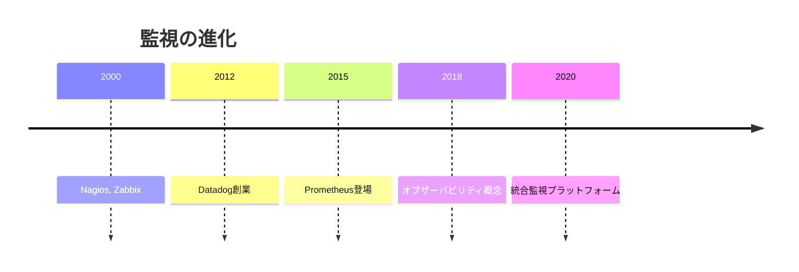

# 14. 監視と運用 [選択]

## ⚠️ このカテゴリは選択コンテンツです

このカテゴリは**必須ではありません**。以下の場合に学習をおすすめします：

- 本番サービスの運用に興味がある
- 障害対応やパフォーマンス改善を学びたい
- SRE/DevOpsエンジニアを目指している

## 概要

**学習日数**: 2-3日（選択）

本番サービスの監視と運用の基礎を学びます。ログ管理、メトリクス監視、アラート設定、インシデント対応の基本を習得します。

## 前提知識

- **必須**: [07. インフラ基礎](../07-infrastructure-basics/) を修了していること
- **推奨**: [08. CI/CD基礎](../08-ci-cd-basics/) を修了していること

## なぜ学ぶ必要があるのか

### この技術が解決する問題

監視がない場合：

- **障害の検知が遅い**: ユーザーからの報告で気づく
- **原因特定が困難**: ログがないと何が起きたかわからない
- **再発防止できない**: 根本原因がわからない

監視がある場合：

- **早期検知**: 異常を自動検知
- **迅速な原因特定**: ログとメトリクスから調査
- **予防**: 傾向から問題を予測

### 実務での重要性

- **SLA/SLO**: サービスの品質を維持
- **コスト最適化**: リソースの使用状況を可視化
- **改善**: データに基づいた意思決定

## 技術の歴史的背景

- **伝統的監視**: Nagios等でサーバー単位の監視
- **モダン監視**: メトリクス、ログ、トレースの統合
- **オブザーバビリティ**: システムの状態を外部から観測可能にする

## 学習内容

| No | コンテンツ | 難易度 | 内容 |
|----|------------|--------|------|
| 01 | [監視の基本概念](14-monitoring-operations-01.md) | [中級] | なぜ監視が必要か、監視の種類 |
| 02 | [ログ管理](14-monitoring-operations-02.md) | [中級] | 構造化ログ、集約、検索 |
| 03 | [メトリクス監視](14-monitoring-operations-03.md) | [中級] | 主要メトリクス、ダッシュボード |
| 04 | [アラートとインシデント対応](14-monitoring-operations-04.md) | [応用] | アラート設計、オンコール、ポストモーテム |

## 学習目標

このカテゴリを修了すると、以下ができるようになります：

- [ ] 監視の4つのゴールデンシグナルを説明できる
- [ ] 構造化ログの設計ができる
- [ ] 基本的なメトリクスダッシュボードを作成できる
- [ ] アラートの設計原則を理解している

## 費用に関する注意

> 💡 **良いニュース**: 監視は無料ツールで学習できます。
> 
> 研修では以下の無料ツールを使用します：
> - **Prometheus** + **Grafana**: 無料のOSS監視スタック
> - **Loki**: 無料のログ集約
> - **Docker Compose**: ローカルで監視環境を構築
>
> Datadog等の商用ツールは、概念の説明のみ行います。

## 📝 理解度チェックテスト

[quiz.md](./quiz.md) - コンテンツを読んだ後に解いてください（15問、目安15分）

## 🔨 実践課題

[exercises/](./exercises/) - Prometheus + Grafanaで監視基盤を構築する実践

| 課題 | 難易度 | 内容 |
|------|:------:|------|
| [課題1](./exercises/exercise-01.md) | ⭐ | 監視基盤の構築 |
| [課題2](./exercises/exercise-02.md) | ⭐⭐ | アプリケーションメトリクス |
| [課題3](./exercises/exercise-03.md) | ⭐⭐⭐ | アラートとインシデント対応 |

## 📚 参考リソース

- [Prometheus ドキュメント](https://prometheus.io/docs/)
- [Grafana ドキュメント](https://grafana.com/docs/)
- [SRE本（Google）](https://sre.google/sre-book/table-of-contents/)
- [4つのゴールデンシグナル](https://sre.google/sre-book/monitoring-distributed-systems/)
