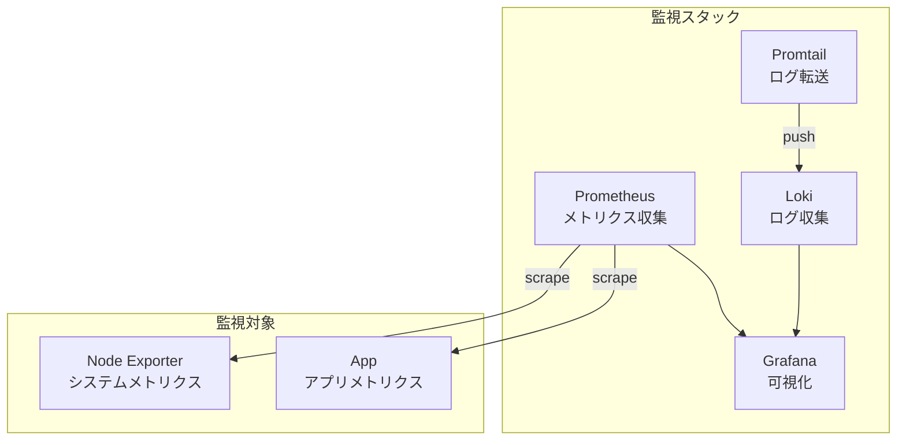

# 課題1: 監視基盤の構築

## 📋 概要

| 項目 | 内容 |
|------|------|
| 難易度 | ⭐ |
| 所要時間 | 45分 |
| 前提知識 | Docker Compose |

## 🎯 目標

Prometheus + Grafana + Lokiの監視スタックを構築し、基本的な監視ができるようになる。

## 📝 課題内容

### アーキテクチャ



### Step 1: ディレクトリ構造

```
exercise-01/
├── docker-compose.yml
├── prometheus/
│   └── prometheus.yml
├── promtail/
│   └── config.yml
└── grafana/
    └── provisioning/
        └── datasources/
            └── datasources.yml
```

### Step 2: Prometheus設定

**prometheus/prometheus.yml**:
```yaml
global:
  scrape_interval: 15s
  evaluation_interval: 15s

scrape_configs:
  # Prometheus自身
  - job_name: 'prometheus'
    static_configs:
      - targets: ['localhost:9090']

  # Node Exporter（システムメトリクス）
  - job_name: 'node'
    static_configs:
      - targets: ['node-exporter:9100']
```

### Step 3: Promtail設定

**promtail/config.yml**:
```yaml
server:
  http_listen_port: 9080

positions:
  filename: /tmp/positions.yaml

clients:
  - url: http://loki:3100/loki/api/v1/push

scrape_configs:
  - job_name: containers
    static_configs:
      - targets:
          - localhost
        labels:
          job: containerlogs
          __path__: /var/lib/docker/containers/*/*log
    pipeline_stages:
      - json:
          expressions:
            output: log
            stream: stream
            timestamp: time
      - output:
          source: output
```

### Step 4: Grafana データソース設定

**grafana/provisioning/datasources/datasources.yml**:
```yaml
apiVersion: 1

datasources:
  - name: Prometheus
    type: prometheus
    access: proxy
    url: http://prometheus:9090
    isDefault: true

  - name: Loki
    type: loki
    access: proxy
    url: http://loki:3100
```

### Step 5: Docker Compose

**docker-compose.yml**を作成してください:

**要件**:

1. **Prometheus**
   - ポート: 9090
   - 設定ファイルをマウント

2. **Grafana**
   - ポート: 3001（ホスト）→ 3000（コンテナ）
   - 管理者パスワード: `admin`
   - データソースの自動プロビジョニング
   - データの永続化

3. **Loki**
   - ポート: 3100

4. **Promtail**
   - Dockerログを収集

5. **Node Exporter**
   - ポート: 9100
   - システムメトリクスを収集

### Step 6: 起動と確認

```bash
# 起動
docker compose up -d

# 確認
docker compose ps

# Prometheus確認
# http://localhost:9090
# Status > Targets ですべてのターゲットがUPになっていること

# Grafana確認
# http://localhost:3001
# admin / admin でログイン
# Data Sources で Prometheus と Loki が表示されること
```

### Step 7: 基本的なクエリ

**Prometheusで確認**:
```promql
# CPU使用率
100 - (avg(irate(node_cpu_seconds_total{mode="idle"}[5m])) * 100)

# メモリ使用率
(1 - node_memory_MemAvailable_bytes / node_memory_MemTotal_bytes) * 100

# ディスク使用率
(1 - node_filesystem_avail_bytes{mountpoint="/"} / node_filesystem_size_bytes{mountpoint="/"}) * 100
```

**Grafanaでダッシュボード作成**:
1. 左メニュー → Dashboards → New → New Dashboard
2. Add visualization
3. Data source: Prometheus
4. Query: 上記のPromQLを入力

## ✅ 完了条件

- [ ] すべてのコンテナが起動している
- [ ] PrometheusのTargetsがすべてUP
- [ ] GrafanaでPrometheusとLokiのデータソースが設定されている
- [ ] 基本的なシステムメトリクスがGrafanaで表示される

## 💡 ヒント

<details>
<summary>Node Exporterの設定</summary>

```yaml
node-exporter:
  image: prom/node-exporter:latest
  ports:
    - "9100:9100"
  volumes:
    - /proc:/host/proc:ro
    - /sys:/host/sys:ro
    - /:/rootfs:ro
  command:
    - '--path.procfs=/host/proc'
    - '--path.sysfs=/host/sys'
    - '--path.rootfs=/rootfs'
```

</details>

<details>
<summary>Grafanaのボリューム設定</summary>

```yaml
grafana:
  volumes:
    - grafana-data:/var/lib/grafana
    - ./grafana/provisioning:/etc/grafana/provisioning

volumes:
  grafana-data:
```

</details>

## 📤 提出物

- `exercise-01/docker-compose.yml`
- `exercise-01/prometheus/prometheus.yml`
- `exercise-01/promtail/config.yml`
- `exercise-01/grafana/provisioning/datasources/datasources.yml`
- スクリーンショット（Prometheus Targets、Grafanaダッシュボード）

## 🔗 参考

- [監視の基本概念](../14-monitoring-operations-01.md)
