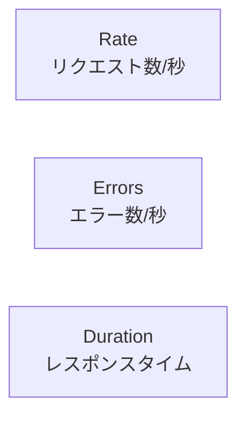

# 課題2: アプリケーションメトリクス

## 📋 概要

| 項目 | 内容 |
|------|------|
| 難易度 | ⭐⭐ |
| 所要時間 | 60分 |
| 前提知識 | 監視基盤の構築 |

## 🎯 目標

アプリケーションにメトリクスを実装し、REDメソッドに基づいたダッシュボードを作成する。

## 📝 課題内容

### REDメソッド



### Step 1: アプリケーションの作成

**app/package.json**:
```json
{
  "name": "metrics-app",
  "version": "1.0.0",
  "scripts": {
    "start": "node src/index.js"
  },
  "dependencies": {
    "express": "^4.18.2",
    "prom-client": "^15.1.0"
  }
}
```

**app/src/index.js**を作成してください:

**要件**:

1. **メトリクス定義**
   - `http_requests_total` (Counter): HTTPリクエスト総数
     - ラベル: method, path, status
   - `http_request_duration_seconds` (Histogram): レスポンスタイム
     - ラベル: method, path, status
     - バケット: 0.01, 0.05, 0.1, 0.5, 1, 5秒

2. **エンドポイント**
   - `GET /` - メイン（正常）
   - `GET /slow` - 遅いレスポンス（1-3秒のランダム遅延）
   - `GET /error` - エラー（50%の確率で500エラー）
   - `GET /metrics` - Prometheusメトリクス

3. **ミドルウェア**
   - すべてのリクエストでメトリクスを記録

### Step 2: Dockerfile

**app/Dockerfile**:
```dockerfile
FROM node:18-alpine
WORKDIR /app
COPY package*.json ./
RUN npm install
COPY src ./src
EXPOSE 3000
CMD ["npm", "start"]
```

### Step 3: Prometheus設定の更新

`prometheus/prometheus.yml`にアプリのスクレイプ設定を追加:

```yaml
scrape_configs:
  # ... 既存の設定 ...

  - job_name: 'app'
    static_configs:
      - targets: ['app:3000']
    metrics_path: /metrics
```

### Step 4: docker-compose.ymlの更新

アプリケーションを追加:

```yaml
services:
  # ... 既存のサービス ...

  app:
    build: ./app
    ports:
      - "3000:3000"
```

### Step 5: 負荷生成スクリプト

**load-test.sh**:
```bash
#!/bin/bash

# 通常リクエスト
for i in {1..100}; do
  curl -s http://localhost:3000/ > /dev/null &
done

# 遅いリクエスト
for i in {1..20}; do
  curl -s http://localhost:3000/slow > /dev/null &
done

# エラーリクエスト
for i in {1..30}; do
  curl -s http://localhost:3000/error > /dev/null &
done

wait
echo "Load test completed"
```

### Step 6: Grafanaダッシュボード作成

以下のパネルを持つダッシュボードを作成:

| パネル | 種類 | クエリ |
|--------|------|--------|
| リクエスト数/秒 | Time Series | `sum(rate(http_requests_total[5m]))` |
| エラー率 | Gauge | エラー率の計算（下記参照） |
| p50 レスポンスタイム | Time Series | `histogram_quantile(0.50, ...)` |
| p95 レスポンスタイム | Time Series | `histogram_quantile(0.95, ...)` |
| p99 レスポンスタイム | Time Series | `histogram_quantile(0.99, ...)` |
| ステータスコード分布 | Pie Chart | ステータスコード別リクエスト数 |
| エンドポイント別レイテンシー | Table | エンドポイントごとのp95 |

**エラー率のクエリ**:
```promql
sum(rate(http_requests_total{status=~"5.."}[5m])) 
/ sum(rate(http_requests_total[5m])) * 100
```

**p95のクエリ**:
```promql
histogram_quantile(0.95, 
  sum(rate(http_request_duration_seconds_bucket[5m])) by (le)
)
```

### Step 7: ダッシュボードのエクスポート

1. Grafanaでダッシュボードを作成
2. Settings (歯車アイコン) → JSON Model
3. JSONをコピーして `dashboards/app-dashboard.json` に保存

## ✅ 完了条件

- [ ] アプリケーションがメトリクスを出力している
- [ ] Prometheusでアプリのメトリクスが収集されている
- [ ] REDメソッドに基づいたダッシュボードが作成されている
- [ ] 負荷テスト後にメトリクスが可視化されている
- [ ] ダッシュボードJSONがエクスポートされている

## 💡 ヒント

<details>
<summary>prom-clientの基本的な使い方</summary>

```javascript
const client = require('prom-client');

// デフォルトメトリクスを収集
client.collectDefaultMetrics();

// Counter
const httpRequestsTotal = new client.Counter({
  name: 'http_requests_total',
  help: 'Total HTTP requests',
  labelNames: ['method', 'path', 'status'],
});

// Histogram
const httpRequestDuration = new client.Histogram({
  name: 'http_request_duration_seconds',
  help: 'HTTP request duration',
  labelNames: ['method', 'path', 'status'],
  buckets: [0.01, 0.05, 0.1, 0.5, 1, 5],
});

// 使用例
httpRequestsTotal.inc({ method: 'GET', path: '/', status: 200 });
httpRequestDuration.observe({ method: 'GET', path: '/', status: 200 }, 0.05);
```

</details>

<details>
<summary>レスポンスタイム計測のミドルウェア</summary>

```javascript
app.use((req, res, next) => {
  const start = Date.now();
  
  res.on('finish', () => {
    const duration = (Date.now() - start) / 1000;
    httpRequestsTotal.inc({
      method: req.method,
      path: req.route?.path || req.path,
      status: res.statusCode,
    });
    httpRequestDuration.observe({
      method: req.method,
      path: req.route?.path || req.path,
      status: res.statusCode,
    }, duration);
  });
  
  next();
});
```

</details>

## 📤 提出物

- `exercise-02/app/src/index.js`
- `exercise-02/app/Dockerfile`
- `exercise-02/docker-compose.yml`
- `exercise-02/prometheus/prometheus.yml`
- `exercise-02/dashboards/app-dashboard.json`
- スクリーンショット（ダッシュボード）

## 🔗 参考

- [メトリクス監視](../14-monitoring-operations-03.md)
