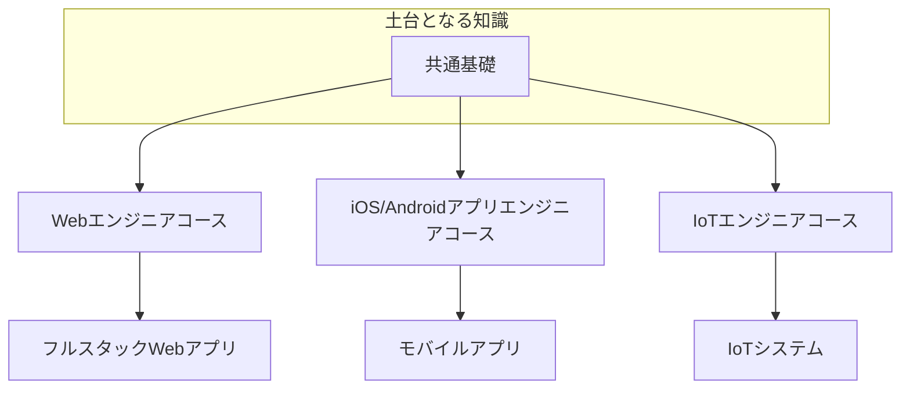
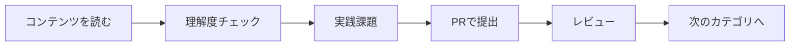

# 共通基礎カリキュラム

## 概要

共通基礎は、すべてのコース（Web、iOS/Android、IoT）で共通して学ぶ基礎知識です。

**学習期間**: 2-3週間（80-120時間）

## なぜ共通基礎が重要なのか

共通基礎は、どのコースに進んでも必要となる**土台**です。

- **エンジニアの心構え**: 報連相、目的思考、継続学習
- **Git**: コードのバージョン管理
- **プログラミング基礎**: TypeScriptによるプログラミングの基礎
- **ソフトウェア設計**: 良いコードを書くための設計原則
- **データベース**: データの保存と取得
- **テスト**: コードの品質を担保する
- **セキュリティ**: 安全なシステムを作る
- **インフラ**: システムを動かす基盤
- **CI/CD**: 開発を効率化する
- **AI駆動開発**: AIと協働する開発
- **仕様駆動開発**: 仕様から実装する方法

## カテゴリ一覧

### 必須カテゴリ（00-10）

| No | カテゴリ | 学習日数 | 内容 |
|----|----------|----------|------|
| 00 | [エンジニアの心構え](00-engineer-mindset/) | 1日 | 報連相、目的思考、継続学習 |
| 01 | [Git基礎](01-git-basics/) | 1-2日 | バージョン管理、GitHub、プルリクエスト |
| 02 | [プログラミング基礎](02-programming-fundamentals/) | 3-4日 | TypeScript、型システム、オブジェクト指向 |
| 03 | [ソフトウェア設計](03-software-design/) | 2-3日 | SOLID原則、設計パターン、アーキテクチャ |
| 04 | [データベース基礎](04-database-basics/) | 2-3日 | SQL、データベース設計、トランザクション |
| 05 | [テストと品質](05-testing-quality/) | 2-3日 | 単体テスト、TDD、コードカバレッジ |
| 06 | [セキュリティ基礎](06-security-basics/) | 1-2日 | OWASP Top 10、認証・認可 |
| 07 | [インフラ基礎](07-infrastructure-basics/) | 2-3日 | サーバー、クラウド、Docker |
| 08 | [CI/CD基礎](08-ci-cd-basics/) | 1-2日 | GitHub Actions、自動テスト |
| 09 | [AI駆動開発](09-ai-driven-development/) | 2-3日 | Cursor、プロンプトエンジニアリング |
| 10 | [仕様駆動開発](10-spec-driven-development/) | 1-2日 | 仕様書、要件定義、設計書 |

### 発展カテゴリ【選択】（11-14）

> ⚠️ **以下は選択コンテンツです。** 必須ではありませんが、DevOps/インフラに興味がある方におすすめです。

| No | カテゴリ | 学習日数 | 内容 | おすすめ |
|----|----------|----------|------|----------|
| 11 | [コンテナ発展](11-container-advanced/) | 3-4日 | Docker Compose、マルチコンテナ | Docker活用したい人 |
| 12 | [IaC入門（AWS CDK）](12-iac-basics/) | 2-3日 | AWS CDK、TypeScriptでインフラ定義 | TypeScriptでインフラ管理したい人 |
| 13 | [クラウド実践](13-cloud-practice/) | 3-4日 | AWS実践、ECS/Fargate | クラウド本番運用学びたい人 |
| 14 | [監視と運用](14-monitoring-operations/) | 2-3日 | 監視基礎、ログ管理、アラート | SRE目指す人 |

## 学習の進め方

1. **コンテンツを読む**: 各カテゴリのREADME.mdと各コンテンツを読む
2. **理解度チェック**: tests/common/配下のテストで理解度を確認
3. **実践課題**: exercises/common/配下の課題に取り組む
4. **PRで提出**: 課題をプルリクエストで提出
5. **レビュー**: メンターのレビューを受ける
6. **次のカテゴリへ**: 承認されたら次のカテゴリへ

## 難易度マーカー

| マーカー | 対象 | 説明 |
|----------|------|------|
| [基礎] | 完全初心者向け | プログラミング未経験者でも理解できる |
| [中級] | 2-3年経験者向け | 基礎的な知識がある前提で進める |
| [応用] | 両方のレベルで挑戦可能 | 発展的な内容、スキップ可能 |

## 次のステップ

共通基礎（00-10）を修了したら、以下のいずれかに進みます：

### パターン1: コース別学習へ進む（最短）

発展カテゴリをスキップして、コース別学習に進みます：

- [Webエンジニアコース](../web/)
- [iOS/Androidアプリエンジニアコース](../mobile/)
- [IoTエンジニアコース](../iot/)

### パターン2: 発展カテゴリを学習してから進む（推奨）

興味のある発展カテゴリを学習してから、コース別学習に進みます：

- [11. コンテナ発展](11-container-advanced/) - Docker Composeを使いたい人
- [12. IaC入門（AWS CDK）](12-iac-basics/) - TypeScriptでインフラ管理したい人
- [13. クラウド実践](13-cloud-practice/) - AWS/ECSを学びたい人
- [14. 監視と運用](14-monitoring-operations/) - 本番運用を学びたい人

> 💡 **ヒント**: コース別学習を終えた後に発展カテゴリに戻ることもできます。
