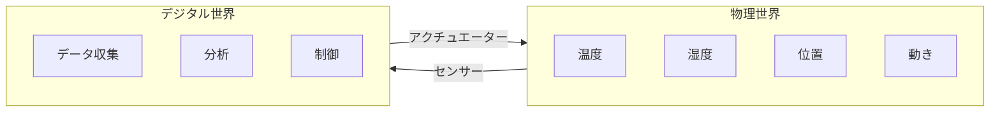
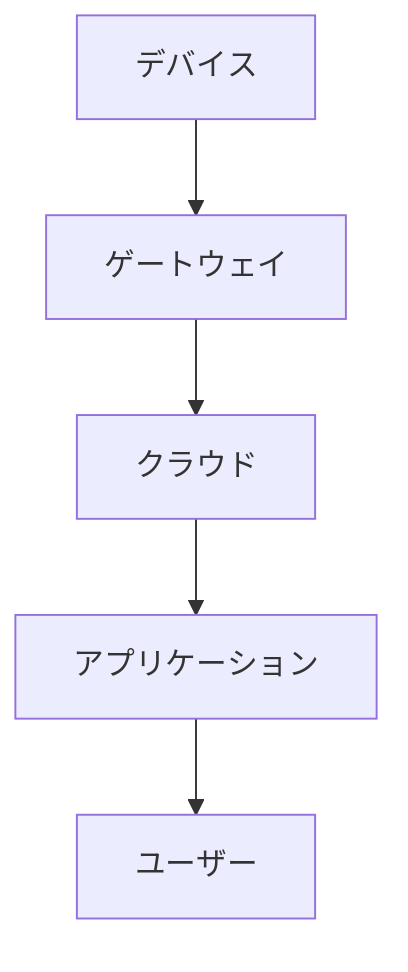

# IoTの基本概念

## 📋 概要

| 項目 | 内容 |
|------|------|
| 難易度 | [基礎] |
| 所要時間 | 45-60分 |
| 前提知識 | なし |

## なぜ学ぶ必要があるのか

### IoTが解決する問題

IoTは物理世界とデジタル世界を繋ぎます。

### 実務での重要性

- **Industry 4.0**: 製造業のデジタル化
- **スマートシティ**: 都市インフラの効率化
- **ヘルスケア**: 健康管理デバイス
- **農業**: スマート農業

## IoTの基本構成

### デバイス層

- **センサー**: 温度、湿度、加速度等を検知
- **アクチュエーター**: モーター、LED等を制御
- **マイコン**: データ処理と制御

### 通信層

- **Wi-Fi**: 高速通信
- **Bluetooth**: 近距離通信
- **LoRa**: 長距離・低消費電力

### クラウド層

- **データ収集**: センサーデータの蓄積
- **分析**: 機械学習、統計分析
- **制御**: デバイスへの指令送信

## IoTアーキテクチャ

## 学習目標の確認

このコンテンツを読んだ後、以下ができるようになっているはずです：

- [ ] IoTの基本概念を説明できる
- [ ] IoTの基本構成を理解している
- [ ] IoTアーキテクチャを説明できる

## 次のステップ

- [02. ハードウェア基礎](01-iot-fundamentals-02.md)

## 参考リソース

- [AWS IoT入門](https://aws.amazon.com/jp/iot/)
- [Azure IoT入門](https://azure.microsoft.com/ja-jp/solutions/iot/)

---

**著作権表示**

Copyright © 2024 Honeycome Inc. All rights reserved.

本コンテンツは、Honeycome Inc.の所有物です。無断での複製、配布、転載を禁止します。
詳細は[利用規約](../../docs/terms-of-use.md)をご覧ください。
