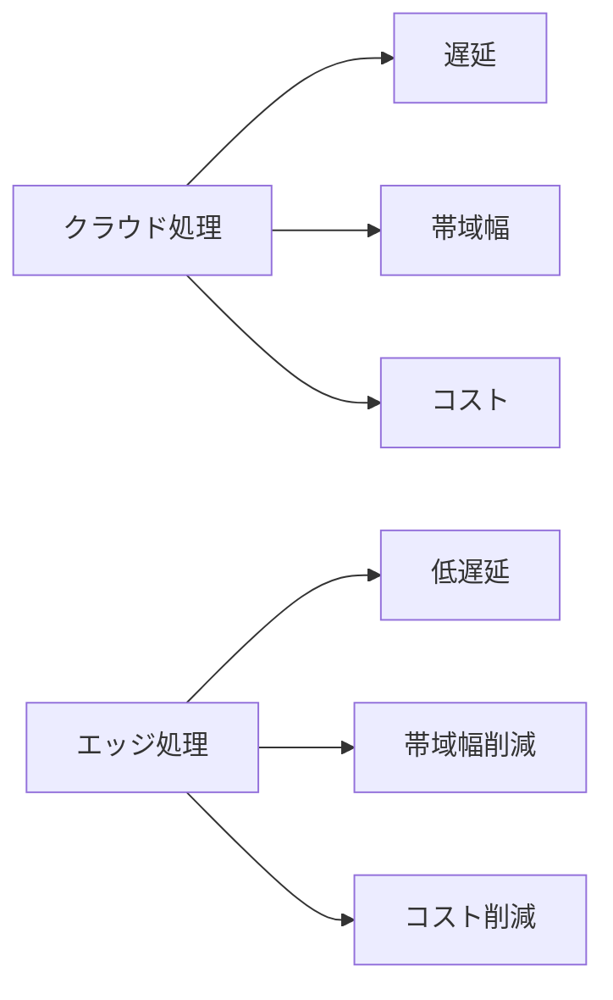

# エッジコンピューティング

## 📋 概要

| 項目 | 内容 |
|------|------|
| 難易度 | [中級] |
| 所要時間 | 45-60分 |
| 前提知識 | IoT基礎 |

## なぜ学ぶ必要があるのか

### エッジコンピューティングが解決する問題

## エッジ vs クラウド

| 項目 | エッジ | クラウド |
|------|--------|---------|
| **処理速度** | 高速（ローカル） | やや遅い（ネットワーク経由） |
| **帯域幅** | 不要 | 必要 |
| **コスト** | デバイスコスト | クラウドコスト |
| **スケーラビリティ** | 限定的 | 高い |

## エッジコンピューティングのユースケース

- **リアルタイム制御**: ロボット、自動運転
- **オフライン動作**: ネットワークが不安定な環境
- **プライバシー**: データをローカルで処理

## 学習目標の確認

このコンテンツを読んだ後、以下ができるようになっているはずです：

- [ ] エッジコンピューティングの利点を説明できる
- [ ] エッジとクラウドの使い分けができる

## 次のステップ

- [04. IoTアーキテクチャ](01-iot-fundamentals-04.md)

## 参考リソース

- [AWS IoT Greengrass](https://aws.amazon.com/greengrass/)
