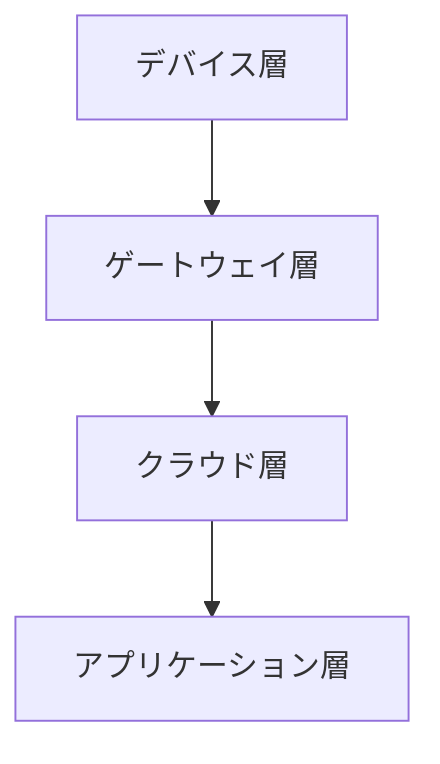

# IoTアーキテクチャ

## 📋 概要

| 項目 | 内容 |
|------|------|
| 難易度 | [中級] |
| 所要時間 | 45-60分 |
| 前提知識 | IoT基礎 |

## なぜ学ぶ必要があるのか

### IoTアーキテクチャが解決する問題

適切なアーキテクチャを理解することで、スケーラブルなIoTシステムを構築できます。

## 3層アーキテクチャ

### デバイス層

- **役割**: データ収集、制御
- **技術**: マイコン、センサー

### ゲートウェイ層

- **役割**: データ集約、プロトコル変換
- **技術**: エッジデバイス、ゲートウェイ

### クラウド層

- **役割**: データ保存、分析、制御
- **技術**: AWS IoT、Azure IoT

## 学習目標の確認

このコンテンツを読んだ後、以下ができるようになっているはずです：

- [ ] IoTアーキテクチャを説明できる
- [ ] 各層の役割を理解している

## 次のステップ

- [02. 組み込みシステム](../02-embedded-systems/)

## 参考リソース

- [AWS IoT Architecture](https://aws.amazon.com/iot/solutions/)

---

**著作権表示**

Copyright © 2024 Honeycome Inc. All rights reserved.

本コンテンツは、Honeycome Inc.の所有物です。無断での複製、配布、転載を禁止します。
詳細は[利用規約](../../docs/terms-of-use.md)をご覧ください。
