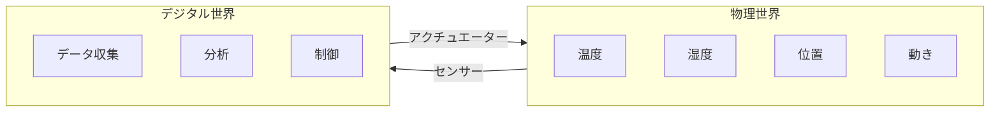
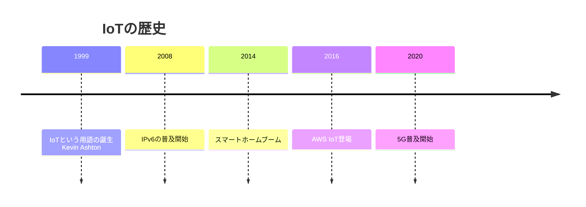

# 01. IoT基礎

## 概要

**学習日数**: 2-3日

IoTの基礎を学びます。IoTの基本概念、ハードウェア基礎、エッジコンピューティング、IoTアーキテクチャについて理解します。

## なぜ学ぶ必要があるのか

### この技術が解決する問題

IoTは物理世界とデジタル世界を繋ぎます：
- **データ収集**: 現実世界の状態をリアルタイムに把握
- **遠隔監視**: 離れた場所から機器を監視
- **自動制御**: データに基づいて機器を自動制御

### 実務での重要性

- **Industry 4.0**: 製造業のデジタル化
- **スマートシティ**: 都市インフラの効率化
- **ヘルスケア**: 健康管理デバイス
- **農業**: スマート農業

## 技術の歴史的背景

## 学習内容

| No | コンテンツ | 難易度 | 内容 |
|----|------------|--------|------|
| 01 | [IoTの基本概念](01-iot-fundamentals-01.md) | [基礎] | IoTとは、ユースケース |
| 02 | [ハードウェア基礎](01-iot-fundamentals-02.md) | [基礎] | マイコン、センサー、アクチュエーター |
| 03 | [エッジコンピューティング](01-iot-fundamentals-03.md) | [中級] | エッジ vs クラウド |
| 04 | [IoTアーキテクチャ](01-iot-fundamentals-04.md) | [中級] | デバイス、ゲートウェイ、クラウド |

## 学習目標

- [ ] IoTの基本概念を説明できる
- [ ] センサーとアクチュエーターの違いを説明できる
- [ ] エッジコンピューティングの利点を説明できる
- [ ] IoTアーキテクチャを説明できる

## 参考リソース

- [AWS IoT入門](https://aws.amazon.com/jp/iot/)
- [Azure IoT入門](https://azure.microsoft.com/ja-jp/solutions/iot/)

---

**著作権表示**

Copyright © 2024 Honeycome Inc. All rights reserved.

本コンテンツは、Honeycome Inc.の所有物です。無断での複製、配布、転載を禁止します。
詳細は[利用規約](../../../docs/terms-of-use.md)をご覧ください。
