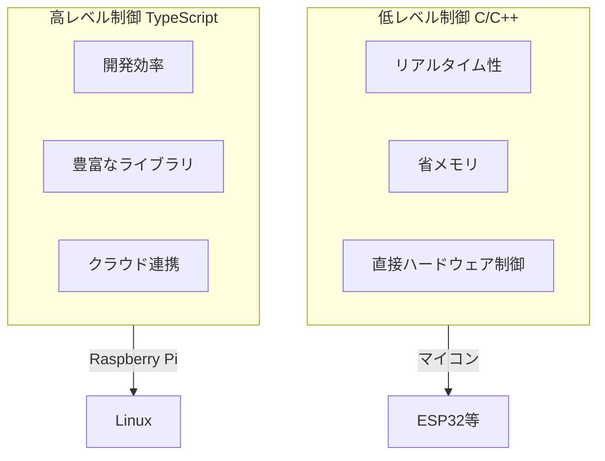

# 02. 組み込みシステム

## 概要

**学習日数**: 4-5日

組み込みプログラミングを学びます。C/C++での低レベル制御と、TypeScript/Node.jsでの高レベル制御について理解します。

## なぜ学ぶ必要があるのか

### この技術が解決する問題

- **低レベル制御**: リアルタイム性が必要な処理、省リソース環境
- **高レベル制御**: 複雑なロジック、クラウド連携、開発効率

### 実務での重要性

- **組み込み開発の需要**: 自動車、家電、産業機器
- **TypeScriptの活用**: 共通基礎の知識を活かせる
- **使い分け**: 適材適所で言語を選択

## 学習内容

| No | コンテンツ | 難易度 | 内容 |
|----|------------|--------|------|
| 01 | [C/C++基礎](02-embedded-systems-01.md) | [中級] | C言語の基礎、ポインタ |
| 02 | [マイコンプログラミング](02-embedded-systems-02.md) | [中級] | ESP32、Arduino |
| 03 | [Node.js on Raspberry Pi](02-embedded-systems-03.md) | [基礎] | Raspberry Piでの開発 |
| 04 | [GPIOとセンサー](02-embedded-systems-04.md) | [中級] | 入出力、センサー接続 |
| 05 | [リアルタイムシステム](02-embedded-systems-05.md) | [応用] | タイミング、割り込み |

## 学習目標

- [ ] C言語の基本構文を理解している
- [ ] マイコンで簡単なプログラムを書ける
- [ ] Raspberry PiでNode.jsを動かせる
- [ ] センサーからデータを取得できる

## 参考リソース

- [Arduino公式リファレンス](https://www.arduino.cc/reference/en/)
- [Raspberry Pi公式ドキュメント](https://www.raspberrypi.org/documentation/)
