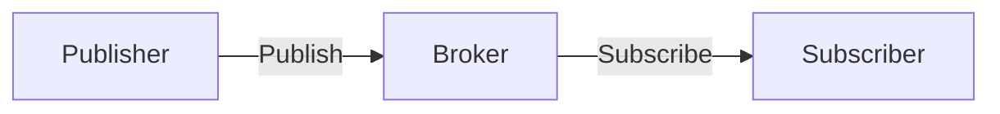

# MQTT

## 📋 概要

| 項目 | 内容 |
|------|------|
| 難易度 | [中級] |
| 所要時間 | 1-2時間 |
| 前提知識 | IoT基礎 |

## なぜ学ぶ必要があるのか

### MQTTが解決する問題

MQTTは、IoT向けに設計された軽量なメッセージングプロトコルです。



## MQTTの基本

### トピック

```
sensor/temperature/room1
device/status/device001
```

### Publish/Subscribe

```typescript
import mqtt from 'mqtt';

const client = mqtt.connect('mqtt://broker.example.com');

// Subscribe
client.subscribe('sensor/temperature');

// Publish
client.publish('sensor/temperature', '25.5');

// メッセージ受信
client.on('message', (topic, message) => {
  console.log(`Topic: ${topic}, Message: ${message.toString()}`);
});
```

## QoS (Quality of Service)

| QoS | 説明 | 使用例 |
|-----|------|--------|
| **0** | 最大1回送信 | 頻繁なデータ（温度等） |
| **1** | 最低1回送信 | 重要なデータ |
| **2** | 正確に1回送信 | 決済等の重要なデータ |

## 学習目標の確認

このコンテンツを読んだ後、以下ができるようになっているはずです：

- [ ] MQTTの仕組みを説明できる
- [ ] MQTTでメッセージを送受信できる
- [ ] QoSを理解している

## 次のステップ

- [02. CoAP](03-iot-protocols-02.md)

## 参考リソース

- [MQTT.org](https://mqtt.org/)
