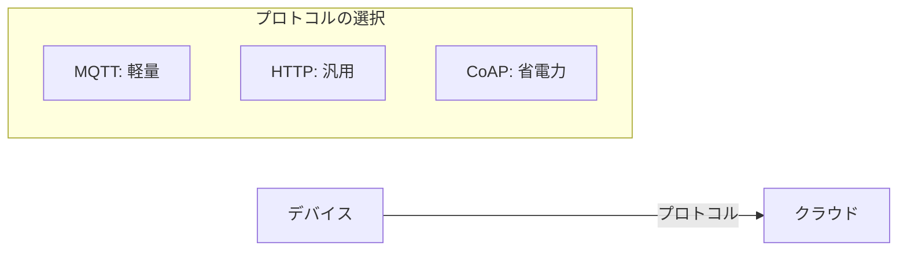

# 03. IoTプロトコル

## 概要

**学習日数**: 2-3日

IoTで使われる通信プロトコルを学びます。MQTT、CoAP、無線通信技術について理解します。

## なぜ学ぶ必要があるのか

### この技術が解決する問題

IoTデバイスは様々な制約があります：
- **帯域幅の制限**: 低速な回線
- **バッテリー**: 省電力が重要
- **信頼性**: データの確実な送信

適切なプロトコルを選ぶことで、これらの課題を解決できます。

## 学習内容

| No | コンテンツ | 難易度 | 内容 |
|----|------------|--------|------|
| 01 | [MQTT](03-iot-protocols-01.md) | [中級] | Publish/Subscribe、QoS |
| 02 | [CoAP](03-iot-protocols-02.md) | [中級] | RESTfulなIoTプロトコル |
| 03 | [無線通信](03-iot-protocols-03.md) | [中級] | Wi-Fi、Bluetooth、LoRa |
| 04 | [プロトコル選択](03-iot-protocols-04.md) | [中級] | 用途に応じた選択 |

## 学習目標

- [ ] MQTTの仕組みを説明できる
- [ ] MQTTでメッセージを送受信できる
- [ ] 無線通信技術の特徴を説明できる
- [ ] 用途に応じてプロトコルを選択できる

## 参考リソース

- [MQTT.org](https://mqtt.org/)
- [Mosquitto](https://mosquitto.org/)

---

**著作権表示**

Copyright © 2024 Honeycome Inc. All rights reserved.

本コンテンツは、Honeycome Inc.の所有物です。無断での複製、配布、転載を禁止します。
詳細は[利用規約](../../../docs/terms-of-use.md)をご覧ください。
