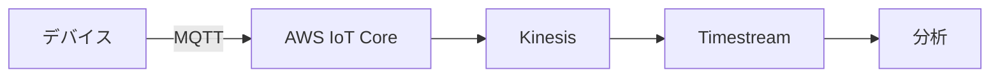

# データ収集・分析

## 📋 概要

| 項目 | 内容 |
|------|------|
| 難易度 | [中級] |
| 所要時間 | 1-2時間 |
| 前提知識 | AWS IoT基礎 |

## なぜ学ぶ必要があるのか

### データ収集・分析が解決する問題

収集したデータを分析することで、洞察を得て、自動制御が可能になります。

## データフロー

## AWS Timestream

時系列データベースで、IoTデータを効率的に保存・分析できます。

## 学習目標の確認

このコンテンツを読んだ後、以下ができるようになっているはずです：

- [ ] データを収集できる
- [ ] データを分析できる

## 次のステップ

- [04. 可視化](04-iot-cloud-integration-04.md)

## 参考リソース

- [AWS Timestream](https://aws.amazon.com/timestream/)
