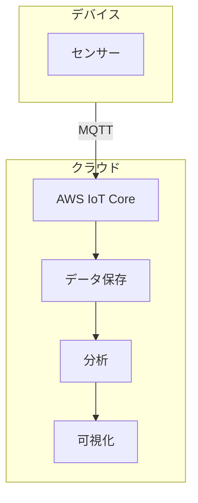

# 04. IoTクラウド連携

## 概要

**学習日数**: 3-4日

IoTデバイスとクラウドプラットフォームを連携させる方法を学びます。AWS IoT、Azure IoTを使ったデータ収集、分析、可視化について理解します。

## なぜ学ぶ必要があるのか

### この技術が解決する問題

クラウドと連携することで：
- **大量データの保存**: デバイスでは保存できない大量データ
- **高度な分析**: 機械学習を使った分析
- **リアルタイム可視化**: ダッシュボードでの監視
- **アラート**: 異常検知と通知

### 実務での重要性

- **スケーラビリティ**: 大量のデバイスを管理
- **セキュリティ**: デバイス認証、暗号化
- **運用**: デバイスのリモート管理

## 学習内容

| No | コンテンツ | 難易度 | 内容 |
|----|------------|--------|------|
| 01 | [AWS IoT基礎](04-iot-cloud-integration-01.md) | [中級] | AWS IoT Core、Thing |
| 02 | [デバイス連携](04-iot-cloud-integration-02.md) | [中級] | デバイスからのデータ送信 |
| 03 | [データ収集・分析](04-iot-cloud-integration-03.md) | [中級] | Kinesis、Timestream |
| 04 | [可視化](04-iot-cloud-integration-04.md) | [中級] | Grafana、QuickSight |
| 05 | [セキュリティ](04-iot-cloud-integration-05.md) | [中級] | 証明書、暗号化 |

## 学習目標

- [ ] AWS IoTにデバイスを登録できる
- [ ] デバイスからクラウドにデータを送信できる
- [ ] 収集したデータを可視化できる
- [ ] 基本的なセキュリティを設定できる

## 参考リソース

- [AWS IoT Core](https://aws.amazon.com/jp/iot-core/)
- [Azure IoT Hub](https://azure.microsoft.com/ja-jp/products/iot-hub/)

---

**著作権表示**

Copyright © 2024 Honeycome Inc. All rights reserved.

本コンテンツは、Honeycome Inc.の所有物です。無断での複製、配布、転載を禁止します。
詳細は[利用規約](../../../docs/terms-of-use.md)をご覧ください。
