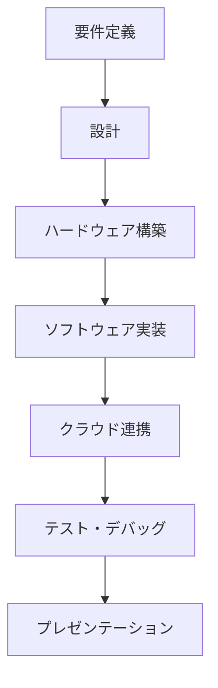
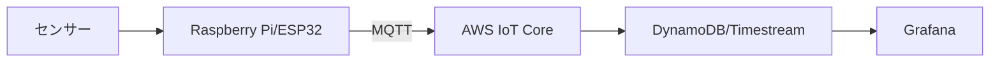

# 05. 応用演習（Capstone Project）

## 概要

**学習日数**: 5-7日

これまで学んだ知識を総動員して、実際に動作するIoTシステムを開発します。要件定義から実装、デプロイ、プレゼンテーションまでを行います。

## 応用演習の目的

- **知識の統合**: ハードウェアからクラウドまでの一連の流れを経験
- **実践経験**: 実際に動くシステムを作る
- **成果物**: デモ可能な成果物を作る

## 成果物の要件

### 必須要件

- [ ] センサーからのデータ収集
- [ ] クラウドへのデータ送信
- [ ] ダッシュボードでの可視化
- [ ] ドキュメント（構成図、使い方）

### システム構成

## 進め方

### Day 1: 要件定義・設計

1. **システムのテーマ決め**
2. **要件定義**: 収集するデータ、可視化方法
3. **設計**: システム構成図、配線図

### Day 2-3: ハードウェア構築

1. **配線**: センサーの接続
2. **動作確認**: センサーからのデータ取得

### Day 4-5: ソフトウェア実装

1. **デバイスプログラム**: データ収集、送信
2. **クラウド設定**: AWS IoT設定

### Day 6: クラウド連携・可視化

1. **データ保存**: DynamoDB/Timestream
2. **可視化**: Grafanaダッシュボード

### Day 7: プレゼンテーション

1. **デモ準備**
2. **プレゼンテーション**

## テーマ例

### 初級

- **温湿度モニター**: 室温・湿度の監視
- **照度センサー**: 明るさの監視
- **ボタン入力**: ボタン押下の記録

### 中級

- **スマート植物監視**: 土壌湿度、日照
- **ドア開閉モニター**: 開閉検知
- **騒音モニター**: 音量監視

### 上級

- **環境モニタリングシステム**: 複数センサー統合
- **簡易防犯システム**: 人感センサー、通知

## 参考リソース

- [AWS IoT Getting Started](https://docs.aws.amazon.com/iot/latest/developerguide/iot-gs.html)
- [Raspberry Pi Sense HAT](https://www.raspberrypi.org/products/sense-hat/)

---

**著作権表示**

Copyright © 2024 Honeycome Inc. All rights reserved.

本コンテンツは、Honeycome Inc.の所有物です。無断での複製、配布、転載を禁止します。
詳細は[利用規約](../../../docs/terms-of-use.md)をご覧ください。
