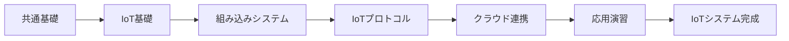
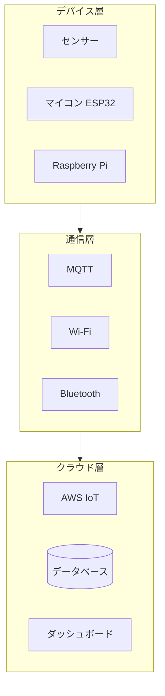

# IoTエンジニアコース

## 概要

IoTシステム開発を学ぶコースです。IoTの基礎、組み込みシステム、IoTプロトコル、クラウド連携を学びます。

**学習期間**: 2-3週間（80-120時間）
**前提条件**: 共通基礎を修了していること

## コースの目標

このコースを修了すると、以下ができるようになります：

- [ ] IoTの基本概念とアーキテクチャを理解している
- [ ] C/C++またはTypeScriptで組み込みプログラミングができる
- [ ] MQTT等のIoTプロトコルを使った通信ができる
- [ ] クラウドプラットフォームとの連携ができる
- [ ] 実際に動作するIoTシステムを構築できる

## 技術スタック

| レイヤー | 技術 |
|----------|------|
| デバイス | ESP32、Raspberry Pi、各種センサー |
| 通信 | MQTT、Wi-Fi、Bluetooth、LoRa |
| クラウド | AWS IoT、Azure IoT |
| 言語 | C/C++（組み込み）、TypeScript/Node.js（高レベル） |

## カテゴリ一覧

| No | カテゴリ | 学習日数 | 内容 |
|----|----------|----------|------|
| 01 | [IoT基礎](01-iot-fundamentals/) | 2-3日 | IoTの基本概念、ハードウェア基礎 |
| 02 | [組み込みシステム](02-embedded-systems/) | 4-5日 | C/C++、TypeScript/Node.js |
| 03 | [IoTプロトコル](03-iot-protocols/) | 2-3日 | MQTT、CoAP、無線通信 |
| 04 | [IoTクラウド連携](04-iot-cloud-integration/) | 3-4日 | AWS IoT、Azure IoT |
| 05 | [応用演習](05-capstone-project/) | 5-7日 | IoTシステム開発 |

## 学習の進め方

1. 各カテゴリのREADME.mdと各コンテンツを読む
2. tests/iot/配下のテストで理解度を確認
3. exercises/iot/配下の課題に取り組む
4. 課題をプルリクエストで提出
5. メンターのレビューを受ける

## 成果物

コース修了時には、以下の成果物を作成します：

- **動作するIoTシステム**
  - センサーからデータ収集
  - クラウドへデータ送信
  - ダッシュボードで可視化

## ハードウェア要件

このコースでは以下のハードウェアを使用します：

| 機器 | 用途 | 備考 |
|------|------|------|
| Raspberry Pi 4 | 高レベル制御 | 貸出可能 |
| ESP32 | 低レベル制御 | 貸出可能 |
| センサーキット | データ収集 | 貸出可能 |
| ブレッドボード | 配線 | 貸出可能 |

---

**著作権表示**

Copyright © 2024 Honeycome Inc. All rights reserved.

本コンテンツは、Honeycome Inc.の所有物です。無断での複製、配布、転載を禁止します。
詳細は[利用規約](../../../docs/terms-of-use.md)をご覧ください。
