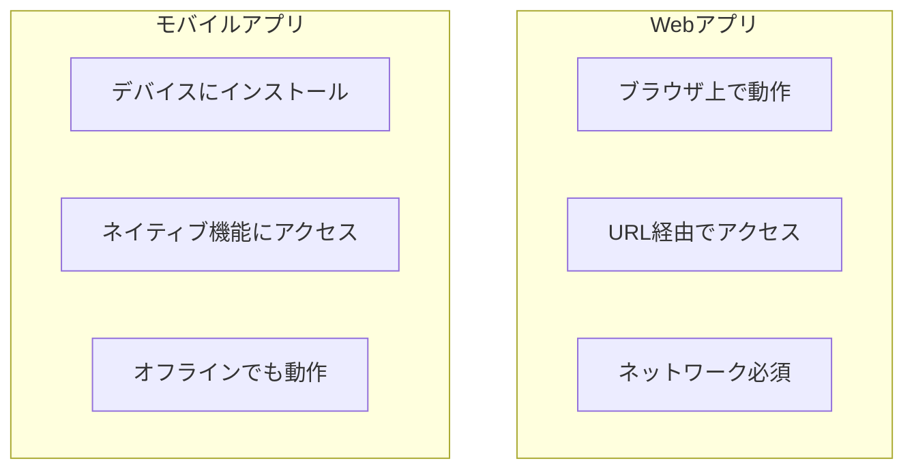

# モバイルアプリの特徴

## 📋 概要

| 項目 | 内容 |
|------|------|
| 難易度 | [基礎] |
| 所要時間 | 30-45分 |
| 前提知識 | なし |

## なぜ学ぶ必要があるのか

### Webアプリ vs モバイルアプリ

### モバイルアプリの特徴

| 特徴 | 説明 | メリット |
|------|------|---------|
| **ネイティブ機能** | カメラ、GPS、センサー等 | デバイスの機能をフル活用 |
| **パフォーマンス** | ネイティブコードで実行 | 高速な動作 |
| **オフライン対応** | ネットワーク不要 | どこでも使える |
| **プッシュ通知** | リアルタイム通知 | ユーザーエンゲージメント向上 |

### 実務での重要性

- **モバイルファースト**: 多くのユーザーがスマートフォンからアクセス
- **ネイティブ体験**: Webでは実現できない体験を提供
- **ストア配布**: App StoreやGoogle Playでの配布

## モバイルアプリの種類

### 1. ネイティブアプリ

- **iOS**: Swift、Objective-C
- **Android**: Kotlin、Java
- **メリット**: 最高のパフォーマンス、ネイティブ機能への完全アクセス
- **デメリット**: プラットフォームごとに開発が必要

### 2. クロスプラットフォームアプリ

- **React Native**: JavaScript/TypeScript
- **Flutter**: Dart
- **メリット**: 1つのコードベースで複数プラットフォーム対応
- **デメリット**: ネイティブよりパフォーマンスが劣る場合がある

### 3. ハイブリッドアプリ

- **Cordova/PhoneGap**: Web技術で開発
- **メリット**: Web技術で開発可能
- **デメリット**: パフォーマンスとネイティブ機能へのアクセスが限定的

## 学習目標の確認

このコンテンツを読んだ後、以下ができるようになっているはずです：

- [ ] Webアプリとモバイルアプリの違いを説明できる
- [ ] モバイルアプリの種類を理解している
- [ ] 各アプリタイプのメリット・デメリットを説明できる

## 次のステップ

- [02. プラットフォームの違い](01-mobile-fundamentals-02.md)

## 参考リソース

- [Apple Developer](https://developer.apple.com/)
- [Android Developers](https://developer.android.com/)

---

**著作権表示**

Copyright © 2024 Honeycome Inc. All rights reserved.

本コンテンツは、Honeycome Inc.の所有物です。無断での複製、配布、転載を禁止します。
詳細は[利用規約](../../docs/terms-of-use.md)をご覧ください。
