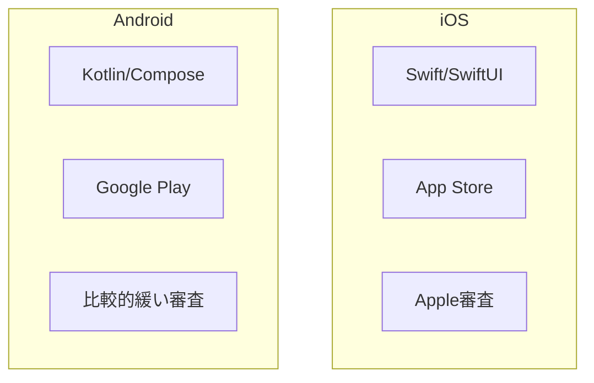

# プラットフォームの違い

## 📋 概要

| 項目 | 内容 |
|------|------|
| 難易度 | [基礎] |
| 所要時間 | 30-45分 |
| 前提知識 | なし |

## なぜ学ぶ必要があるのか

### iOS vs Android

## iOSの特徴

### 開発環境

- **言語**: Swift、Objective-C
- **IDE**: Xcode（macOSのみ）
- **UI**: UIKit、SwiftUI
- **配布**: App Store

### 特徴

- **統一されたデバイス**: 限られたデバイスで動作
- **厳格な審査**: App Storeの審査が厳しい
- **高品質**: ユーザー体験が統一されている

## Androidの特徴

### 開発環境

- **言語**: Kotlin、Java
- **IDE**: Android Studio
- **UI**: Jetpack Compose、XML
- **配布**: Google Play

### 特徴

- **多様なデバイス**: 様々なメーカー・サイズ
- **柔軟な配布**: 複数の配布チャネル
- **カスタマイズ性**: 高い自由度

## クロスプラットフォーム

### React Native

- **言語**: JavaScript/TypeScript
- **特徴**: 1つのコードベースで両方対応
- **パフォーマンス**: ネイティブより劣る場合がある

## 学習目標の確認

このコンテンツを読んだ後、以下ができるようになっているはずです：

- [ ] iOSとAndroidの違いを説明できる
- [ ] 各プラットフォームの特徴を理解している
- [ ] 開発環境の違いを理解している

## 次のステップ

- [03. モバイルUI/UX](01-mobile-fundamentals-03.md)

## 参考リソース

- [Apple Developer](https://developer.apple.com/)
- [Android Developers](https://developer.android.com/)
