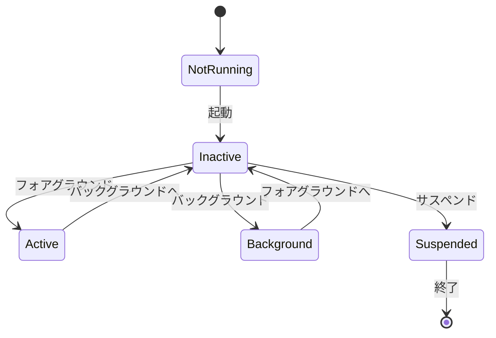
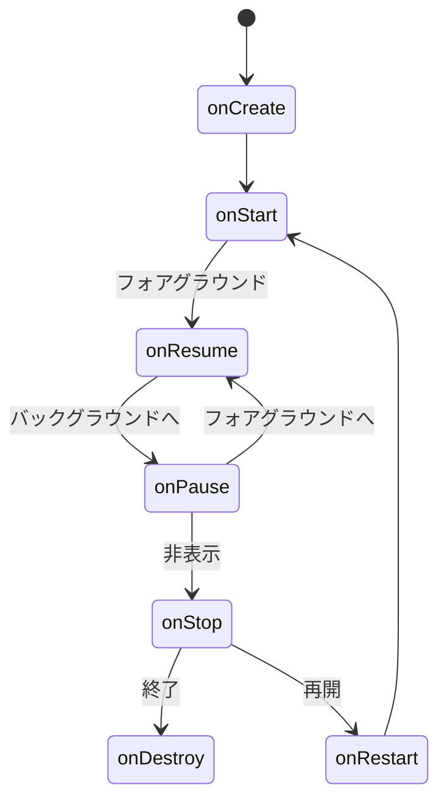

# アプリのライフサイクル

## 📋 概要

| 項目 | 内容 |
|------|------|
| 難易度 | [中級] |
| 所要時間 | 30-45分 |
| 前提知識 | モバイル基礎 |

## なぜ学ぶ必要があるのか

### ライフサイクルが解決する問題

アプリの状態（フォアグラウンド、バックグラウンド等）を理解することで、適切な処理を実装できます。

## iOSのライフサイクル

### 状態

- **Not Running**: アプリが起動していない
- **Inactive**: フォアグラウンドだがイベントを受け取らない
- **Active**: フォアグラウンドで動作中
- **Background**: バックグラウンドで動作
- **Suspended**: メモリに保持されているが実行されていない

## Androidのライフサイクル

### コールバック

- **onCreate**: アクティビティの作成
- **onStart**: アクティビティの開始
- **onResume**: フォアグラウンド
- **onPause**: バックグラウンドへ
- **onStop**: 非表示
- **onDestroy**: 破棄

## 学習目標の確認

このコンテンツを読んだ後、以下ができるようになっているはずです：

- [ ] iOSのライフサイクルを理解している
- [ ] Androidのライフサイクルを理解している
- [ ] 各状態で適切な処理を実装できる

## 次のステップ

- [02. iOS開発](../02-ios-development/)

## 参考リソース

- [iOS App Life Cycle](https://developer.apple.com/documentation/uikit/app_and_environment/managing_your_app_s_life_cycle)
- [Android Activity Lifecycle](https://developer.android.com/guide/components/activities/activity-lifecycle)
