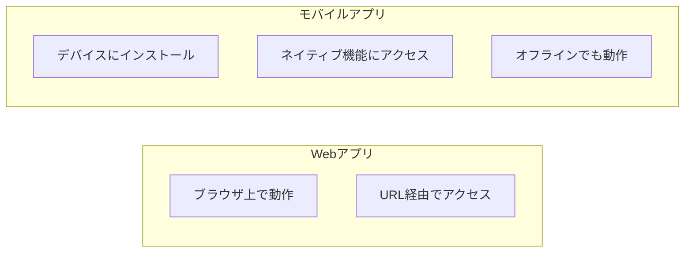

# 01. モバイル基礎

## 概要

**学習日数**: 1-2日

モバイルアプリ開発の基礎を学びます。モバイルアプリの特徴、iOS/Androidの違い、モバイルUI/UXの基礎について理解します。

## なぜ学ぶ必要があるのか

### この技術が解決する問題

モバイルアプリは、Webアプリでは実現できない以下の機能を提供できます：
- **ネイティブ機能**: カメラ、GPS、センサー等
- **プッシュ通知**: ユーザーにリアルタイムで通知
- **オフライン対応**: ネットワークがなくても動作
- **パフォーマンス**: ネイティブの高速な動作

### 実務での重要性

- **モバイルファースト**: 多くのユーザーがスマートフォンからアクセス
- **ストアでの配布**: App StoreやGoogle Playでの配布
- **UXの重要性**: モバイルはUI/UXが特に重要

## 学習内容

| No | コンテンツ | 難易度 | 内容 |
|----|------------|--------|------|
| 01 | [モバイルアプリの特徴](01-mobile-fundamentals-01.md) | [基礎] | Web vs モバイル、メリット/デメリット |
| 02 | [プラットフォームの違い](01-mobile-fundamentals-02.md) | [基礎] | iOS vs Android |
| 03 | [モバイルUI/UX](01-mobile-fundamentals-03.md) | [基礎] | Human Interface Guidelines、Material Design |
| 04 | [アプリのライフサイクル](01-mobile-fundamentals-04.md) | [中級] | フォアグラウンド、バックグラウンド |

## 学習目標

- [ ] モバイルアプリの特徴を説明できる
- [ ] iOSとAndroidの違いを説明できる
- [ ] モバイルUI/UXの基本原則を理解している
- [ ] アプリのライフサイクルを説明できる

## 参考リソース

- [Human Interface Guidelines](https://developer.apple.com/design/human-interface-guidelines/)
- [Material Design](https://m3.material.io/)
