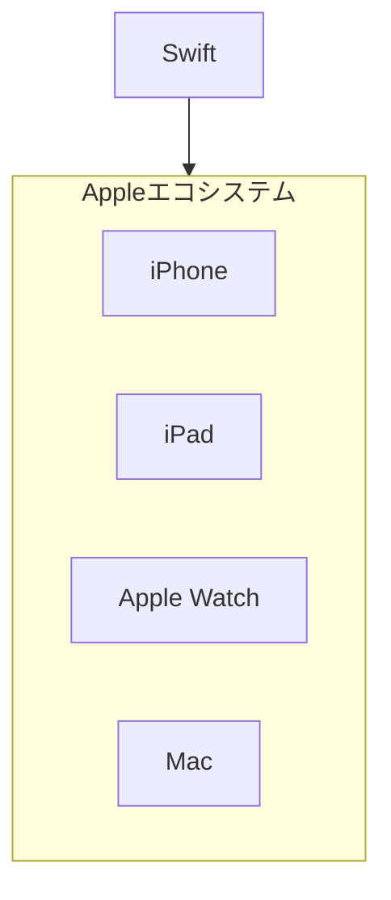
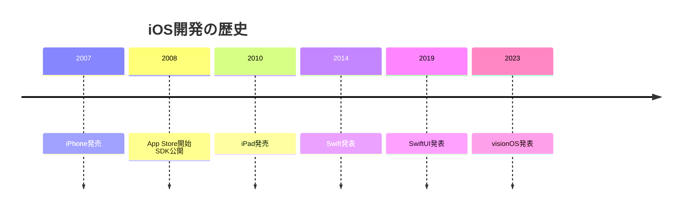

# 02. iOS開発

## 概要

**学習日数**: 3-4日

SwiftでiOSアプリを開発する方法を学びます。Swift言語の基礎、UIKit/SwiftUI、iOSアーキテクチャパターンについて理解します。

## なぜ学ぶ必要があるのか

### この技術が解決する問題

- **Appleエコシステム**: iPhone、iPad、Apple Watch、Macで動作するアプリ
- **高品質なUX**: Appleのガイドラインに沿った高品質なアプリ
- **App Store**: 世界中のユーザーにリーチ

### 実務での重要性

- **iOSの市場シェア**: 特に日本では高いシェア
- **購買力**: iOSユーザーは購買力が高い傾向
- **エンタープライズ**: 企業向けアプリでも採用

## 技術の歴史的背景

## 学習内容

| No | コンテンツ | 難易度 | 内容 |
|----|------------|--------|------|
| 01 | [Swift基礎](02-ios-development-01.md) | [基礎] | Swift言語の基礎 |
| 02 | [UIKit](02-ios-development-02.md) | [中級] | UIKit、Storyboard |
| 03 | [SwiftUI](02-ios-development-03.md) | [中級] | 宣言的UI、プレビュー |
| 04 | [iOSアーキテクチャ](02-ios-development-04.md) | [中級] | MVC、MVVM |
| 05 | [App Store公開](02-ios-development-05.md) | [中級] | 証明書、App Store Connect |

## 学習目標

- [ ] Swiftの基本構文を使ってプログラムを書ける
- [ ] UIKit/SwiftUIでUIを作成できる
- [ ] MVVMパターンを理解している
- [ ] App Store公開の手順を理解している

## 参考リソース

- [Swift公式ドキュメント](https://docs.swift.org/swift-book/)
- [Apple Developer Documentation](https://developer.apple.com/documentation/)

---

**著作権表示**

Copyright © 2024 Honeycome Inc. All rights reserved.

本コンテンツは、Honeycome Inc.の所有物です。無断での複製、配布、転載を禁止します。
詳細は[利用規約](../../../docs/terms-of-use.md)をご覧ください。
