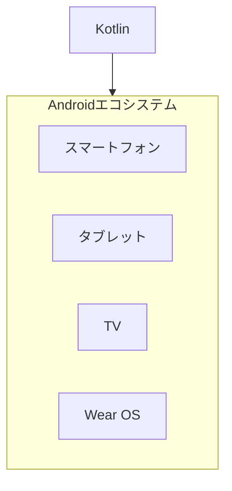
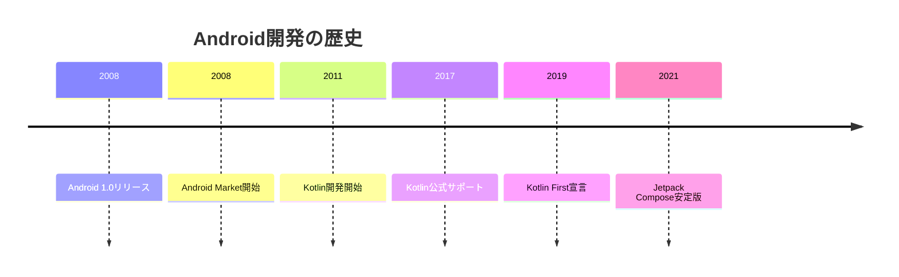

# 03. Android開発

## 概要

**学習日数**: 3-4日

KotlinでAndroidアプリを開発する方法を学びます。Kotlin言語の基礎、Android SDK、Jetpack Compose、Androidアーキテクチャパターンについて理解します。

## なぜ学ぶ必要があるのか

### この技術が解決する問題

- **世界最大のシェア**: Androidは世界で最も使われているOS
- **多様なデバイス**: スマートフォン、タブレット、TV、ウォッチ
- **オープン**: より自由度の高い開発が可能

### 実務での重要性

- **グローバル市場**: 特にアジア、新興国で高いシェア
- **デバイスの多様性**: 様々な画面サイズに対応
- **Google Play**: 世界中のユーザーにリーチ

## 技術の歴史的背景

## 学習内容

| No | コンテンツ | 難易度 | 内容 |
|----|------------|--------|------|
| 01 | [Kotlin基礎](03-android-development-01.md) | [基礎] | Kotlin言語の基礎 |
| 02 | [Android SDK](03-android-development-02.md) | [中級] | Activity、Fragment |
| 03 | [Jetpack Compose](03-android-development-03.md) | [中級] | 宣言的UI |
| 04 | [Androidアーキテクチャ](03-android-development-04.md) | [中級] | MVVM、ViewModel |
| 05 | [Google Play公開](03-android-development-05.md) | [中級] | 署名、Google Play Console |

## 学習目標

- [ ] Kotlinの基本構文を使ってプログラムを書ける
- [ ] Jetpack ComposeでUIを作成できる
- [ ] MVVMパターンを理解している
- [ ] Google Play公開の手順を理解している

## 参考リソース

- [Kotlin公式ドキュメント](https://kotlinlang.org/docs/home.html)
- [Android Developers](https://developer.android.com/)

---

**著作権表示**

Copyright © 2024 Honeycome Inc. All rights reserved.

本コンテンツは、Honeycome Inc.の所有物です。無断での複製、配布、転載を禁止します。
詳細は[利用規約](../../../docs/terms-of-use.md)をご覧ください。
