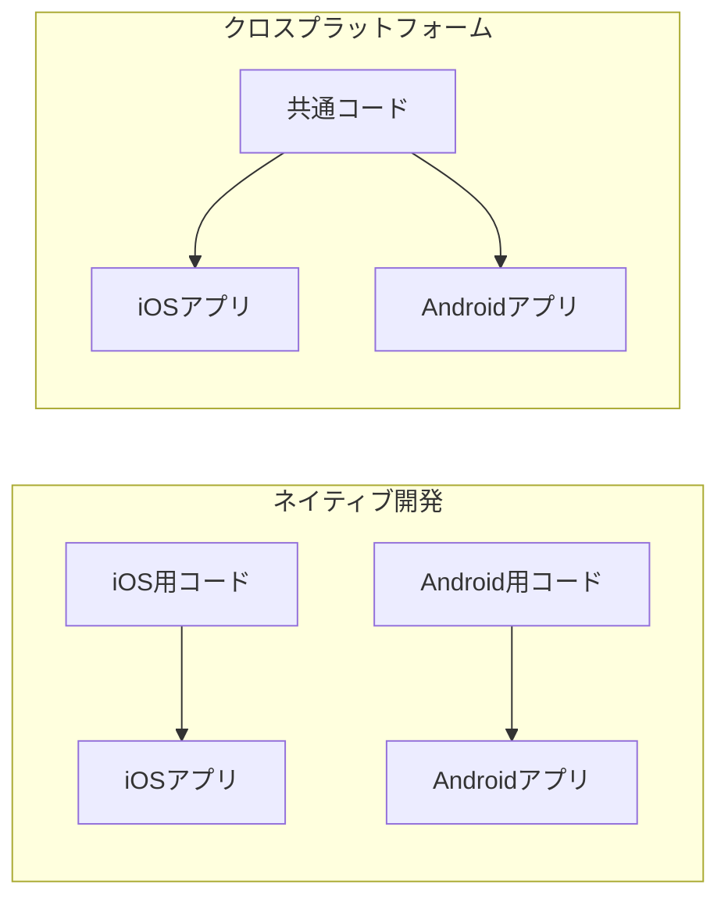
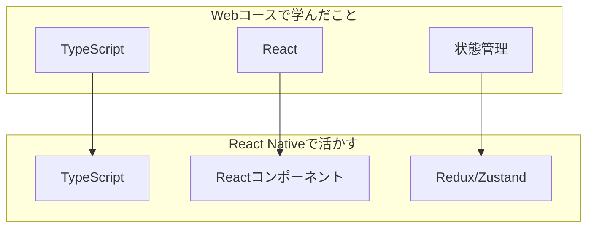
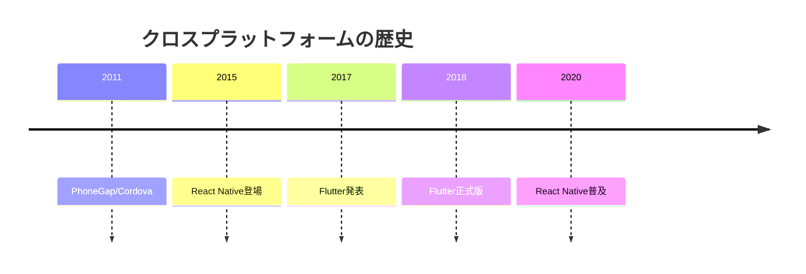

# 04. クロスプラットフォーム開発

## 概要

**学習日数**: 2-3日

React Native/TypeScriptを使ったクロスプラットフォーム開発を学びます。1つのコードベースでiOSとAndroid両方のアプリを開発する方法を理解します。

## なぜ学ぶ必要があるのか

### この技術が解決する問題

- **開発効率**: 1つのコードベースで両プラットフォームに対応
- **メンテナンス**: 修正が1箇所で済む
- **TypeScriptの活用**: Webの知識を活かせる

### 実務での重要性

- **コスト削減**: 2つのチームが不要
- **スピード**: 素早くリリースできる
- **Webエンジニアの活用**: ReactエンジニアがモバイルにもExertise

### Webコースの知識を活かす

Webコースで学んだReactとTypeScriptの知識がそのまま活かせます。

## 技術の歴史的背景

## 学習内容

| No | コンテンツ | 難易度 | 内容 |
|----|------------|--------|------|
| 01 | [React Native基礎](04-cross-platform-01.md) | [基礎] | React Nativeの基本 |
| 02 | [ネイティブコンポーネント](04-cross-platform-02.md) | [中級] | View、Text、Image等 |
| 03 | [ネイティブモジュール連携](04-cross-platform-03.md) | [中級] | カメラ、GPS等 |
| 04 | [Expo](04-cross-platform-04.md) | [基礎] | Expoの使い方 |
| 05 | [パフォーマンス最適化](04-cross-platform-05.md) | [応用] | 最適化手法 |

## 学習目標

- [ ] React NativeでiOS/Androidアプリを作成できる
- [ ] ネイティブモジュールと連携できる
- [ ] Expoを使って素早く開発できる
- [ ] 基本的なパフォーマンス最適化ができる

## 参考リソース

- [React Native公式ドキュメント](https://reactnative.dev/)
- [Expo公式ドキュメント](https://docs.expo.dev/)

---

**著作権表示**

Copyright © 2024 Honeycome Inc. All rights reserved.

本コンテンツは、Honeycome Inc.の所有物です。無断での複製、配布、転載を禁止します。
詳細は[利用規約](../../../docs/terms-of-use.md)をご覧ください。
