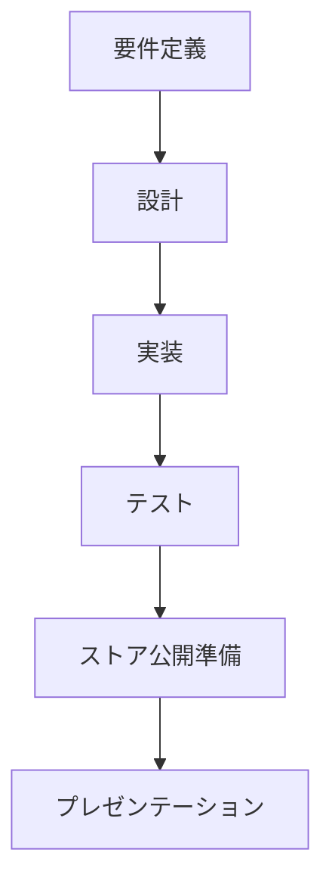

# 05. 応用演習（Capstone Project）

## 概要

**学習日数**: 3-5日

これまで学んだ知識を総動員して、モバイルアプリを開発します。要件定義から実装、ストア公開準備、プレゼンテーションまでを行います。

## 応用演習の目的

- **知識の統合**: 学んだ技術を組み合わせて実際のアプリを作る
- **実践経験**: 要件定義からストア公開準備までの一連の流れを経験
- **成果物**: ポートフォリオとして使える成果物を作る

## 成果物の要件

### 必須要件

- [ ] iOS版またはAndroid版（または両方）
- [ ] 基本的なCRUD操作
- [ ] ローカルストレージまたはAPIとの連携
- [ ] ストア公開に必要な情報（スクリーンショット、説明文等）

### 選択する開発方法

| 方法 | 言語 | 特徴 |
|------|------|------|
| iOS ネイティブ | Swift | iOSに最適化 |
| Android ネイティブ | Kotlin | Androidに最適化 |
| クロスプラットフォーム | TypeScript/React Native | 両方対応 |

## 進め方

### Day 1: 要件定義・設計

1. **アプリのテーマ決め**
2. **要件定義**: 機能一覧、画面一覧
3. **設計**: 画面設計、データモデル

### Day 2-3: 実装

1. **環境構築**
2. **UI実装**
3. **機能実装**

### Day 4: テスト・ストア準備

1. **テスト**
2. **ストア公開準備**: スクリーンショット、説明文

### Day 5: プレゼンテーション

1. **スライド作成**
2. **デモ準備**
3. **プレゼンテーション**

## テーマ例

### 初級

- **シンプルメモアプリ**: 基本的なCRUD
- **カウンターアプリ**: 状態管理の練習
- **Todoリスト**: リスト表示と操作

### 中級

- **天気アプリ**: API連携
- **写真ギャラリー**: カメラ連携
- **位置情報アプリ**: GPS連携

## 参考リソース

- [App Store審査ガイドライン](https://developer.apple.com/jp/app-store/review/guidelines/)
- [Google Playポリシー](https://play.google.com/about/developer-content-policy/)

---

**著作権表示**

Copyright © 2024 Honeycome Inc. All rights reserved.

本コンテンツは、Honeycome Inc.の所有物です。無断での複製、配布、転載を禁止します。
詳細は[利用規約](../../../docs/terms-of-use.md)をご覧ください。
