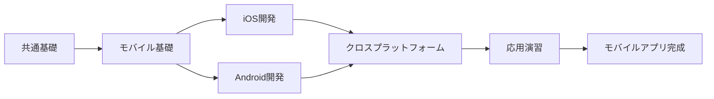
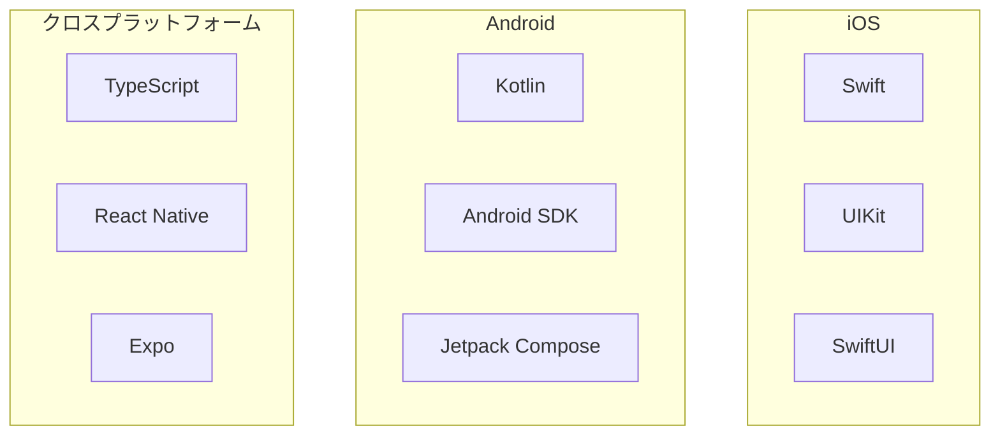
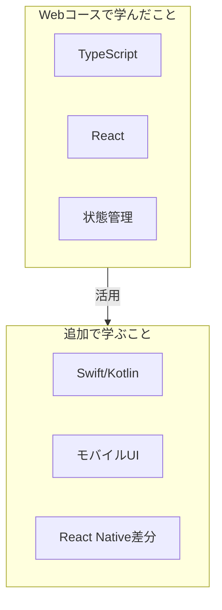

# iOS/Androidアプリエンジニアコース

## 概要

モバイルアプリ開発を学ぶコースです。iOS（Swift）、Android（Kotlin）、クロスプラットフォーム（React Native/TypeScript）を学びます。

**学習期間**: 
- **通常**: 2-3週間（80-120時間）
- **Webコース後**: 0.5-1ヶ月（差分学習）

**前提条件**: 共通基礎を修了していること

## コースの目標

このコースを修了すると、以下ができるようになります：

- [ ] モバイルアプリの特徴とプラットフォームの違いを理解している
- [ ] SwiftでiOSアプリを開発できる
- [ ] KotlinでAndroidアプリを開発できる
- [ ] React Native/TypeScriptでクロスプラットフォームアプリを開発できる
- [ ] ストア公開の準備ができる

## 技術スタック

| プラットフォーム | 技術 |
|------------------|------|
| iOS | Swift, UIKit/SwiftUI |
| Android | Kotlin, Android SDK, Jetpack Compose |
| クロスプラットフォーム | TypeScript, React Native, Expo |

## Webコース後の差分学習

Webコースを修了している場合：
- TypeScriptとReactの知識をReact Nativeで活用
- Swift/Kotlinは新規で学習
- 学習期間が短縮（0.5-1ヶ月）

## カテゴリ一覧

| No | カテゴリ | 学習日数 | 内容 |
|----|----------|----------|------|
| 01 | [モバイル基礎](01-mobile-fundamentals/) | 1-2日 | モバイルアプリの特徴、UI/UX |
| 02 | [iOS開発](02-ios-development/) | 3-4日 | Swift、UIKit/SwiftUI |
| 03 | [Android開発](03-android-development/) | 3-4日 | Kotlin、Android SDK |
| 04 | [クロスプラットフォーム](04-cross-platform/) | 2-3日 | React Native/TypeScript |
| 05 | [応用演習](05-capstone-project/) | 3-5日 | モバイルアプリ開発 |

## 学習の進め方

1. 各カテゴリのREADME.mdと各コンテンツを読む
2. tests/mobile/配下のテストで理解度を確認
3. exercises/mobile/配下の課題に取り組む
4. 課題をプルリクエストで提出
5. メンターのレビューを受ける

## 成果物

コース修了時には、以下の成果物を作成します：

- **モバイルアプリケーション**
  - iOS版またはAndroid版（または両方）
  - React Native版（オプション）
  - ストア公開準備完了

## 次のステップ

モバイルエンジニアコースを修了したら、以下のコースに進むことができます：

- [IoTエンジニアコース](../iot/) - フルコース（1-1.5ヶ月）

---

**著作権表示**

Copyright © 2024 Honeycome Inc. All rights reserved.

本コンテンツは、Honeycome Inc.の所有物です。無断での複製、配布、転載を禁止します。
詳細は[利用規約](../../../docs/terms-of-use.md)をご覧ください。
