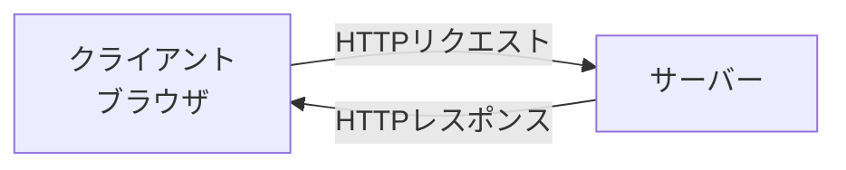
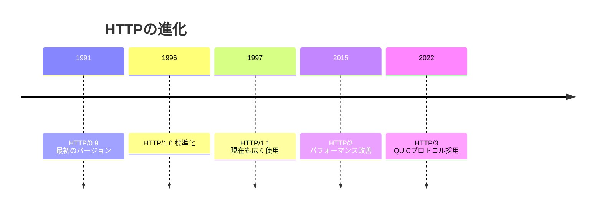
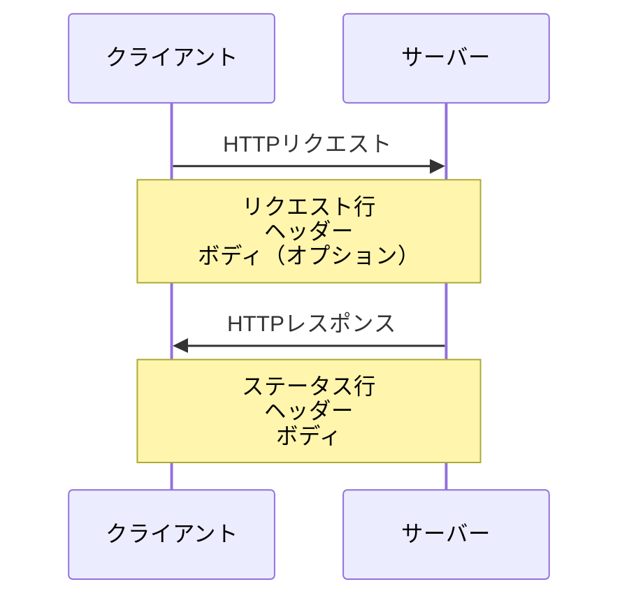

# HTTPプロトコル

## 📋 概要

| 項目 | 内容 |
|------|------|
| 難易度 | [基礎] |
| 所要時間 | 30-45分 |
| 前提知識 | なし |

## なぜ学ぶ必要があるのか

### この技術が解決する問題

HTTP（HyperText Transfer Protocol）は、Webの基盤となる通信プロトコルです。



**HTTPがないと**:
- ブラウザとサーバーが通信できない
- Webページを表示できない
- APIを呼び出せない

### 実務での重要性

- **ほぼすべてのWebアプリがHTTPを使用**: REST API、GraphQLもHTTPベース
- **デバッグの基礎**: ネットワークタブでHTTP通信を確認
- **パフォーマンス最適化**: HTTPの仕組みを理解すると最適化できる

### AI時代における重要性

- **AI生成コードの検証**: APIのコードが正しいか判断するために必要
- **エラーの原因特定**: HTTPステータスコードで問題を特定

## 技術の歴史的背景



- **1991年**: Tim Berners-LeeがHTTP/0.9を提案
- **1996年**: HTTP/1.0が標準化（RFC 1945）
- **1997年**: HTTP/1.1が標準化（RFC 2068、後にRFC 2616）
- **2015年**: HTTP/2が標準化（RFC 7540）
- **2022年**: HTTP/3が標準化（RFC 9114）

## HTTPの基本概念

### リクエストとレスポンス

HTTPは**リクエスト・レスポンス型**のプロトコルです。



### HTTPリクエストの構造

```
GET /api/users HTTP/1.1
Host: example.com
User-Agent: Mozilla/5.0
Accept: application/json

(ボディ - GETの場合は通常なし)
```

**構成要素**:
1. **リクエスト行**: メソッド、パス、HTTPバージョン
2. **ヘッダー**: 追加情報（Host、User-Agent等）
3. **ボディ**: データ（POST、PUT等で使用）

### HTTPレスポンスの構造

```
HTTP/1.1 200 OK
Content-Type: application/json
Content-Length: 123

{
  "id": 1,
  "name": "John"
}
```

**構成要素**:
1. **ステータス行**: HTTPバージョン、ステータスコード、メッセージ
2. **ヘッダー**: 追加情報（Content-Type等）
3. **ボディ**: レスポンスデータ

## HTTPメソッド

| メソッド | 用途 | べき等性 | 安全性 |
|---------|------|---------|--------|
| **GET** | リソースの取得 | ✅ | ✅ |
| **POST** | リソースの作成 | ❌ | ❌ |
| **PUT** | リソースの更新（全体） | ✅ | ❌ |
| **PATCH** | リソースの更新（部分） | ❌ | ❌ |
| **DELETE** | リソースの削除 | ✅ | ❌ |

### GET - リソースの取得

```http
GET /api/users/1 HTTP/1.1
Host: example.com
```

- **用途**: データの取得
- **べき等性**: ✅ 何度実行しても同じ結果
- **安全性**: ✅ サーバーの状態を変更しない

### POST - リソースの作成

```http
POST /api/users HTTP/1.1
Host: example.com
Content-Type: application/json

{
  "name": "John",
  "email": "john@example.com"
}
```

- **用途**: 新しいリソースの作成
- **べき等性**: ❌ 実行するたびに新しいリソースが作成される
- **安全性**: ❌ サーバーの状態を変更する

### PUT - リソースの更新（全体）

```http
PUT /api/users/1 HTTP/1.1
Host: example.com
Content-Type: application/json

{
  "id": 1,
  "name": "John Updated",
  "email": "john@example.com"
}
```

- **用途**: リソース全体を置き換え
- **べき等性**: ✅ 何度実行しても同じ結果

### DELETE - リソースの削除

```http
DELETE /api/users/1 HTTP/1.1
Host: example.com
```

- **用途**: リソースの削除
- **べき等性**: ✅ 削除済みでも同じ結果

## HTTPステータスコード

### 2xx - 成功

| コード | 意味 | 使用例 |
|--------|------|--------|
| **200** | OK | リクエスト成功 |
| **201** | Created | リソース作成成功 |
| **204** | No Content | 成功（ボディなし） |

### 3xx - リダイレクト

| コード | 意味 | 使用例 |
|--------|------|--------|
| **301** | Moved Permanently | 恒久的な移動 |
| **302** | Found | 一時的なリダイレクト |
| **304** | Not Modified | キャッシュ有効 |

### 4xx - クライアントエラー

| コード | 意味 | 使用例 |
|--------|------|--------|
| **400** | Bad Request | リクエストが不正 |
| **401** | Unauthorized | 認証が必要 |
| **403** | Forbidden | アクセス権限なし |
| **404** | Not Found | リソースが見つからない |
| **409** | Conflict | 競合（例：重複作成） |

### 5xx - サーバーエラー

| コード | 意味 | 使用例 |
|--------|------|--------|
| **500** | Internal Server Error | サーバー内部エラー |
| **502** | Bad Gateway | ゲートウェイエラー |
| **503** | Service Unavailable | サービス利用不可 |

## よくあるHTTPヘッダー

### リクエストヘッダー

| ヘッダー | 説明 | 例 |
|---------|------|-----|
| `Host` | サーバーのホスト名 | `Host: example.com` |
| `User-Agent` | クライアント情報 | `User-Agent: Mozilla/5.0` |
| `Accept` | 受け入れ可能なコンテンツタイプ | `Accept: application/json` |
| `Content-Type` | ボディの形式 | `Content-Type: application/json` |
| `Authorization` | 認証情報 | `Authorization: Bearer token` |

### レスポンスヘッダー

| ヘッダー | 説明 | 例 |
|---------|------|-----|
| `Content-Type` | ボディの形式 | `Content-Type: application/json` |
| `Content-Length` | ボディのサイズ | `Content-Length: 123` |
| `Cache-Control` | キャッシュ制御 | `Cache-Control: max-age=3600` |
| `Set-Cookie` | クッキーの設定 | `Set-Cookie: session=abc123` |

## 実践例

### ブラウザの開発者ツールで確認

1. **Chrome DevToolsを開く**: F12キー
2. **Networkタブを開く**
3. **ページをリロード**
4. **リクエストをクリックして詳細を確認**

### curlコマンドでHTTPリクエスト

```bash
# GETリクエスト
curl https://api.example.com/users

# POSTリクエスト
curl -X POST https://api.example.com/users \
  -H "Content-Type: application/json" \
  -d '{"name": "John"}'

# ヘッダーも表示
curl -i https://api.example.com/users
```

## 学習目標の確認

このコンテンツを読んだ後、以下ができるようになっているはずです：

- [ ] HTTPリクエストとレスポンスの構造を説明できる
- [ ] 主要なHTTPメソッド（GET、POST、PUT、DELETE）の違いを説明できる
- [ ] HTTPステータスコードの意味を理解している
- [ ] ブラウザの開発者ツールでHTTP通信を確認できる

## 次のステップ

- [02. HTML/CSS基礎](01-web-fundamentals-02.md)
- [03. ブラウザの仕組み](01-web-fundamentals-03.md)
- [04. REST API設計](01-web-fundamentals-04.md)

## 参考リソース

- [MDN: HTTP入門](https://developer.mozilla.org/ja/docs/Web/HTTP)
- [HTTPステータスコード一覧](https://developer.mozilla.org/ja/docs/Web/HTTP/Status)
- [RFC 9110: HTTP Semantics](https://www.rfc-editor.org/rfc/rfc9110.html)
