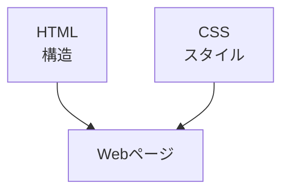
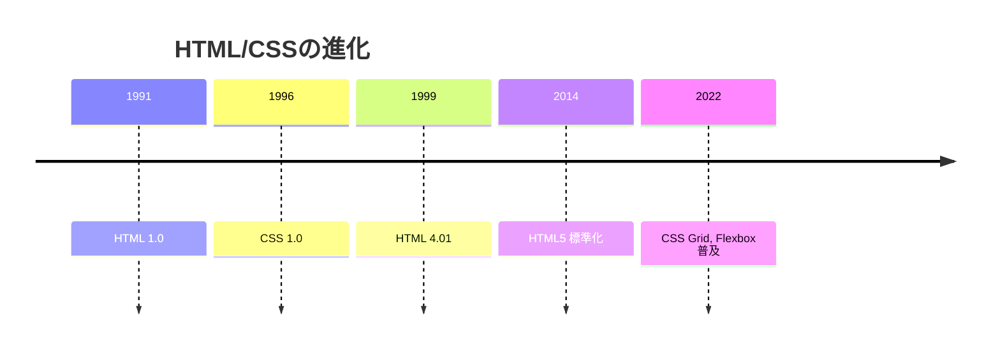
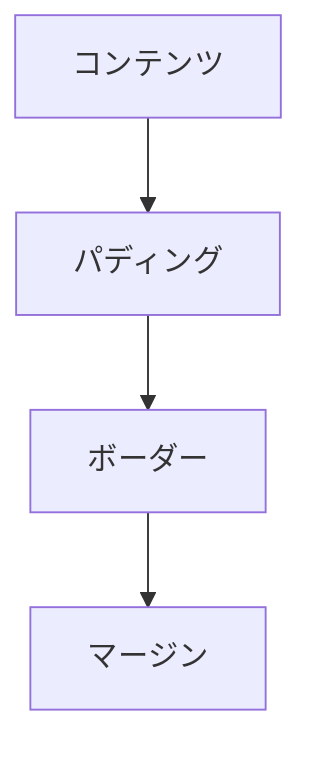

# HTML/CSS基礎

## 📋 概要

| 項目 | 内容 |
|------|------|
| 難易度 | [基礎] |
| 所要時間 | 1-2時間 |
| 前提知識 | なし |

## なぜ学ぶ必要があるのか

### この技術が解決する問題

HTMLとCSSは、Webページの構造と見た目を定義する技術です。



**HTML/CSSがないと**:
- Webページを表示できない
- ユーザーインターフェースを作れない
- レスポンシブデザインができない

### 実務での重要性

- **すべてのWebアプリの基礎**: React、Vue等のフレームワークも最終的にはHTML/CSSに変換
- **UI/UXの基礎**: 良いUIを作るために必要
- **アクセシビリティ**: 適切なHTML構造が重要

### AI時代における重要性

- **AI生成コードの検証**: HTML/CSSの知識がないと、AIの出力が正しいか判断できない
- **デバッグ**: ブラウザの開発者ツールでHTML/CSSを確認・修正

## 技術の歴史的背景



- **1991年**: HTML 1.0が提案
- **1996年**: CSS 1.0が標準化
- **2014年**: HTML5が標準化（W3C勧告）
- **現在**: モダンなCSS（Grid、Flexbox、Custom Properties）

## HTMLの基本

### HTMLの構造

```html
<!DOCTYPE html>
<html lang="ja">
<head>
  <meta charset="UTF-8">
  <meta name="viewport" content="width=device-width, initial-scale=1.0">
  <title>ページタイトル</title>
</head>
<body>
  <h1>見出し</h1>
  <p>段落</p>
</body>
</html>
```

### 主要なHTML要素

| 要素 | 用途 | 例 |
|------|------|-----|
| `<h1>` - `<h6>` | 見出し | `<h1>タイトル</h1>` |
| `<p>` | 段落 | `<p>テキスト</p>` |
| `<a>` | リンク | `<a href="/">リンク</a>` |
| `` | 画像 | `` |
| `<div>` | コンテナ | `<div>コンテンツ</div>` |
| `<span>` | インライン要素 | `<span>テキスト</span>` |
| `<ul>`, `<ol>`, `<li>` | リスト | `<ul><li>項目</li></ul>` |
| `<form>`, `<input>` | フォーム | `<form><input type="text"></form>` |

### セマンティックHTML

意味のある要素を使うことで、アクセシビリティとSEOが向上します。

```html
<!-- ❌ 悪い例 -->
<div>
  <div>タイトル</div>
  <div>本文</div>
</div>

<!-- ✅ 良い例 -->
<article>
  <header>
    <h1>タイトル</h1>
  </header>
  <main>
    <p>本文</p>
  </main>
</article>
```

**セマンティック要素**:
- `<header>`: ヘッダー
- `<nav>`: ナビゲーション
- `<main>`: メインコンテンツ
- `<article>`: 記事
- `<section>`: セクション
- `<aside>`: サイドバー
- `<footer>`: フッター

## CSSの基本

### CSSの書き方

```css
/* セレクタ { プロパティ: 値; } */
h1 {
  color: blue;
  font-size: 24px;
}
```

### セレクタの種類

| セレクタ | 説明 | 例 |
|---------|------|-----|
| **要素セレクタ** | 要素名で選択 | `h1 { }` |
| **クラスセレクタ** | クラス名で選択 | `.class { }` |
| **IDセレクタ** | IDで選択 | `#id { }` |
| **子孫セレクタ** | 子孫要素を選択 | `div p { }` |
| **子セレクタ** | 直接の子要素を選択 | `div > p { }` |

### ボックスモデル



```css
.box {
  width: 200px;        /* コンテンツの幅 */
  padding: 20px;        /* パディング */
  border: 2px solid;   /* ボーダー */
  margin: 10px;         /* マージン */
}
```

### Flexbox

```css
.container {
  display: flex;
  justify-content: center;  /* 横方向の配置 */
  align-items: center;      /* 縦方向の配置 */
  gap: 10px;                /* 要素間の間隔 */
}
```

### Grid

```css
.container {
  display: grid;
  grid-template-columns: repeat(3, 1fr);
  gap: 20px;
}
```

## レスポンシブデザイン

### メディアクエリ

```css
/* モバイルファースト */
.container {
  width: 100%;
}

/* タブレット以上 */
@media (min-width: 768px) {
  .container {
    width: 750px;
  }
}

/* デスクトップ以上 */
@media (min-width: 1024px) {
  .container {
    width: 1200px;
  }
}
```

### viewport設定

```html
<meta name="viewport" content="width=device-width, initial-scale=1.0">
```

## 学習目標の確認

このコンテンツを読んだ後、以下ができるようになっているはずです：

- [ ] HTMLの基本構造を理解している
- [ ] セマンティックHTMLを使える
- [ ] CSSでスタイルを適用できる
- [ ] FlexboxとGridを使える
- [ ] レスポンシブデザインを実装できる

## 次のステップ

- [03. ブラウザの仕組み](01-web-fundamentals-03.md)
- [04. REST API設計](01-web-fundamentals-04.md)

## 参考リソース

- [MDN: HTML入門](https://developer.mozilla.org/ja/docs/Learn/HTML)
- [MDN: CSS入門](https://developer.mozilla.org/ja/docs/Learn/CSS)
- [CSS Flexbox](https://css-tricks.com/snippets/css/a-guide-to-flexbox/)
- [CSS Grid](https://css-tricks.com/snippets/css/complete-guide-grid/)
