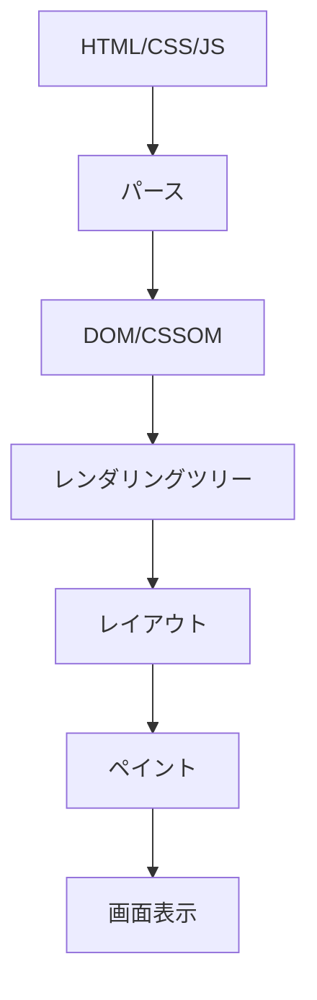
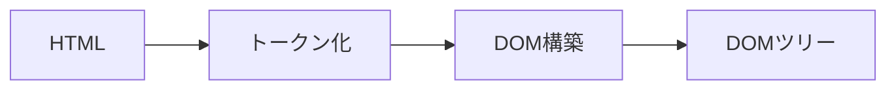
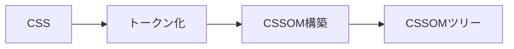
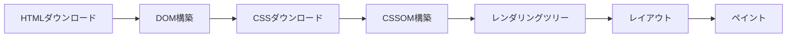

# ブラウザの仕組み

## 📋 概要

| 項目 | 内容 |
|------|------|
| 難易度 | [中級] |
| 所要時間 | 45-60分 |
| 前提知識 | HTML/CSS基礎 |

## なぜ学ぶ必要があるのか

### この技術が解決する問題

ブラウザの仕組みを理解することで、パフォーマンス最適化やデバッグができるようになります。



### 実務での重要性

- **パフォーマンス最適化**: レンダリングの仕組みを理解すると最適化できる
- **デバッグ**: 開発者ツールで問題を特定
- **クロスブラウザ対応**: ブラウザの違いを理解

### AI時代における重要性

- **AI生成コードの検証**: ブラウザの仕組みを知らないと、AIの出力が正しいか判断できない
- **パフォーマンス問題の特定**: ボトルネックを見つけるために必要

## ブラウザのレンダリングプロセス

### 1. HTMLのパース



### 2. CSSのパース



### 3. レンダリングツリーの構築

DOM + CSSOM → レンダリングツリー

### 4. レイアウト（リフロー）

各要素の位置とサイズを計算

### 5. ペイント

ピクセルを描画

### 6. 合成

レイヤーを合成して画面に表示

## パフォーマンス最適化

### クリティカルレンダリングパス



**最適化のポイント**:
- CSSを先に読み込む
- JavaScriptの実行を遅延させる
- 画像の最適化

### リフローとリペイント

**リフロー**: レイアウトの再計算（コストが高い）
**リペイント**: ピクセルの再描画

```javascript
// ❌ 悪い例: 複数回リフローが発生
element.style.width = '100px';
element.style.height = '100px';

// ✅ 良い例: 1回のリフロー
element.style.cssText = 'width: 100px; height: 100px;';
```

## 開発者ツール

### Chrome DevTools

1. **Elements**: DOMの確認・編集
2. **Console**: JavaScriptの実行・デバッグ
3. **Network**: HTTP通信の確認
4. **Performance**: パフォーマンスの分析
5. **Lighthouse**: パフォーマンススコア

## 学習目標の確認

このコンテンツを読んだ後、以下ができるようになっているはずです：

- [ ] ブラウザのレンダリングプロセスを説明できる
- [ ] 開発者ツールでDOMを確認・編集できる
- [ ] パフォーマンス最適化のポイントを理解している

## 次のステップ

- [04. REST API設計](01-web-fundamentals-04.md)

## 参考リソース

- [How Browsers Work](https://web.dev/howbrowserswork/)
- [Chrome DevTools](https://developer.chrome.com/docs/devtools/)
