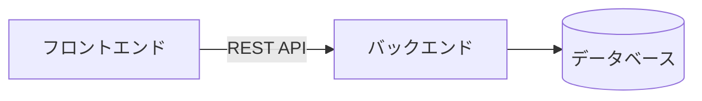

# REST API設計

## 📋 概要

| 項目 | 内容 |
|------|------|
| 難易度 | [中級] |
| 所要時間 | 45-60分 |
| 前提知識 | HTTPプロトコル |

## なぜ学ぶ必要があるのか

### この技術が解決する問題

REST APIは、クライアントとサーバー間の通信を標準化する設計原則です。



### 実務での重要性

- **モダンなWebアプリの標準**: フロントエンドとバックエンドを分離
- **マイクロサービス**: サービス間の通信に使用
- **モバイルアプリ**: バックエンドAPIを共有

### AI時代における重要性

- **AI生成コードの検証**: REST APIの設計原則を知らないと、AIの出力が正しいか判断できない
- **API設計のレビュー**: 適切な設計か判断するために必要

## RESTの原則

### 1. リソース指向

URLでリソースを表現

```
✅ 良い例
GET /api/users/1
GET /api/users/1/posts

❌ 悪い例
GET /api/getUser?id=1
GET /api/userPosts?userId=1
```

### 2. HTTPメソッドの適切な使用

| 操作 | HTTPメソッド | 例 |
|------|-------------|-----|
| 取得 | GET | `GET /api/users/1` |
| 作成 | POST | `POST /api/users` |
| 更新（全体） | PUT | `PUT /api/users/1` |
| 更新（部分） | PATCH | `PATCH /api/users/1` |
| 削除 | DELETE | `DELETE /api/users/1` |

### 3. ステートレス

サーバーはクライアントの状態を保持しない

### 4. 統一インターフェース

標準的なHTTPメソッドとステータスコードを使用

## API設計のベストプラクティス

### URL設計

```
✅ 良い例
GET    /api/users
GET    /api/users/1
POST   /api/users
PUT    /api/users/1
DELETE /api/users/1

GET    /api/users/1/posts
POST   /api/users/1/posts
```

### レスポンス形式

```json
// 単一リソース
{
  "id": 1,
  "name": "John",
  "email": "john@example.com"
}

// リスト
{
  "data": [
    { "id": 1, "name": "John" },
    { "id": 2, "name": "Jane" }
  ],
  "total": 2
}

// エラー
{
  "error": {
    "code": "VALIDATION_ERROR",
    "message": "Invalid input",
    "details": [...]
  }
}
```

### ステータスコードの適切な使用

- **200 OK**: 成功
- **201 Created**: 作成成功
- **400 Bad Request**: リクエストが不正
- **401 Unauthorized**: 認証が必要
- **403 Forbidden**: 権限なし
- **404 Not Found**: リソースが見つからない
- **500 Internal Server Error**: サーバーエラー

## 学習目標の確認

このコンテンツを読んだ後、以下ができるようになっているはずです：

- [ ] REST APIの設計原則を説明できる
- [ ] 適切なHTTPメソッドを選択できる
- [ ] RESTfulなURLを設計できる
- [ ] 適切なステータスコードを使用できる

## 次のステップ

- [02. フロントエンド開発](../02-frontend-development/)

## 参考リソース

- [REST API Tutorial](https://restfulapi.net/)
- [API Design Guide](https://cloud.google.com/apis/design)

---

**著作権表示**

Copyright © 2024 Honeycome Inc. All rights reserved.

本コンテンツは、Honeycome Inc.の所有物です。無断での複製、配布、転載を禁止します。
詳細は[利用規約](../../docs/terms-of-use.md)をご覧ください。
