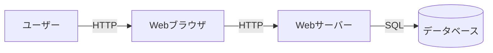
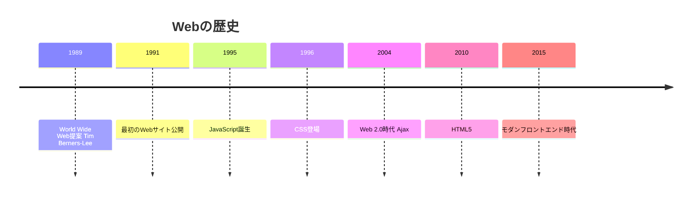

# 01. Web基礎

## 概要

**学習日数**: 2-3日

Webの基礎技術を学びます。HTTPプロトコル、HTML/CSS、ブラウザの仕組み、REST API設計について理解します。

## なぜ学ぶ必要があるのか

### この技術が解決する問題

Webは現代社会のインフラです。Web技術を理解することで：

- **Webアプリケーションの全体像**を把握できる
- **問題発生時**にどこで問題が起きているか特定できる
- **パフォーマンス最適化**のポイントを理解できる

### 実務での重要性

- **ほぼすべてのサービスがWeb**: ECサイト、SNS、業務システムなど
- **フロントエンドとバックエンドの基礎**: どちらに進んでも必要な知識
- **API設計**: モダンな開発ではAPI設計が重要

### AI時代における重要性

- **AI生成コードの検証**: HTTPの仕組みを知らないとAPIのコードをレビューできない
- **デバッグ**: 問題発生時に原因を特定するために必要

## 技術の歴史的背景

- **1989年**: Tim Berners-LeeがWorld Wide Webを提案
- **1991年**: 最初のWebサイトが公開
- **以降**: 継続的に進化し、現代のWebに

## 学習内容

| No | コンテンツ | 難易度 | 内容 |
|----|------------|--------|------|
| 01 | [HTTPプロトコル](01-web-fundamentals-01.md) | [基礎] | リクエスト/レスポンス、メソッド、ステータスコード |
| 02 | [HTML/CSS基礎](01-web-fundamentals-02.md) | [基礎] | HTML構造、CSSスタイリング |
| 03 | [ブラウザの仕組み](01-web-fundamentals-03.md) | [中級] | レンダリング、JavaScript実行 |
| 04 | [REST API設計](01-web-fundamentals-04.md) | [中級] | RESTful設計、エンドポイント設計 |

## 学習目標

- [ ] HTTPプロトコルの基本を説明できる
- [ ] HTMLとCSSで簡単なページを作成できる
- [ ] ブラウザの仕組みを理解している
- [ ] RESTful APIの設計原則を説明できる

## 参考リソース

- [MDN Web Docs](https://developer.mozilla.org/ja/)
- [HTTP入門](https://developer.mozilla.org/ja/docs/Web/HTTP)
