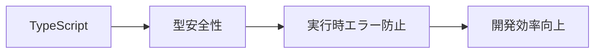

# TypeScript復習（フロントエンド向け）

## 📋 概要

| 項目 | 内容 |
|------|------|
| 難易度 | [基礎] |
| 所要時間 | 30-45分 |
| 前提知識 | TypeScript基礎（共通基礎02） |

## なぜ学ぶ必要があるのか

### フロントエンドでのTypeScript

フロントエンド開発では、TypeScriptの型システムが特に重要です。



### 実務での重要性

- **大規模開発**: 型があることで、大規模なコードベースでも安全に開発できる
- **IDE補完**: 型情報により、強力な補完が効く
- **リファクタリング**: 型があることで、安全にリファクタリングできる

### AI時代における重要性

- **AI生成コードの検証**: 型エラーでAIの間違いを即座に発見できる
- **正確な指示**: 型を指定することで、AIに正確なコードを生成させられる

## フロントエンドでよく使うTypeScript機能

### 1. 型エイリアスとインターフェース

```typescript
// 型エイリアス
type User = {
  id: number;
  name: string;
  email: string;
};

// インターフェース
interface User {
  id: number;
  name: string;
  email: string;
}

// ReactコンポーネントのProps
interface ButtonProps {
  label: string;
  onClick: () => void;
  disabled?: boolean;
}
```

### 2. ユニオン型とリテラル型

```typescript
// ユニオン型
type Status = 'loading' | 'success' | 'error';

// リテラル型
type Theme = 'light' | 'dark';

// 使用例
const [status, setStatus] = useState<Status>('loading');
```

### 3. ジェネリクス

```typescript
// ジェネリック関数
function identity<T>(arg: T): T {
  return arg;
}

// React Hooksでの使用
function useLocalStorage<T>(key: string, initialValue: T) {
  const [storedValue, setStoredValue] = useState<T>(() => {
    // ...
  });
  return [storedValue, setStoredValue] as const;
}
```

### 4. 型ガード

```typescript
function isString(value: unknown): value is string {
  return typeof value === 'string';
}

function processValue(value: string | number) {
  if (isString(value)) {
    // ここでは value は string 型
    console.log(value.toUpperCase());
  }
}
```

### 5. ユーティリティ型

```typescript
type User = {
  id: number;
  name: string;
  email: string;
  age: number;
};

// Partial: すべてのプロパティをオプショナルに
type PartialUser = Partial<User>;

// Pick: 特定のプロパティを選択
type UserBasic = Pick<User, 'id' | 'name'>;

// Omit: 特定のプロパティを除外
type UserWithoutId = Omit<User, 'id'>;
```

## ReactでのTypeScript

### コンポーネントの型定義

```typescript
import { FC } from 'react';

interface ButtonProps {
  label: string;
  onClick: () => void;
  variant?: 'primary' | 'secondary';
}

// 関数コンポーネント
const Button: FC<ButtonProps> = ({ label, onClick, variant = 'primary' }) => {
  return (
    <button onClick={onClick} className={variant}>
      {label}
    </button>
  );
};

// または、直接型を指定
const Button = ({ label, onClick, variant = 'primary' }: ButtonProps) => {
  // ...
};
```

### useState の型指定

```typescript
const [count, setCount] = useState<number>(0);
const [user, setUser] = useState<User | null>(null);
const [items, setItems] = useState<string[]>([]);
```

### useRef の型指定

```typescript
// DOM要素への参照
const inputRef = useRef<HTMLInputElement>(null);

// 値の保持
const countRef = useRef<number>(0);
```

## 学習目標の確認

このコンテンツを読んだ後、以下ができるようになっているはずです：

- [ ] 型エイリアスとインターフェースを使い分けられる
- [ ] ユニオン型とリテラル型を使える
- [ ] ジェネリクスを理解している
- [ ] Reactコンポーネントに適切な型を付けられる

## 次のステップ

- [02. React基礎](02-frontend-development-02.md)

## 参考リソース

- [TypeScript公式ドキュメント](https://www.typescriptlang.org/ja/docs/)
- [React TypeScript Cheatsheet](https://react-typescript-cheatsheet.netlify.app/)

---

**著作権表示**

Copyright © 2024 Honeycome Inc. All rights reserved.

本コンテンツは、Honeycome Inc.の所有物です。無断での複製、配布、転載を禁止します。
詳細は[利用規約](../../docs/terms-of-use.md)をご覧ください。
